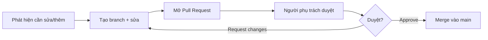

# Đề xuất & duyệt thay đổi handbook

**Người chịu trách nhiệm:** Anderson (CEO)
**Cập nhật lần cuối:** 2026-08-25
**Trạng thái:** Đang dùng

## Tại sao có trang này

Handbook chỉ sống được khi **ai cũng đề xuất sửa được**, nhưng vẫn có người gác cổng đảm bảo chất lượng. Quy trình này tách rõ vai trò **đề xuất** và **duyệt** — mở cho đóng góp mà không mất kiểm soát.

## Khi nào áp dụng (Trigger)

- Bạn phát hiện thông tin sai hoặc lỗi thời trong handbook
- Bạn có quy trình/quyết định mới cần ghi lại
- Bạn muốn cải thiện một trang hiện có (thêm ví dụ, sửa cách diễn đạt)
- Một câu hỏi được trả lời trong chat nhưng chưa có trong handbook

---

## Luồng chính

---

## Vai trò & trách nhiệm

| Vai trò | Chịu trách nhiệm gì |
|---------|---------------------|
| Người đề xuất (bất kỳ ai) | Viết/sửa nội dung, mở PR, giải thích lý do thay đổi |
| Người duyệt (owner của mục đó) | Review nội dung, đảm bảo đúng format và chính xác, approve hoặc request changes |
| Biên tập tổng (Anderson) | Đảm bảo nhất quán style toàn bộ handbook, giải quyết conflict |

---

## Các bước

| # | Việc làm | Ai làm | Đầu ra | Timeline |
|---|----------|--------|--------|----------|
| 1 | Phát hiện thông tin cần sửa/thêm | Bất kỳ ai | Ý tưởng thay đổi | — |
| 2 | Tạo branch mới từ `main` | Người đề xuất | Branch `handbook/[mô-tả-ngắn]` | — |
| 3 | Viết/sửa nội dung theo playbook | Người đề xuất | File `.md` đúng format | — |
| 4 | Tự kiểm theo checklist Phần 4 playbook | Người đề xuất | Checklist pass | Trước khi mở PR |
| 5 | Mở Pull Request, mô tả lý do thay đổi | Người đề xuất | PR trên GitHub | — |
| 6 | Review nội dung + format | Owner của mục | Approve / Request changes | Trong 2 ngày làm việc |
| 7 | Merge vào main | Owner / Biên tập | Handbook cập nhật | Sau khi approve |
| 8 | Thông báo trên Slack/Telegram kèm link | Người đề xuất | "Đã cập nhật handbook, xem ở đây" | Ngay sau merge |

---

## Quy tắc cứng (không được vi phạm) + lý do

| Quy tắc | Lý do |
|---------|-------|
| **Viết vào handbook TRƯỚC, thông báo SAU** — không bao giờ chỉ thông báo qua chat mà không ghi lại | Thông tin trên chat sẽ trôi đi, handbook là nguồn thông tin duy nhất |
| **Một thông tin chỉ sống ở MỘT nơi** — cần nhắc lại thì link, không copy | Tránh hai phiên bản conflict, không biết bản nào mới |
| **Người viết không tự approve PR của mình** | Đảm bảo có ít nhất 1 người khác đã đọc |
| **Mỗi trang phải có đúng 1 người chịu trách nhiệm** | Tránh đùn đẩy, rõ ai duyệt |
| **Đặt tên file theo quy ước `[chủ-đề]-[loại].md`** | Nhìn tên file biết nội dung + loại tài liệu |

---

## Ngoại lệ & Escalation

| Tình huống | Hành động |
|-----------|----------|
| Thay đổi ảnh hưởng nhiều mục / thay đổi cấu trúc lớn | Tag Anderson (biên tập tổng) vào PR để review |
| Không biết ai là owner của mục cần sửa | Xem [owners-reference.md](./owners-reference.md) hoặc hỏi Anderson |
| Owner không response trong 2 ngày | Escalate lên Anderson |
| Cần sửa gấp (thông tin sai gây ảnh hưởng) | Cho phép merge trước, tạo PR review sau — ghi rõ lý do |

---

## Checklist

- [ ] Nội dung đúng format theo playbook (xem [playbook.md](../playbook.md))
- [ ] Tên file đúng quy ước `[chủ-đề]-[loại].md`
- [ ] Có mục "Tại sao" hoặc context mở đầu
- [ ] Không trùng lặp nội dung với trang khác (link thay vì copy)
- [ ] Đã tự đọc lại — người mới đọc là hiểu, không cần hỏi thêm
- [ ] PR có mô tả lý do thay đổi

---

## Liên kết

- [Cách nghĩ khi viết handbook](./contributing-handbook.md)
- [Bảng tra: ai chịu trách nhiệm mục nào](./owners-reference.md)
- [Playbook — Bộ hướng dẫn viết handbook](../playbook.md)
