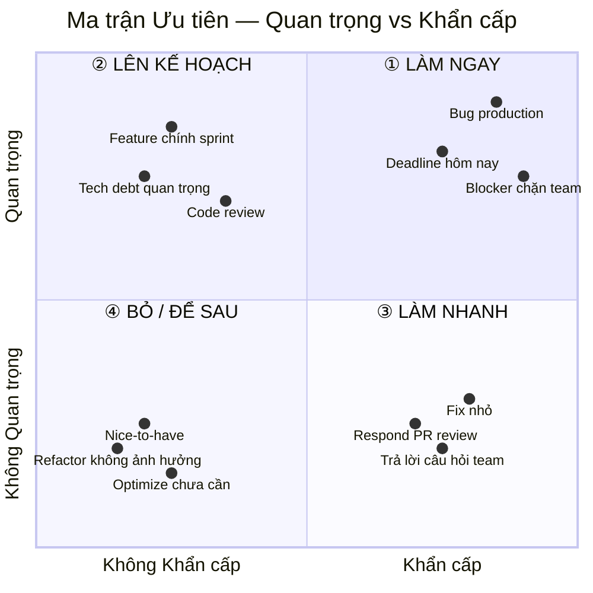

# Quản lý công việc cá nhân — Cẩm nang cho Developer

**Người chịu trách nhiệm:** [Dev / Tech Lead]
**Cập nhật lần cuối:** 2026-09-01
**Trạng thái:** Nháp

Bạn là developer tại Cyberk. Theo tinh thần Agile, bạn không phải người **chờ được giao việc** — bạn là người **tự giao việc cho mình**. PM/PL định hướng Epic và sprint goal, nhưng việc chọn task nào làm trước, breakdown ra sao, cập nhật board thế nào — đó là trách nhiệm của bạn.

Một lập trình viên chuyên nghiệp không đợi ai mở board giúp mình. Bạn tự mở, tự chọn, tự quản lý — và board chính là công cụ để bạn làm điều đó.

Trang này hướng dẫn bạn **cách nghĩ** và **cách làm** trong từng tình huống hàng ngày.

---

## Ma trận Ưu tiên — Cách chọn task đầu ngày

Khi mở board ra và thấy nhiều task, câu hỏi đầu tiên không phải "làm cái nào dễ?" mà là **"cái nào quan trọng và khẩn cấp nhất?"**. Ma trận Eisenhower giúp bạn trả lời câu hỏi đó trong 30 giây:



**Áp dụng trên board:**

| Góc phần tư | Hành động trên board | Ví dụ |
|---|---|---|
| **① LÀM NGAY** (Quan trọng + Khẩn cấp) | Chuyển `In Progress` ngay, làm đầu tiên | Bug production, deadline hôm nay, blocker chặn team |
| **② LÊN KẾ HOẠCH** (Quan trọng + Không khẩn cấp) | Đảm bảo nằm trong `Todo` của sprint, xếp lịch rõ ràng | Feature chính, tech debt quan trọng, code review |
| **③ LÀM NHANH** (Không quan trọng + Khẩn cấp) | Làm nhanh trong khoảng trống giữa task lớn, không để chiếm cả ngày | Fix nhỏ, respond PR review, trả lời câu hỏi |
| **④ BỎ / ĐỂ SAU** (Không quan trọng + Không khẩn cấp) | Để ở `Backlog`, không kéo vào sprint trừ khi hết việc | Nice-to-have, refactor không ảnh hưởng |

> **⚠️ Sai lầm phổ biến:** Developer dành cả ngày cho việc ③ (khẩn cấp nhưng không quan trọng) — trả lời chat, fix lỗi nhỏ, review nhanh — rồi cuối ngày không đụng được task ② (quan trọng nhưng chưa gấp). Kết quả: sprint trễ, feature chính bị dồn.

---

## Tình huống 1 — Đầu ngày mở board ra, nhìn thấy gì và làm gì?

Mở board ra là nhìn toàn cảnh — không phải để "biết mình có việc gì" (cái đó bạn biết rồi), mà để **chọn đúng việc quan trọng nhất** cho hôm nay. Não bạn sáng sớm còn tỉnh, đừng phí nó vào việc nhỏ.

Cách đọc board: quét nhanh 4 cột (`Backlog` → `Todo` → `In Progress` → `Done`). Tập trung vào `Todo` và `In Progress` — đó là chiến trường hôm nay.

**✅ Cách tốt:**

```
Mở Personal Board → thấy 5 task trong Todo.
Tự hỏi: "Cái nào quan trọng nhất? Cái nào có deadline gần nhất?"
→ Chọn task [FR-042] Integrate payment API (deadline ngày mai, blocker cho team QA)
→ Kéo sang In Progress
→ Mở IDE, bắt đầu code task đó
```

Tại sao tốt: Chọn theo ưu tiên, không theo sở thích. Task quan trọng + gấp được làm trước. Board cập nhật trước khi code — team nhìn vào biết bạn đang làm gì.

**❌ Cách tồi:**

```
Mở IDE → thấy branch hôm qua đang dở → code tiếp luôn
(Không mở board, không check task nào ưu tiên hơn)
→ Code 3 tiếng cho một task nice-to-have
→ Cuối ngày mới nhận ra task payment API deadline ngày mai chưa đụng
```

Tại sao tồi: Làm theo quán tính, không theo ưu tiên. Task quan trọng bị bỏ qua vì "cái đang làm dở thì làm nốt cho xong". Sprint trễ vì sai thứ tự.

---

## Tình huống 2 — Task quá lớn hoặc không rõ ràng thì xử lý thế nào?

Nếu bạn nhìn vào một task mà cảm giác "không biết bắt đầu từ đâu" hoặc "cái này chắc mất 2–3 ngày" — đó là dấu hiệu task cần breakdown. Đừng cố ôm nguyên cục — chia nhỏ rồi chiến từng phần.

Quy tắc: **task tốt < 4 giờ**. Nếu lớn hơn → tách. Nếu mô tả mơ hồ → hỏi ngay, đừng đoán.

**✅ Cách tốt:**

```
Task: "[FR-015] Implement user profile page"
→ Nghĩ: "Cái này bao gồm UI + API + validation + upload avatar... chắc 2 ngày"
→ Tách thành 4 sub-tasks:
  1. [FR-015] Setup profile page layout + routing (2h)
  2. [FR-015] API get/update profile (3h)
  3. [FR-015] Form validation + error handling (2h)
  4. [FR-015] Avatar upload with preview (3h)
→ Tạo 4 tasks trên board, mỗi cái có checklist riêng
→ Báo Tech Lead trên Telegram: "FR-015 đã breakdown xong, 4 tasks trên board"
```

Tại sao tốt: Mỗi task đủ nhỏ để Done trong ngày. Progress rõ ràng — mỗi ngày có task Done thay vì "vẫn đang làm cái profile page". Estimate chính xác hơn.

**❌ Cách tồi:**

```
Task: "[FR-015] Implement user profile page"
→ Nghĩ: "OK để làm xem sao"
→ Code 3 ngày, task vẫn In Progress
→ Daily meeting 3 ngày liên tiếp: "Vẫn đang làm profile page"
→ PM hỏi "còn bao lâu?" — trả lời: "Chắc sắp xong"
```

Tại sao tồi: Không ai biết bạn đang ở đâu trong task. "Sắp xong" là câu trả lời vô nghĩa. Task to khiến bạn khó estimate, PM khó lập kế hoạch, sprint dễ trễ.

---

## Tình huống 3 — Bị block, không làm tiếp được thì sao?

Blocker là bình thường — chờ API từ team khác, chờ design, chờ approval. Vấn đề không phải là bị block, mà là **bị block mà im lặng**. Một blocker 5 phút có thể trở thành bottleneck 2 ngày nếu không ai biết.

Nguyên tắc: **báo ngay trên Telegram** + **gắn comment trên task** + **pick task khác làm trong lúc chờ**.

**✅ Cách tốt:**

```
Đang làm task [FR-042] Integrate payment API
→ Cần API key từ payment provider, đã gửi mail từ hôm qua nhưng chưa có reply
→ Hành động:
  1. Comment trên task: "Blocked: chờ API key từ Stripe, đã follow up 10:00 AM"
  2. Gửi Telegram cho PM: "FR-042 bị block vì chờ API key Stripe.
     Đã follow up. Trong lúc chờ, mình chuyển sang FR-043"
  3. Chuyển FR-042 về Todo, pick FR-043 vào In Progress
```

Tại sao tốt: Team biết blocker ngay lập tức. PM có thể escalate nếu cần. Bạn không ngồi chờ — vẫn productive với task khác. Board phản ánh đúng thực tế.

**❌ Cách tồi:**

```
Đang làm task [FR-042] Integrate payment API
→ Cần API key, chưa có
→ Lướt web chờ... rồi fix mấy cái CSS nhỏ nhỏ... rồi xem tutorial
→ Daily meeting hôm sau: "Ờ hôm qua mình bị block vì chờ API key"
→ PM: "Sao không nói sớm? Mình có thể gọi provider ngay hôm qua mà"
```

Tại sao tồi: Mất nguyên 1 ngày vì không báo. PM không biết nên không giúp được. Board vẫn hiện "In Progress" nhưng thực tế bạn không progress gì cả. Cả team mất ít nhất 1 ngày vì một tin nhắn 30 giây không được gửi.

---

## Tình huống 4 — Xong task trước deadline, còn thời gian rảnh?

Xong sớm là tốt — nhưng "rảnh" không có nghĩa là "chờ". Developer chuyên nghiệp không bao giờ chờ ai giao việc. Board luôn có task ở `Todo` hoặc `Backlog` — tự pick.

**✅ Cách tốt:**

```
Xong [FR-043] lúc 3h chiều, còn 2 tiếng
→ Mở board → thấy FR-044 đang Todo (deadline tuần sau)
→ Kéo FR-044 vào In Progress, bắt đầu setup
→ Nếu hết task trong Todo → review PR của đồng nghiệp (góc phần tư ③)
→ Nếu hết PR → check Backlog, kéo task tiếp vào Todo
→ Nếu Backlog cũng hết → báo Tech Lead: "Mình hết task, cần việc mới"
```

Tại sao tốt: Chủ động, không chờ. Mỗi phút đều productive. Tech Lead thấy bạn tự quản lý được — tin tưởng giao Epic lớn hơn. Sprint nhanh hơn kế hoạch.

**❌ Cách tồi:**

```
Xong [FR-043] lúc 3h chiều
→ "Hôm nay xong việc rồi"
→ Lướt YouTube, đọc blog, chờ ngày mai Daily Meeting
→ Hoặc: ngồi refactor code cũ không ai yêu cầu, 
   không tạo task, không báo ai
```

Tại sao tồi: 2 tiếng lãng phí. Hoặc tệ hơn — refactor không có trên board, team không biết, PM không biết. Nếu refactor gây bug → không ai trace được vì "việc này không tồn tại" trên board.

---

## Tình huống 5 — Cuối ngày, cần cập nhật gì trên board?

Cuối ngày là lúc "dọn dẹp" board — đảm bảo mọi thứ phản ánh đúng thực tế, chuẩn bị dữ liệu cho Daily Report. Mất 5 phút, nhưng tiết kiệm 30 phút sáng hôm sau khi phải nhớ lại "hôm qua mình làm gì nhỉ?".

**✅ Cách tốt:**

```
16:55 — trước khi tắt máy:
1. ✅ Task [FR-044] đã setup xong → chuyển Done, comment "PR #127 merged"
2. ✅ Task [FR-045] đang làm dở → giữ In Progress, comment:
   "Done: API endpoint + validation. Remaining: unit test (~1h sáng mai)"
3. ✅ Không có blocker → không cần báo
4. ✅ Mở Daily Report template → viết report dựa trên board
→ Board sạch, report có dữ liệu, sáng mai mở ra biết ngay làm gì tiếp
```

Tại sao tốt: Board luôn đúng. Report viết dễ vì nhìn board là thấy. Sáng hôm sau mở board ra — tiếp tục ngay, không mất thời gian "ờ hôm qua mình đang ở đâu nhỉ".

**❌ Cách tồi:**

```
17:00 — tắt máy luôn:
→ Task đã xong nhưng vẫn In Progress trên board
→ Task mới nhận trong ngày chưa tạo trên board
→ Sáng hôm sau mở board ra: "Ủa cái này mình xong rồi mà?
   Cái kia mình đang làm dở ở đâu nhỉ?"
→ Daily Meeting: "Ờ hôm qua mình làm mấy cái... quên rồi"
```

Tại sao tồi: Board nói dối — task xong vẫn hiện đang làm, task mới không có. PM nhìn board thấy sai. Daily Meeting báo cáo sai vì không nhớ. Mọi dữ liệu trong sprint đều bị nhiễu.

---

## Tóm lại

| Tình huống | Nguyên tắc |
|-----------|-----------|
| **Đầu ngày** | Mở board TRƯỚC, chọn task theo ưu tiên, KHÔNG mở IDE trước |
| **Task quá to** | Breakdown < 4 giờ mỗi task. "Vẫn đang làm" không phải progress |
| **Bị block** | Báo Telegram NGAY + comment trên task + pick task khác |
| **Xong sớm** | Tự pick task tiếp. Không chờ ai giao. Board trống → báo Lead |
| **Cuối ngày** | 5 phút dọn board: Done đúng, In Progress đúng, report có dữ liệu |

> **Một câu gói gọn tất cả:** Board là sự thật — nếu board không biết, team không biết. Cập nhật board không phải là "việc thêm", mà là cách bạn chứng minh mình đang làm việc.

---

## Liên kết

- [Dev Daily Process — Quy trình từng bước](dev-daily-process.md)
- [Board Handbook — Tổng quan quản lý dự án](../../04-delivery/board-handbook/board-handbook.md)
- [Daily Report — Quy trình báo cáo](../../04-delivery/dev-daily-report/daily-report-process.md)
- [Dev Tasks Logs — Quy trình tạo task](../../04-delivery/dev-tasks-logs/dev-tasks-logs-process.md)
