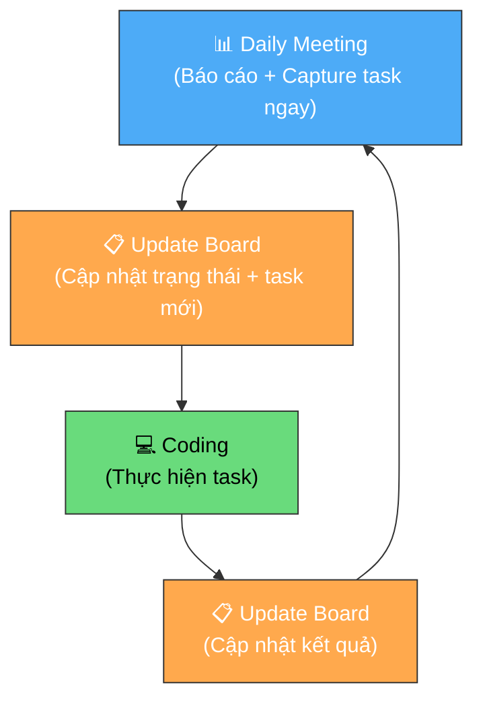

# Quản lý công việc cá nhân hàng ngày — Quy trình cho Developer

**Người chịu trách nhiệm:** Brian
**Cập nhật lần cuối:** 2026-09-01
**Trạng thái:** Nháp

## Tại sao có trang này

Hầu hết con người có trí nhớ rất kém. Chúng ta không thể nhớ hết việc cần làm — đặc biệt khi làm việc trong nhiều Epic, nhiều dự án cùng lúc. Não bộ giỏi *suy nghĩ*, nhưng tệ ở việc *lưu trữ*. Nếu bạn đang giữ danh sách công việc trong đầu, bạn sẽ quên — không phải "có thể quên", mà là **chắc chắn sẽ quên**.

Vì vậy, việc đầu tiên của một developer chuyên nghiệp không phải là code giỏi — mà là **quản lý công việc cá nhân**. Và công cụ để làm điều đó chính là **Personal Board** trên GitHub Projects — nơi mọi thứ bạn cần làm, đang làm, và đã xong đều hiển thị rõ ràng trong 1 click.

> Board cá nhân là "bộ nhớ ngoài" của bạn. Não bạn dùng để giải quyết vấn đề, board dùng để nhớ.

## Khi nào áp dụng (Trigger)

**Mỗi ngày làm việc — phản xạ đầu tiên.**

Đảm bảo rằng phản xạ đầu tiên khi ngồi vào bàn làm việc của developer **không phải là mở IDE và code**, mà là **mở Personal Board** để:
1. Nhìn tổng quan công việc của mình
2. Lựa chọn việc **quan trọng và khẩn cấp nhất** để làm trước
3. Cập nhật trạng thái cho những gì đã thay đổi

Nếu bạn ngồi xuống và lập tức bắt đầu code mà không kiểm tra board — bạn đang làm việc theo quán tính, không phải theo ưu tiên.

---

## Luồng chính — Vòng lặp Daily Circle

Một ngày của developer là một vòng lặp khép kín. Board là trung tâm — mọi thứ bắt đầu và kết thúc ở board.

**Nguyên tắc cốt lõi:** Developer luôn phải đảm bảo **mọi công việc** của mình — cần làm, đang làm, đã xong — được hiển thị rõ ràng trên board. Nếu một việc tồn tại mà board không biết, thì việc đó không tồn tại trong mắt team.

---

## Vai trò & trách nhiệm

| Vai trò | Chịu trách nhiệm gì |
|---------|---------------------|
| Developer | Chủ động quản lý Personal Board của mình: cập nhật status, báo blocker, đảm bảo board phản ánh đúng thực tế |
| Tech Lead / PM | Review board của team để phát hiện bất thường (task treo, overload, board trống), hỗ trợ khi dev bị block |

---

## Các bước

| # | Việc làm | Ai làm | Đầu ra | Timeline |
|---|----------|--------|--------|----------|
| 1 | **Daily Meeting** — Báo cáo: hôm qua làm gì, hôm nay làm gì, có blocker không | Developer | Team nắm được tiến độ | Đầu ngày |
| 2 | **⚡ Capture ngay trong meeting** — Trong lúc họp, phát sinh task mới (bug, refactor, việc cần làm)? **Tạo task trên board ngay lập tức** — không chờ PM giao, không ghi giấy "để tạo sau". Đằng nào cũng phải tạo, tạo ngay khi não còn nhớ | Developer | Tasks mới xuất hiện trên board | Ngay trong meeting |
| 3 | **Mở Personal Board** — Review toàn bộ task của mình trên board (bao gồm task vừa tạo) | Developer | Biết rõ bức tranh tổng thể | Ngay sau meeting |
| 4 | **Phân loại ưu tiên** — Dùng ma trận Quan trọng–Khẩn cấp để chọn task | Developer | Task ưu tiên được chọn | Ngay sau bước 3 |
| 5 | **Update Board** — Chuyển task ưu tiên sang `In Progress`, cập nhật status chính xác | Developer | Board phản ánh đúng thực tế | Trước khi code |
| 6 | **Coding** — Thực hiện task, tập trung vào task đang `In Progress` | Developer | Code / deliverable | Trong ngày |
| 7 | **Xong task → Update Board** — Chuyển `In Progress` → `Done`, pick task tiếp theo | Developer | Board cập nhật, task mới bắt đầu | Ngay khi xong |
| 8 | **Gặp blocker → Báo ngay** — Thông báo trên Telegram, gắn label/comment trên board | Developer | Blocker visible cho team | Ngay lập tức |
| 9 | **Cuối ngày — Update Board lần cuối** — Đảm bảo mọi status đúng, chuẩn bị cho Daily Report | Developer | Board sạch, Daily Report có dữ liệu | Cuối ngày |

> **Tại sao phải tạo task ngay trong meeting?**
> Sau meeting, bạn sẽ mở IDE, bắt đầu code — và những gì vừa thảo luận sẽ **chìm vào quên lãng** trong vòng 30 phút. Chờ PM/PL đến giao việc tạo task cho bạn thì bạn đang **thụ động** — một lập trình viên chuyên nghiệp tự capture, tự tạo, tự quản lý. Tạo task mất 2 phút. Quên task rồi phải hỏi lại mất 2 ngày.

---

## Board của bạn đang khỏe hay đang bệnh?

Nhìn vào board cá nhân 5 giây là biết developer đang làm việc hiệu quả hay đang có vấn đề. Dưới đây là 5 cặp ví dụ — bạn đang ở phía nào?

### 1. Số lượng Todo

**❌ Board bệnh:** Todo có **15 tasks** — từ fix CSS button cho đến refactor cả module authentication. Nhìn vào là thấy ngợp, không biết bắt đầu từ đâu. Board trở thành "danh sách mong ước", không phải kế hoạch.

**✅ Board khỏe:** Todo có **4 tasks** cho tuần này — rõ ràng, đếm được trên một bàn tay. Còn lại nằm gọn ở `Backlog`, khi nào xong mới kéo thêm.

> **Ngưỡng:** 3–5 tasks trong Todo. Quá 10 → đẩy bớt về Backlog. Chỉ 0–1 → bạn đang reactive, chờ người khác giao thay vì chủ động kéo task.

---

### 2. Số lượng In Progress

**❌ Board bệnh:** In Progress có **4 tasks** — "API login", "Fix UI dashboard", "Refactor utils", "Write test". Thực tế? Không task nào được tập trung. Context switching liên tục, mỗi lần chuyển task mất 15–25 phút để lấy lại focus.

**✅ Board khỏe:** In Progress có **1 task** — "API login". Xong cái này → chuyển sang cái tiếp theo. Một lúc chỉ chiến một mặt trận.

> **Ngưỡng:** Tối đa 2 tasks In Progress. Nhiều hơn = không task nào thực sự được làm.

---

### 3. Task treo quá lâu

**❌ Board bệnh:** Task "Integrate payment gateway" nằm ở `In Progress` đã **5 ngày**. Không comment, không update. Team nghĩ bạn đang làm, bạn thì đang kẹt mà ngại nói.

**✅ Board khỏe:** Task bị kẹt → **ngay lập tức** gắn comment "Blocked: chờ API key từ payment provider, đã ping @PM lúc 10h sáng". Đồng thời pick task khác làm trong lúc chờ — board luôn có task đang chuyển động.

> **Ngưỡng:** Task In Progress > 2 ngày → phải breakdown nhỏ hơn hoặc báo blocker ngay.

---

### 4. Không có task Done

**❌ Board bệnh:** Cả tuần không có task nào ở cột `Done`. Board trông như đang đứng im. PM nhìn vào không biết bạn đang làm gì — đang code chăm chỉ hay đang stuck.

**✅ Board khỏe:** Mỗi ngày có ít nhất **1 task nhỏ Done** — dù chỉ là sub-task. Board có nhịp chuyển động, cả team thấy progress rõ ràng.

> **Ngưỡng:** Nếu không có Done trong 2 ngày → task của bạn quá to. Tách sub-task có thể Done trong ngày.

---

### 5. Làm việc "ngoài board"

**❌ Board bệnh:** Client nhờ hotfix gấp, bạn nhảy vào fix ngay — mất 3 tiếng. Board vẫn hiện task khác đang `In Progress`. PM hỏi "hôm nay làm gì?" — bạn kể một đống việc không có trên board. Board nói dối.

**✅ Board khỏe:** Client nhờ hotfix → **tạo task trên board TRƯỚC** (chỉ mất 2 phút), chuyển `In Progress`, rồi mới làm. Xong → chuyển `Done`. Board luôn phản ánh đúng thực tế — 100% thời gian.

> **Nguyên tắc:** Nếu một việc không có trên board, team không biết, PM không biết — khi có vấn đề, không ai giúp bạn được.

---

## Quy tắc cứng — tóm gọn

Năm quy tắc trên gói lại thành 5 câu không bao giờ vi phạm:

| # | Quy tắc | Một câu lý do |
|---|---------|---------------|
| 1 | **Phản xạ đầu ngày: mở Board, không phải IDE** | Code trước khi check board = có thể đang làm sai việc |
| 2 | **Board = thực tế — mọi lúc** | Board nói dối → team nhìn sai → quyết định sai |
| 3 | **Tối đa 2 task In Progress** | 3+ task "đang làm" = 0 task được tập trung |
| 4 | **Blocker → báo Telegram ngay, không chờ Daily** | Chờ 1 ngày = cả team mất 1 ngày |
| 5 | **Mọi việc phải có trên board** | Việc "vô hình" = không ai giúp được khi kẹt |

---

## Ngoại lệ & Escalation

| Tình huống | Hành động |
|-----------|----------|
| Không có task nào trên board (board trống) | Chủ động review Epic còn lại, tự kéo task. Nếu hết task → **báo PM/Tech Lead ngay** trong buổi sáng, không chờ đến hết ngày |
| Task bị block bởi team khác (Design chưa xong, API chưa có) | Gắn comment blocker trên task, báo Telegram. **Không được ngồi chờ** — pick task khác trong khi đợi |
| Phát sinh công việc ngoài board (client nhờ gấp, hotfix) | Tạo task trên board TRƯỚC khi làm (dù chỉ 5 phút để tạo). Board phải biết bạn đang làm gì |
| Ước tính sai — task tưởng 2 giờ hóa ra mất 2 ngày | Cập nhật estimate, chia nhỏ task, báo PM/Lead để điều chỉnh sprint |

---

## Liên kết

- [Dev Daily Handbook — Cẩm nang cách nghĩ](dev-daily-handbook.md)
- [Board Handbook — Tổng quan quản lý dự án](../../04-delivery/board-handbook/board-handbook.md)
- [Daily Report — Quy trình báo cáo](../../04-delivery/dev-daily-report/daily-report-process.md)
- [Dev Tasks Logs — Quy trình tạo task](../../04-delivery/dev-tasks-logs/dev-tasks-logs-process.md)
