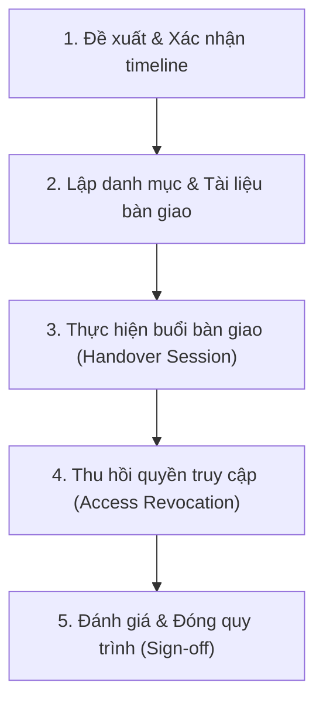

# Rời Dự Án

**Người chịu trách nhiệm:** Product Lead
**Trạng thái:** Đang dùng

## Tại sao có trang này

Quy trình này nhằm đảm bảo việc chuyển giao công việc, tài nguyên, mã nguồn và quyền hạn của một thành viên khi rời khỏi dự án diễn ra suôn sẻ, không làm gián đoạn tiến độ chung và tránh thất thoát tài sản/thông tin của Cyberk và khách hàng.

## Khi nào áp dụng (Trigger)

Quy trình được kích hoạt khi:
- Thành viên dự án chủ động đề xuất xin rời dự án.
- Có quyết định điều chuyển nhân sự sang dự án khác từ Ban Quản lý.
- Thành viên nghỉ việc tại công ty.

---

## Luồng chính

---

## Vai trò & trách nhiệm

| Vai trò | Chịu trách nhiệm gì |
|---------|---------------------|
| **Thành viên rời đi (Outgoing Member)** | - Hoàn thành các task dở dang có thể kết thúc sớm. - Soạn thảo tài liệu bàn giao (Handover Doc) chi tiết. - Thực hiện hướng dẫn/họp bàn giao trực tiếp cho người nhận. - Bàn giao toàn bộ tài khoản, mã nguồn, tài nguyên liên quan. |
| **Thành viên nhận bàn giao (Receiver)** | - Đọc hiểu tài liệu bàn giao và code/task liên quan. - Tham gia buổi bàn giao, đặt câu hỏi làm rõ các điểm chưa rõ. - Tiếp quản các công việc và tài nguyên được giao. |
| **Product Lead** | - Điều phối và giám sát tiến độ bàn giao. - Chỉ định người nhận bàn giao (Receiver). - Phê duyệt tài liệu bàn giao. - Đảm bảo tất cả quyền truy cập đặc quyền đã được thu hồi. - Đề xuất/xác nhận phân bổ thưởng dự án (nếu có) theo [[project-bonus-policy\|Chính Sách Thưởng Dự Án]]. |

---

## Các bước

| # | Việc làm | Ai làm | Đầu ra | Timeline |
|---|----------|--------|--------|----------|
| 1 | **Gửi yêu cầu rời dự án** | Outgoing Member | Email/Tin nhắn chính thức gửi Product Lead | Ít nhất 2 tuần trước ngày rời dự án thực tế |
| 2 | **Lập kế hoạch & chỉ định Receiver** | Product Lead | Xác nhận timeline và chỉ định Receiver | Trong vòng 2 ngày làm việc sau khi nhận yêu cầu |
| 3 | **Soạn tài liệu bàn giao** | Outgoing Member | Link tài liệu bàn giao (Markdown/Google Doc) | Hoàn thành trước ngày rời đi 5 ngày |
| 4 | **Duyệt tài liệu bàn giao** | Product Lead / Receiver | Nhận xét, yêu cầu bổ sung nếu cần | Hoàn thành trước ngày rời đi 3 ngày |
| 5 | **Họp bàn giao & giải đáp** | Outgoing Member + Receiver | Buổi họp (ghi âm/quay màn hình nếu cần) | Trước ngày rời đi 2 ngày |
| 6 | **Chuyển giao quyền & Thu hồi access** | Product Lead | Danh sách tài khoản đã chuyển giao hoặc thu hồi | Ngày làm việc cuối cùng |
| 7 | **Xác nhận hoàn tất (Sign-off)** | Product Lead | Đánh dấu hoàn tất checklist và lưu trữ tài liệu | Ngày làm việc cuối cùng |

---

## Quy tắc cứng (không được vi phạm) + lý do

| Quy tắc | Lý do |
|---------|-------|
| Không rời dự án khi chưa có tài liệu bàn giao được phê duyệt | Người ở lại sẽ gặp khó khăn lớn trong việc mò lại logic code, tài liệu và các đầu mối công việc, gây trễ tiến độ. |
| Phải thu hồi/chuyển giao toàn bộ thông tin tài khoản (credentials) hệ thống | Đảm bảo an toàn bảo mật thông tin của Cyberk và khách hàng. Tránh rủi ro rò rỉ dữ liệu. |
| Trường hợp tự ý rời dự án không có lý do chính đáng sẽ không được nhận thưởng dự án | Đồng bộ với chính sách thưởng tại [[project-bonus-policy\|Chính Sách Thưởng Dự Án]] nhằm đảm bảo tính cam kết của thành viên. |

---

## Ngoại lệ & Escalation

| Tình huống | Hành động |
|-----------|----------|
| **Nghỉ đột xuất (lý do bất khả kháng: sức khỏe, gia đình)** | - Product Lead lập tức tiếp quản và rà soát các task hiện tại trên Jira/Board. - Chỉ định khẩn cấp Receiver để tiếp quản tạm thời. - Đề xuất phân chia thưởng pro-rata theo đóng góp thực tế (cần Anderson duyệt). |
| **Không tìm được Receiver phù hợp** | Product Lead của dự án sẽ tạm thời đóng vai trò Receiver để lưu giữ thông tin, tránh gián đoạn trước khi tìm được nhân sự thay thế. |

---

## Checklist

- [ ] Email/Tin nhắn thông báo rời dự án đã được Product Lead duyệt.
- [ ] Tài liệu bàn giao (Handover Doc) đã được tạo và share cho Product Lead & Receiver.
- [ ] Buổi họp bàn giao (Handover Session) đã được thực hiện (có Record).
- [ ] Toàn bộ các Pull Request (PR) cá nhân đã được merge hoặc giao lại cho người khác quản lý.
- [ ] Tài khoản/API key dùng chung đã bàn giao quyền sở hữu (Owner) cho Product Lead.
- [ ] Thu hồi phân quyền cá nhân trên Git, Cloud (AWS/Azure/GCP), và các công cụ SaaS (Figma, Jira, Slack, ...).
- [ ] Cập nhật trạng thái trên tài liệu nhân sự dự án chung.

---

## Liên kết

- [Project Leave Handbook](project-leave-handbook.md)
- [Project Onboarding Process](../project-onboarding/project-onboarding-process.md)
- [Chính Sách Thưởng Dự Án](../../delivery/dev/bonus-policy/project-bonus-policy.md)
