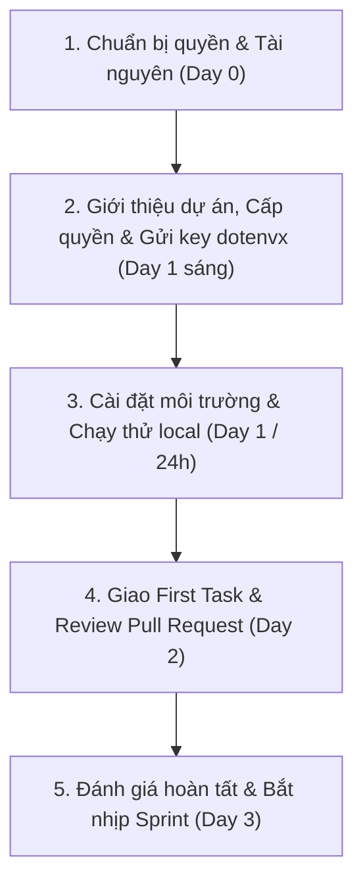

# Onboarding Dự Án

**Người chịu trách nhiệm:** Product Lead  
**Trạng thái:** Đang dùng  

## Tại sao có trang này

Quy trình này nhằm đảm bảo việc tiếp nhận và hướng dẫn thành viên mới gia nhập dự án diễn ra nhanh chóng, chuẩn xác, giúp nhân sự bắt nhịp công việc sớm mà không làm gián đoạn tiến độ chung hay gây rủi ro về an toàn thông tin của Cyberk và khách hàng.

Product Lead trực tiếp giới thiệu tổng quan dự án, kết hợp cùng thành viên mới chủ động sử dụng các công cụ AI để tìm hiểu sâu về kiến trúc, mã nguồn và nghiệp vụ nhằm tăng tốc tối đa quá trình tiếp cận.

Mục tiêu chính:
- **Trong vòng 24 giờ đầu tiên (Day 1):** Thành viên mới cài đặt và chạy thành công ứng dụng trên máy cá nhân dưới sự hướng dẫn của Product Lead.
- **Đến Ngày thứ 2 (Day 2):** Hoàn thành và được merge Pull Request đầu tiên (First PR) dưới sự review của Product Lead.
- **Ngày thứ 3 (Day 3):** Đánh giá hoàn tất quy trình tiếp nhận, chính thức phân bổ công việc vào Sprint của dự án.

## Khi nào áp dụng (Trigger)

Quy trình được kích hoạt khi:
- Thành viên mới gia nhập Cyberk và được phân công vào dự án.
- Thành viên nội bộ được điều chuyển từ dự án khác sang hoặc tham gia thêm dự án mới.
- Thành viên được chỉ định làm người tiếp nhận (Receiver) trong quy trình [[project-leave-process|Rời Dự Án]].

---

## Luồng chính

---

## Vai trò & trách nhiệm

| Vai trò | Chịu trách nhiệm gì |
|---------|---------------------|
| **Product Lead** | - Chịu trách nhiệm trực tiếp và toàn diện về việc tiếp nhận thành viên mới vào dự án. - Chuẩn bị và cấp quyền truy cập: GitHub Repository, Project Board trên GitHub Projects, Group Telegram dự án. - Gửi key giải mã [dotenvx](https://github.com/dotenvx/dotenvx) (`DOTENV_PRIVATE_KEY`) qua kênh riêng an toàn để thành viên giải mã các biến môi trường được lưu trong repo. - Trực tiếp tổ chức buổi giới thiệu bối cảnh sản phẩm, yêu cầu của khách hàng, timeline và kiến trúc tổng quan. - Trực tiếp hướng dẫn thành viên mới cài đặt môi trường và nghiệm thu kết quả chạy local trong vòng 24 giờ. - Chọn và giao First Task, review Pull Request đầu tiên và phê duyệt hoàn tất tiếp nhận (Sign-off) vào Ngày 3. |
| **Thành viên mới (Onboardee)** | - Tiếp nhận thông tin từ Product Lead, chủ động kết hợp công cụ AI để đọc hiểu cấu trúc mã nguồn, luồng dữ liệu và nghiệp vụ nhằm tăng tốc nắm bắt dự án. - Cài đặt môi trường và nạp key giải mã `dotenvx` dưới sự hướng dẫn của Product Lead, đảm bảo ứng dụng chạy thành công trên máy cá nhân trong 24 giờ. - Tuân thủ nguyên tắc **Horenso** (Báo cáo - Liên lạc - Thảo luận): chủ động báo cáo tiến độ và nêu vấn đề khi gặp ách tắc. - Thực hiện First Task trên GitHub Projects, mở Pull Request và tiếp thu phản hồi review để merge code trong Day 2. - Tham gia đầy đủ Daily meeting và cập nhật Personal Board hàng ngày theo quy định. |

---

## Các bước

| # | Việc làm | Ai làm | Đầu ra | Timeline |
|---|----------|--------|--------|----------|
| 1 | **Chuẩn bị quyền & tài nguyên** - Rà soát danh mục tài nguyên cần cấp. - Chuẩn bị quyền truy cập GitHub Repo, key giải mã `dotenvx`, group Telegram và Board dự án. | Product Lead | Danh mục quyền và key giải mã đã sẵn sàng | **Day 0** (Trước ngày gia nhập 1 ngày) |
| 2 | **Giới thiệu dự án, Cấp quyền & Gửi key dotenvx** - Add thành viên vào Group/Topic Telegram dự án và giới thiệu với team. - Cấp quyền truy cập GitHub và gửi key giải mã `dotenvx` (`DOTENV_PRIVATE_KEY`) an toàn cho thành viên mới. - Tổ chức buổi giới thiệu tổng quan (30–45 phút) về mục tiêu dự án, khách hàng, timeline và kiến trúc hệ thống. | Product Lead + Thành viên mới | Thành viên truy cập đủ tài nguyên, có key giải mã và nắm bối cảnh | **Day 1** (Trước 10:00 sáng) |
| 3 | **Cài đặt môi trường dưới sự hướng dẫn của Product Lead** - Product Lead hướng dẫn quy trình cài đặt local theo `README.md`. - Thành viên mới clone repo, nạp key giải mã `dotenvx`, khởi chạy dự án (`dotenvx run`), chạy migrations/seed database và kết hợp AI giải mã log lỗi (nếu có). | Thành viên mới (Product Lead hướng dẫn) | Ứng dụng chạy được trên máy cá nhân, test local pass | **Day 1** (Buổi chiều) |
| 4 | **Nghiệm thu chạy local (Local Run Sign-off)** - Thành viên mới demo cho Product Lead thấy ứng dụng chạy thành công trên `localhost`. - Nếu phát hiện tài liệu `README.md` bị thiếu/sai bước: thành viên mới mở PR cập nhật lại tài liệu ngay. | Thành viên mới + Product Lead | Xác nhận hoàn tất chạy local trong 24 giờ | **Day 1** (Trước 17:30) |
| 5 | **Giao việc & Thực hiện First Task** - Product Lead chọn và giao 1 task nhỏ, cô lập trên GitHub Projects. - Thành viên mới tạo branch đúng chuẩn, kết hợp AI hỗ trợ sinh test/refactor và tự kiểm thử kỹ lưỡng. | Product Lead (Giao) + Thành viên mới (Làm) | Branch code sạch, vượt qua kiểm thử cá nhân | **Day 2** (Buổi sáng) |
| 6 | **Mở Pull Request & Code Review** - Thành viên mới mở PR kèm mô tả chi tiết, bằng chứng kiểm thử (ảnh chụp/video). - Product Lead review, hướng dẫn chuẩn hóa convention và merge PR vào nhánh phát triển. | Thành viên mới + Product Lead | First PR được review và merge thành công | **Day 2** (Trước 17:30) |
| 7 | **Đánh giá hoàn tất & Bắt nhịp Sprint** - Họp 15 phút rà soát kết quả tiếp nhận, giải đáp các câu hỏi còn tồn đọng. - Product Lead xác nhận hoàn tất checklist và chính thức phân bổ công việc vào Sprint tiếp theo. | Product Lead + Thành viên mới | Ký duyệt hoàn tất tiếp nhận, thành viên vào Sprint chính thức | **Day 3** (Đầu giờ sáng) |

---

## Quy tắc cứng (không được vi phạm) + lý do

| Quy tắc | Lý do |
|---------|-------|
| Quản lý biến môi trường bằng `dotenvx`; tuyệt đối không commit file key giải mã (`.env.keys`) lên Git | Toàn bộ biến môi trường của dự án được mã hóa bảo mật bằng [dotenvx](https://github.com/dotenvx/dotenvx) và lưu trực tiếp trong Git. Product Lead chịu trách nhiệm gửi key giải mã (`DOTENV_PRIVATE_KEY`) cho thành viên qua kênh riêng an toàn. Thành viên tuyệt đối không được đưa key này vào code hay commit lên Git. |
| Product Lead chịu trách nhiệm hướng dẫn trực tiếp, không để thành viên mới tự xoay xở một mình | Đảm bảo nhân sự mới nắm đúng định hướng, tránh tình trạng bơ vơ, mất phương hướng và kéo dài thời gian làm quen dự án vô ích. |
| Tuân thủ cam kết thời gian: 24h chạy thành công local và Day 2 hoàn thành First PR | Tối ưu hóa hiệu suất làm việc. Với sự hướng dẫn trực tiếp của Product Lead và sự trợ lực của AI, việc thiết lập môi trường và làm quen quy trình hoàn toàn có thể hoàn thành trong 48 giờ. |
| Áp dụng quy tắc 30 phút Horenso (không im lặng khi gặp sự cố quá 30 phút) | Khi gặp lỗi kỹ thuật: tự tìm hiểu và debug cùng AI tối đa 30 phút. Nếu không xử lý được, bắt buộc phải báo cáo ngay cho Product Lead để được tháo gỡ, không để trễ tiến độ chung. |
| Mọi code đầu tiên phải qua Pull Request và có phê duyệt của Product Lead trước khi merge | Kiểm soát chất lượng mã nguồn, hướng dẫn thành viên mới làm quen với coding convention và luồng CI/CD của dự án; tránh rủi ro phá vỡ nhánh chính. |
| Bắt buộc sử dụng đúng bộ công cụ chuẩn của Cyberk | Mọi giao tiếp diễn ra trên **Telegram**, quản lý công việc trên **GitHub Projects**, mã nguồn và tài liệu trên **Git**, quản lý biến môi trường bảo mật bằng **dotenvx**. Không tự ý sử dụng các công cụ ngoài luồng. |

---

## Ngoại lệ & Escalation

| Tình huống | Hành động |
|-----------|----------|
| **Không cài đặt được môi trường do xung đột phần cứng hoặc hệ điều hành đặc thù** | - Sau 1 giờ không giải quyết được: Product Lead trực tiếp mở session Pair Programming (chia sẻ màn hình) để xử lý cùng. - Nếu môi trường máy quá khác biệt: chuyển sang dùng Docker Compose hoặc DevContainer chuẩn của dự án. - Ghi chú giải pháp vào tài liệu kỹ thuật của repo để dùng lại sau này. |
| **Lỗi giải mã biến môi trường `dotenvx` (sai key hoặc chưa cài đặt CLI)** | Product Lead kiểm tra lại chuỗi `DOTENV_PRIVATE_KEY` đã cấp và hướng dẫn thành viên cài đặt `dotenvx` CLI chuẩn xác theo tài liệu chính thức. |
| **Tài liệu hướng dẫn (README.md) của dự án bị thiếu hoặc sai lệch do thay đổi lâu ngày** | Product Lead trực tiếp giải thích các bước thực tế; thành viên mới ghi chép lại chính xác và mở ngay 1 Pull Request cập nhật lại file `README.md`. |
| **Dự án đang trong giai đoạn phát hành gấp (Crunch Time), Product Lead bận họp liên tục** | - Product Lead phân công tạm thời một Senior Developer có kinh nghiệm trong team kèm cặp thay thế. - Khoanh vùng cho thành viên mới một task hoàn toàn độc lập (như viết unit test hoặc tài liệu) để không ảnh hưởng đến luồng phát hành. |
| **Thành viên mới là người tiếp nhận bàn giao từ nhân sự rời đi ([[project-leave-process|Project Leave]])** | - Product Lead chủ trì buổi họp bàn giao (Handover Session) giữa người rời đi và người tiếp nhận. - Thành viên mới phải trực tiếp chạy lại toàn bộ mã nguồn và xác nhận quyền truy cập trước sự chứng kiến của Product Lead. |

---

## Checklist

### Dành cho Product Lead

- [ ] **Day 0:** Đã chuẩn bị và kiểm tra phân quyền trên GitHub Repo (quyền Write/Triage, không cấp bypass).
- [ ] **Day 0:** Đã chuẩn bị sẵn key giải mã `dotenvx` (`DOTENV_PRIVATE_KEY`) tương ứng với môi trường phát triển của dự án.
- [ ] **Day 1 (Sáng):** Đã mời thành viên vào đúng Group & Topic Telegram của dự án.
- [ ] **Day 1 (Sáng):** Đã gửi key giải mã `dotenvx` cho thành viên mới qua kênh riêng an toàn.
- [ ] **Day 1 (Sáng):** Đã tổ chức buổi họp giới thiệu bối cảnh, khách hàng, kiến trúc tổng quan.
- [ ] **Day 1 (Chiều):** Đã trực tiếp hướng dẫn và xác nhận thành viên chạy thành công dự án trên `localhost` (Nghiệm thu trong 24h).
- [ ] **Day 2 (Sáng):** Đã giao một First Task rõ ràng trên GitHub Projects (có mô tả và tiêu chuẩn hoàn thành).
- [ ] **Day 2 (Chiều):** Đã review Pull Request đầu tiên của thành viên mới, góp ý convention và merge code.
- [ ] **Day 3 (Sáng):** Đã tổ chức buổi 1-1 rà soát hoàn tất tiếp nhận, đưa thành viên vào Sprint chính thức.

### Dành cho Thành viên mới (Onboardee)

- [ ] **Day 1 (Sáng):** Đã truy cập được toàn bộ hệ thống (Telegram, GitHub, Figma, Board) và nhận key giải mã `dotenvx` từ Product Lead.
- [ ] **Day 1 (Sáng):** Đã lắng nghe giới thiệu dự án và chủ động kết hợp AI tìm hiểu cấu trúc mã nguồn.
- [ ] **Day 1 (Chiều):** Đã hoàn tất cài đặt môi trường và nạp key `dotenvx` dưới sự hướng dẫn của Product Lead, chạy thành công ứng dụng trên máy cá nhân.
- [ ] **Day 1 (Chiều):** Đã chạy thử bộ test tự động trên local và đạt kết quả pass 100%.
- [ ] **Day 1 (Chiều):** Đã mở PR cập nhật lại các bước chưa rõ trong `README.md` (nếu phát hiện sai sót).
- [ ] **Day 2 (Sáng):** Đã tham gia Daily meeting, cập nhật Personal Board trên GitHub Projects theo [[dev-daily-process|Quy trình Dev Daily]].
- [ ] **Day 2 (Sáng):** Đã tạo branch đúng quy chuẩn, thực hiện task kết hợp AI và tự kiểm thử cẩn thận.
- [ ] **Day 2 (Chiều):** Đã mở Pull Request đầu tiên kèm mô tả rõ ràng, tag Product Lead review và xử lý feedback.
- [ ] **Day 2 (Chiều):** Pull Request đầu tiên đã được merge vào nhánh chính của dự án.
- [ ] **Day 3 (Sáng):** Hoàn tất đánh giá tiếp nhận và sẵn sàng nhận công việc chính thức trong Sprint.

---

## Liên kết

- [Cẩm nang Onboarding Dự Án (Handbook)](project-onboarding-handbook.md)
- [Quy trình Rời Dự Án (Project Leave)](../project-leave/project-leave-process.md)
- [Cẩm nang Giao tiếp trong Team (Horenso)](../team-communicate/team-communicate-handbook.md)
- [Quy trình Quản lý Công việc Hàng ngày (Dev Daily)](../dev-daily/dev-daily-process.md)
- [Cẩm nang Quản lý Board Dự Án (Board Handbook)](../../04-delivery/board-handbook/board-handbook.md)
- [Quy trình Báo cáo Hàng ngày (Dev Daily Report)](../../04-delivery/dev-daily-report/daily-report-process.md)
