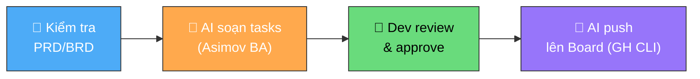

# Handbook Hướng dẫn quản lý dự án

**Người chịu trách nhiệm:** [PM / Tech Lead]
**Cập nhật lần cuối:** 2026-09-01
**Trạng thái:** Đang dùng

Dành cho mọi thành viên của Cyberk.
Đọc sách để nắm được phương pháp quản trị hiệu quả minh bạch của Cyberk.

---

## Quản lý dự án là gì?

Tại Cyberk quản lý dự án bao gồm 4 thành phần:

- **Scope:** Đề bài, tổng khối lượng công việc.
- **Deadline:** Deadline cho mỗi phần công việc đó.
- **Resource:** Nguồn lực, effort, số lượng nhân sự dành cho dự án đó.
- **Responsibility:** Trách nhiệm công việc, tinh thần hoàn thành công việc của từng cá nhân.

## Quản lý dự án tốt là:

- Scope rõ ràng, được cập nhật liên tục, và không bị out-dated
- Deadline là cố định, và hiếm khi bị trễ. Luôn bàn giao đúng hạn
- Resource hợp lý. Anh em hiếm khi phải overtime
- Team đoàn kết. Anh em luôn sẵn sàng hỗ trợ nhau để hoàn thành dự án

---

## Quản lý dự án thì cần quản lý:

### Epic
- Epic là một tính năng cụ thể hoặc một tập hợp công việc lớn của hệ thống.
- Đủ nhỏ sao cho như là một tính năng, hoặc một cập nhật chỉnh sửa, đủ lớn để 1 người hoặc 1 team < 5 người làm việc dưới 1 tuần.
- Luôn có 1 và chỉ 1 người chịu trách nhiệm cho 1 Epic tại 1 thời điểm.
- Có thêm Epic có nghĩa là cần mở rộng effort, thay đổi scope. Khi cần có thêm Epic hãy báo cáo ngay cho quản lý.
- Khi khách hàng có thêm Epic có nghĩa là có cơ hội mở rộng hợp đồng, cần giúp khách hàng làm rõ, tư vấn, và báo cáo cho quản lý để đàm phán hợp đồng.
- **Mọi Epic PHẢI có Feature ID tương ứng trong PRD/BRD** (`BR-XXX`, `FR-XXX`). Không có requirement → không có Epic.

### Milestone (Mốc bàn giao)
- Milestone là một mốc bàn giao công việc, thường là Weekly (hàng tuần) nếu như không có gì đặc biệt. Có thể đặt tên theo Tuần đó (Ví dụ: `2026-08-15`, `W33`) hoặc theo tên phiên bản bàn giao (Ví dụ: `Alpha`, `Beta`).

### Tasks
- Là đầu việc mà một người có thể hoàn thành trong dưới 4 giờ. Luôn làm tasks trong 1 ngày.
- **Task được tạo bởi AI, reviewed bởi Dev, push lên board bằng GH CLI** — không tạo tay trên GitHub UI.
- Mọi task PHẢI link Feature ID (`FR-XXX` / `BR-XXX`) từ PRD/BRD.

> 📖 **Hướng dẫn chi tiết cách tạo task:** xem [Dev Tasks Logs — Quy trình tạo task](../dev-tasks-logs/dev-tasks-logs-process.md)

### Bugs
- Là các issue của dự án. Cần được phát hiện càng sớm càng tốt.
- Mô tả đầy đủ, rõ ràng sao cho người đọc không cần hỏi lại cũng hiểu được vấn đề.
- Deadline luôn nằm trong Epics/Milestones, và Fix càng sớm càng tốt.
- Người chịu trách nhiệm cho Epic, thì sẽ chịu trách nhiệm cho bugs thuộc về Epic đó.

> 📖 **Hướng dẫn chi tiết cách tạo bug:** xem [QA Bugs Logs](../qa-bugs-logs/qa-bugs-logs-process.md)

### Board
- Là bảng tổng hợp của Tasks và Bugs, nơi thể hiện tổng quan của dự án. Luôn đảm bảo gọn gàng, rõ ràng.
- Board tốt là cả team nhìn vào và biết phải làm gì trong tuần. Dự án có đang trễ hạn hay không.

---

## Làm thế nào để quản lý dự án tốt?

### Về Tasks
- Luôn cập nhật task mới nhất lên board.
- Bỏ các tasks đã outdate.
- Task/Bugs mới được tạo luôn đầy đủ các thông tin: Title, Description, deadline, assignees, labels, Epics, Milestones.
- **Task PHẢI được tạo qua quy trình AI-driven:** PRD/BRD → AI soạn → Dev review → GH CLI push. Xem [quy trình chi tiết](../dev-tasks-logs/dev-tasks-logs-process.md).

### Về Bugs
- Mô tả đầy đủ, rõ ràng sao cho người đọc không cần hỏi lại cũng hiểu được vấn đề.
- Deadline luôn nằm trong Epics/Milestones, và Fix càng sớm càng tốt.
- Người chịu trách nhiệm cho Epic, thì sẽ chịu trách nhiệm cho bugs thuộc về Epic đó.

### Về Board
- Cả team nhìn vào và biết phải làm gì trong tuần.
- Mỗi người phải có một dashboard cá nhân, ví dụ như: "Tất cả các task/bugs của Đức (Đức's all Tasks/bugs)", "Sprint 33 - Công việc của team tuần thứ 33".
- 3 loại board cơ bản:
    - **Sprint board:** là các tasks, bugs cần được team hoàn thành trong tuần hiện tại.
    - **Bugs board:** là danh sách bugs đang tồn đọng của dự án.
    - **Personal board:** là dashboard của từng cá nhân, cho phép cá nhân tự nhìn thấy được effort của mình, và biết mình cần phải làm gì.
- 3 loại board nâng cao:
    - **Sprint Future board:** là các tasks, bugs cần được team hoàn thành trong tuần tiếp theo.
    - **Gantt chart:** là biểu đồ thể hiện tiến độ trực quan của dự án.
    - **Filter Boards:** là các board được filter theo từng Epic, từng Milestone, hoặc từng project để dễ dàng quản lý.

---

## Tạo Board chuẩn (GitHub Projects)

Mọi dự án tại Cyberk đều bắt buộc sử dụng **GitHub Projects** (Project V2) làm nguồn sự thật duy nhất.

### Quy tắc đặt tên Board (Board Naming Convention)
- **Các dự án phần mềm / sản phẩm**: Đặt theo định dạng `[project-name]-management`
  - *Ví dụ*: `koto-management`, `atlantis-management`, `relmo-management`.
- **Board dành cho bộ phận / phòng ban cụ thể**: Đặt tên theo đúng tên bộ phận
  - *Ví dụ*: `leader`, `media`, `design`, `dev`, `qa`.

### Các bước khởi tạo Board
1. Truy cập vào GitHub Organization `Cyberk-Official` → Chọn tab **Projects** → Nhấn **New project**.
2. Đặt tên Board theo chuẩn Quy tắc đặt tên ở trên (Ví dụ: `atlantis-management` hoặc `media`).
3. **Cấu hình các Field bắt buộc (Project Fields):**
   - **`Status`**: `Backlog` *(mặc định)*, `Todo`, `In Progress`, `Testing`, `Done`.
   - **`Assignees`**: Chọn chính xác GitHub ID của nhân sự (`anna-cyberk`, `anderson-cyberk`, `hungdn-cyberk`, `truonglx-cyberk`).
   - **`Labels`**: Nhãn phân loại (`operations`, `dev`, `design`, `qa`, `bug`).
   - **`Epic`**: Gắn đúng tên tính năng / Epic của dự án.
   - **`Milestone`**: BẮT BUỘC gắn mốc bàn giao (`YYYY-MM-DD`, `Alpha`, `Beta`...).
   - **`Week`**: Số tuần thực hiện trong năm (Ví dụ: `33`, `34`, `35`).
   - **`Start date` & `Target date`**: Ngày bắt đầu và hạn chót hoàn thành.
   - **`Estimate`**: Ước tính giờ công (tính theo giờ).

### Thiết lập 3 View chuẩn cho Board
- 📌 **View 1: Sprint Board** (Filter theo `Week = [Tuần hiện tại]` & Group theo `Status`).
- 🐞 **View 2: Bugs Board** (Filter theo `Labels = bug`).
- 👤 **View 3: Personal Board** (Mỗi member bắt buộc phải có một dashboard riêng cho cá nhân mình, ví dụ filter: `Assignees = anderson-cyberk` hoặc `Assignees = anna-cyberk`).

---

## Tạo Task chuẩn

Tại Cyberk, task được tạo qua quy trình **AI-driven, gắn với PRD/BRD:**



### Quy tắc cốt lõi
- **Mọi task PHẢI link Feature ID** (`FR-XXX` / `BR-XXX`) từ PRD/BRD
- **Task < 4 giờ** — nếu lớn hơn, breakdown tiếp
- **6 trường bắt buộc:** Assignees, Target date, Labels, Epic, Milestone, Start date
- **3 trường optional:** Week, Estimate, End date
- **Task mới tạo luôn ở Backlog**
- **Push bằng GH CLI** — không click tay trên GitHub UI

### Format nội dung Task (Body Markdown)

```markdown
## Mục tiêu
[Mô tả ngắn gọn kết quả cần đạt được trong 1-2 câu. Reference Feature ID]

## Checklist công việc
- [ ] Đầu việc 1
- [ ] Đầu việc 2
- [ ] Đầu việc 3

## Tài liệu / Lưu ý
> Feature: [FR-XXX] — [link to PRD]
> Branch: `feat/FR-XXX-short-desc`
```

> 📖 **Hướng dẫn đầy đủ:** xem [Dev Tasks Logs](../dev-tasks-logs/) — bao gồm quy trình, cẩm nang, mẫu tốt/tồi, và AI instruction.

---

## Những dấu hiệu khi quản lý dự án không tốt

### Dấu hiệu ở cấp team / dự án
- Bạn không rõ, mơ hồ, hoặc không biết mục tiêu cuối cùng của dự án là gì (Scope)? Tháng này phải bàn giao tính năng nào cho khách hàng, tại sao?
- Không rõ việc cần làm và chờ người quản lý giao việc cho bạn? hoặc bạn không biết mình cần phải làm gì.
- Bạn không biết đâu là task quan trọng nhất cần phải làm ngay trong hôm nay?
- Bạn không rõ rủi ro, tính năng nào có rủi ro gì cần lưu ý. Chỗ nào là điểm nóng cần phải giải quyết ngay?
- Bạn là "Tôn Ngộ Không" gánh team, trong khi những người còn lại là Trư Bát Giới, Sa Tăng.
- Bạn không có task nào, hoặc task của bạn chỉ có đủ đến hết tuần, và bạn không rõ mình cần làm gì về mặt dài hạn.
- Bạn được assign task-by-task thay vì theo một Epic cụ thể.
- Task tạo ra không có deadline, Epic, Milestones.
- Task của bạn treo từ tuần này qua tuần khác.
- Todo bị Abandoned, không có ai làm, hoặc có quá nhiều / quá ít Todo.
- **Task không link Feature ID** — không ai biết nó thuộc feature nào, không verify được scope.
- **Task được tạo manual** thay vì qua quy trình AI-driven — thiếu trường, không nhất quán.

### Dấu hiệu ở cấp cá nhân (Personal Board)
- **Quá nhiều Todo (> 10 tasks)** — Board thành danh sách mong ước, không phải kế hoạch. Developer bị choáng ngợp, không biết bắt đầu từ đâu.
- **Quá ít Todo (0–1 tasks)** — Developer đang reactive, chờ ai đó giao việc. Thiếu chủ động review Epic và tự kéo task.
- **In Progress > 3 tasks cùng lúc** — Multitasking giả. Context switching giết năng suất. Thực tế không task nào được tập trung.
- **Task treo `In Progress` > 2 ngày liên tục** — Task quá lớn cần breakdown, hoặc bị block mà không báo.
- **Không có task `Done` trong cả tuần** — Hoặc không cập nhật board, hoặc task quá lớn chưa xong. Cả hai đều là vấn đề.
- **Board không được mở đầu ngày** — Developer code theo quán tính, không theo ưu tiên. Đây là dấu hiệu nghiêm trọng nhất.

> 📖 **Xem chi tiết:** [Dev Daily — Quản lý công việc cá nhân](../../03-team/dev-daily/dev-daily-process.md) — quy trình hàng ngày, ma trận ưu tiên, và cách tự kiểm tra board cá nhân.

---

## Liên kết

- [Dev Tasks Logs — Quy trình tạo task (AI-driven)](../dev-tasks-logs/dev-tasks-logs-process.md)
- [Dev Tasks Logs — Cẩm nang cho Dev](../dev-tasks-logs/dev-tasks-logs-handbook.md)
- [Dev Tasks Logs — Mẫu task tốt/tồi](../dev-tasks-logs/dev-tasks-logs-example.md)
- [QA Bugs Logs — Quy trình tạo bug](../qa-bugs-logs/qa-bugs-logs-process.md)
- [Daily Report — Báo cáo hàng ngày](../dev-daily-report/daily-report-process.md)
- [Dev Daily — Quản lý công việc cá nhân](../../03-team/dev-daily/dev-daily-process.md)
- [PRD/BRD Templates](../../../bootstrap/skills/write-prd/templates/)
- [Git & Branch Policy](../../../policy/dev-policy/source-code-and-git.md)

