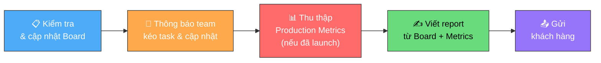

# Viết Daily Report

**Người chịu trách nhiệm:** [Tech Lead / PM]
**Trạng thái:** Nháp

## Tại sao có trang này

Khách hàng quốc tế cần biết dự án đang ở đâu mỗi ngày. Daily report không chỉ là "báo cáo" — mà là công cụ để **phát hiện risk sớm, giữ tiến độ, và xây dựng niềm tin** với khách hàng. Report mơ hồ = khách lo lắng. Report cụ thể = khách yên tâm.

## Khi nào áp dụng (Trigger)

Mỗi ngày làm việc, trước khi kết thúc ngày.

---

## Luồng chính

---

## Vai trò & trách nhiệm

| Vai trò | Chịu trách nhiệm gì |
|---------|---------------------|
| **Dev** | Kéo task, cập nhật trạng thái trên board đúng thực tế |
| **Tech Lead** | Kiểm tra board, đảm bảo mọi người đã cập nhật, review report |
| **PM / Leader** | Viết report từ board, gửi khách hàng, escalate risk nếu cần. **Nếu dự án đã launch: cung cấp Production Metrics** (Users, Revenue, Bugs) cho dev điền vào report |

---

## Các bước

| # | Việc | Ai | Đầu ra | Timeline |
|---|------|----|--------|----------|
| 1 | **Kiểm tra & cập nhật Board:** rà soát task trên board, đảm bảo trạng thái phản ánh đúng thực tế (To Do / In Progress / Done) | Tech Lead / PM | Board chính xác | Trước giờ viết report |
| 2 | **Thông báo team kéo task:** nhắn team cập nhật trạng thái task, kéo về Done nếu đã xong, ghi note nếu bị block | Tech Lead | Mọi dev đã cập nhật board | 30 phút trước deadline report |
| 3 | **Thu thập Production Metrics** *(nếu đã launch)*: lấy snapshot Users (active/total/new), Business KPIs (revenue/transactions), Production Bugs (open/fixed/total) từ analytics tools | PM / Leader | Metrics sẵn sàng cho report | Trước giờ viết report |
| 4 | **Viết report từ Board + Metrics:** dựa trên board đã cập nhật, viết: Progress % → 📊 Production Metrics (nếu có) → What I did → Next steps (có ETA) → Risks (có action plan) | PM / Tech Lead | Report hoàn chỉnh | Cuối ngày |
| 5 | **Gửi khách hàng:** gửi report qua kênh đã quy định (email / Telegram) | PM | Khách hàng nhận report | Cuối ngày |

---

## Quy tắc cứng

| Quy tắc | Lý do |
|---------|-------|
| **Next-step PHẢI có ETA** — không chấp nhận "tiếp tục code" | Không có ETA = không có cam kết = PM không biết report gì cho khách |
| **Mỗi blocker PHẢI có action plan** — không chỉ liệt kê vấn đề | "Có vấn đề performance" không giúp ai. "Response > 3s, đang profiling" mới có ích |
| **Risk hôm trước chưa resolved → PHẢI nêu lại** và highlight | Risk biến mất khỏi report không có nghĩa là biến mất khỏi dự án |
| **Risk phụ thuộc khách hàng → ghi rõ action của khách** | VD: "Đang chờ Jon cung cấp Google Dev account" — PM cần biết để follow up |
| **Viết cụ thể, không viết chung chung** | "Worked on frontend" không truy vết được. "Completed dashboard UI with dark mode" mới có giá trị |
| **Post-Launch: Production Metrics PHẢI có số + nguồn** | "Users tăng" vô nghĩa. "1,250 active / 5,000 total (Firebase)" mới có giá trị |
| **Biến động bất thường → PHẢI cảnh báo** | Users giảm >20%, revenue drop, critical bugs tăng → `⚠️ WARNING` + ghi vào Risks |

---

## Ngoại lệ & Escalation

| Tình huống | Hành động |
|-----------|----------|
| Risk **CRITICAL** — ảnh hưởng deadline dự án | Báo ngay cho Tech Lead + PM, không chờ đến cuối ngày |
| Blocker kéo dài **> 2 ngày** mà chưa resolved | Highlight đỏ trong report. PM escalate lên khách hàng |
| Không liên lạc được với khách hàng để unblock | Ghi rõ trong report: "Không thể liên lạc [Tên], ảnh hưởng [gì]" |

---

## Checklist mỗi ngày

- [ ] Project Progress: có %, có ngày dự kiến, có số ngày còn lại
- [ ] Production Metrics *(nếu đã launch)*: có Users, Business KPIs, Bugs — đều có số + nguồn data
- [ ] Production Metrics: biến động bất thường → có `⚠️ WARNING` + ghi vào Risks
- [ ] What I did: liệt kê cụ thể, không generic
- [ ] Risk hôm trước resolved → chuyển vào "What I did"
- [ ] Next steps: mỗi task có ETA
- [ ] Risks: mỗi cái có severity + action plan
- [ ] Risk hôm trước chưa resolved → nêu lại + highlight
- [ ] Gửi report đúng giờ

---

## Liên kết

- [Cẩm nang Daily Report](daily-report-handbook.md) — Cách nghĩ khi viết từng mục
- [Mẫu Daily Report](daily-report-example.md) — Template copy-paste + ví dụ tốt/tồi
