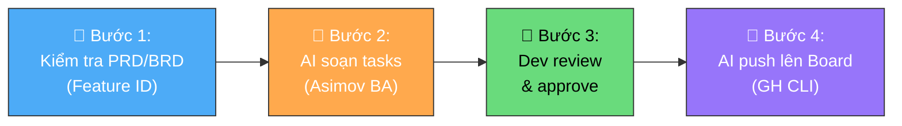
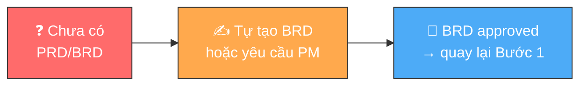

# Tạo Task trên GitHub Projects (AI-Driven)

**Người chịu trách nhiệm:** [Tech Lead]
**Cập nhật lần cuối:** 2026-09-01
**Trạng thái:** Nháp

## Tại sao có trang này

Task tạo tay, không gắn requirement → task "trôi nổi", không ai biết nó thuộc feature nào, không verify được scope, không trace được khi có vấn đề. Quy trình này đảm bảo: **mỗi task đều sinh ra từ PRD/BRD**, được AI phân tích trước khi tạo, và được push lên board bằng automation — không manual.

## Khi nào áp dụng (Trigger)

- Khi nhận Epic/Feature mới cần breakdown thành tasks
- Khi phát hiện việc cần làm trong quá trình code (phải tạo/cập nhật BRD trước)
- Khi cần bổ sung task cho sprint hiện tại hoặc sprint tới

---

## Luồng chính

**Luồng phụ — khi chưa có PRD/BRD:**

---

## Vai trò & trách nhiệm

| Vai trò | Chịu trách nhiệm gì |
|---------|---------------------|
| **Dev** | Kiểm tra PRD/BRD có Feature ID. Prompt AI để breakdown. Review output. Approve trước khi push |
| **AI (Asimov)** | Phân tích Feature → breakdown thành tasks. Sinh title, body, branch name, estimates. Push lên board qua GH CLI |
| **Tech Lead** | Đảm bảo PRD/BRD tồn tại và cập nhật. Review task quality khi cần. Approve vào Sprint |
| **PM/PL** | Duy trì PRD/BRD. Bổ sung requirement khi Dev yêu cầu. Monitor board tổng thể |

---

## Các bước

| # | Việc làm | Ai làm | Đầu ra | Timeline |
|---|----------|--------|--------|----------|
| 1 | **Kiểm tra PRD/BRD:** Xác nhận Feature ID (`BR-XXX`, `FR-XXX`) tồn tại trong tài liệu PRD/BRD của dự án. Nếu chưa có → tự tạo BRD (dùng [write-prd skill](../../../bootstrap/skills/write-prd/skill.md)) hoặc yêu cầu PM/PL bổ sung | Dev | PRD/BRD có Feature ID rõ ràng, đã approved | Trước khi tạo task |
| 2 | **AI soạn tasks:** Prompt AI với Feature ID + mô tả từ PRD. AI phân tích qua quy trình BA của Asimov: breakdown feature → danh sách tasks, mỗi task có title, body, branch name, labels, estimate | AI + Dev | Draft task list (xem [AI Instruction](dev-tasks-logs-ai-instruction/dev-tasks-instruction.md)) | Ngay sau khi có Feature ID |
| 3 | **Dev review & approve:** Kiểm tra output AI: scope đúng FR không, estimate < 4h không, branch name đúng convention không, 6 trường bắt buộc đủ không. Iterate lại nếu sai | Dev | Task list approved, sẵn sàng push | Ngay sau khi AI output |
| 4 | **AI push lên Board:** Dùng GH CLI (`gh issue create` + `gh project item-add`) để tạo issues và thêm vào GitHub Projects. Status mặc định = **Backlog** | AI | Tasks xuất hiện trên board | Ngay sau khi Dev approve |

---

## Quy tắc cứng (không được vi phạm) + lý do

| Quy tắc | Lý do |
|---------|-------|
| **Task PHẢI link Feature ID** (`BR-XXX` hoặc `FR-XXX`) từ PRD/BRD | Task "trôi nổi" không ai biết nó thuộc feature nào → không verify scope, không trace lỗi |
| **Không có PRD/BRD → KHÔNG tạo task** (phải tạo/bổ sung PRD trước) | Bắt đầu code mà không có spec = code sai direction. Tạo BRD 30 phút, sửa code sai 3 ngày |
| **Task được AI tạo, Dev review** — không skip review | AI có thể hallucinate scope, miss edge case. Dev là người chịu trách nhiệm cuối cùng |
| **Push lên board bằng GH CLI/automation** — không click tay trên UI | Manual = chậm, dễ thiếu trường, không reproducible. Automation = đồng nhất, audit trail |
| **Task PHẢI < 4 giờ** — nếu lớn hơn, breakdown tiếp | Task quá to → khó ước lượng, dễ trễ, khó theo dõi tiến độ |
| **6 trường bắt buộc PHẢI đủ** khi tạo task | Thiếu trường = board lộn xộn, không filter được, Sprint Board vô nghĩa |
| **Mỗi task có đúng 1 Assignee** | 2 người = không ai chịu trách nhiệm |
| **Branch name PHẢI follow convention** (`feat/FR-XXX-short-desc`, `fix/FR-XXX-short-desc`) | Nhìn branch biết ngay task nào, trace ngược về Feature ID. Xem [Git Policy](../../../policy/dev-policy/source-code-and-git.md) |
| **Task mới tạo luôn ở Backlog** | Tránh task nhảy thẳng vào In Progress mà chưa qua review |

---

## Ngoại lệ & Escalation

| Tình huống | Hành động |
|-----------|----------|
| Feature quá mơ hồ trong PRD, AI không breakdown được | Yêu cầu PM/PL làm rõ PRD. Nếu 30 phút chưa có câu trả lời → escalate lên Tech Lead |
| Phát sinh việc ngoài PRD (hotfix, technical debt) | Vẫn phải tạo BRD entry (có thể minimal 2-3 dòng). Gắn label `tech-debt` hoặc `hotfix`. Báo PM |
| AI output sai scope hoặc không hợp lý | Iterate prompt: bổ sung context, ràng buộc, hoặc ví dụ. Nếu 3 lần AI vẫn sai → Dev tự viết task, ghi note "AI-assisted" |
| GH CLI lỗi hoặc không push được | Kiểm tra auth (`gh auth status`). Nếu lỗi hệ thống → tạm tạo manual, log issue cho DevOps |

---

## Checklist tạo task

### Trước khi prompt AI
- [ ] Feature ID (`BR-XXX` hoặc `FR-XXX`) đã tồn tại trong PRD/BRD
- [ ] Hiểu rõ scope, acceptance criteria từ PRD

### Sau khi AI output — Review checklist
- [ ] Mỗi task < 4 giờ — nếu lớn hơn yêu cầu AI breakdown tiếp
- [ ] Title ngắn gọn, bắt đầu bằng `[FR-XXX]` + hành động
- [ ] Body có **Mục tiêu** (1-2 câu, reference Feature ID)
- [ ] Body có **Checklist công việc** (≥ 1 item)
- [ ] Branch name đúng convention (`feat/FR-XXX-short-desc`)
- [ ] Đã gán **Assignee** (chính xác GitHub ID)
- [ ] Đã gán **Target date** (YYYY-MM-DD)
- [ ] Đã gán **Label** (dev, design, qa, bug, operations)
- [ ] Đã gán **Epic**
- [ ] Đã gán **Milestone**
- [ ] Đã gán **Week**
- [ ] Scope không vượt quá FR description trong PRD

### Sau khi push lên board
- [ ] Task xuất hiện trên GitHub Projects
- [ ] Status = **Backlog**
- [ ] Mọi field hiển thị đúng trên board

---

## Liên kết

- [Cẩm nang tạo Task cho Dev](dev-tasks-logs-handbook.md) — Cách prompt AI, review output, xử lý edge case
- [Mẫu Task tốt/tồi](dev-tasks-logs-example.md) — Template copy-paste + GH CLI commands
- [AI Instruction](dev-tasks-logs-ai-instruction/dev-tasks-instruction.md) — Quy tắc cho AI breakdown FR → tasks
- [Board Handbook — Tổng quan quản lý dự án](../board-handbook/handbook.md)
- [PRD/BRD Templates](../../../bootstrap/skills/write-prd/templates/) — Template viết PRD/BRD
- [Asimov Spec-Driven Approach](../../../asimov/asimov-dev-pipeline/asimov-approach-en.md)
- [Git & Branch Policy](../../../policy/dev-policy/source-code-and-git.md) — Branch naming convention
- [Daily Report](../dev-daily-report/daily-report-process.md) — Task trên board → report cho khách hàng
