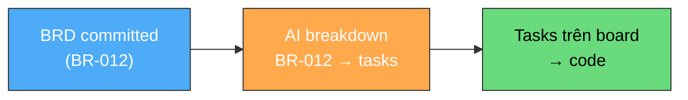

# Viết BRD — Cẩm nang cho Dev

**Người chịu trách nhiệm:** [Tech Lead]
**Cập nhật lần cuối:** 2026-09-01
**Trạng thái:** Nháp

Bạn đang code, phát hiện thiếu một workflow. Hoặc khách hàng vừa gửi yêu cầu mới qua Telegram. Trước đây bạn sẽ nói "anh PM ơi, viết tài liệu giúp em" rồi chờ. Giờ bạn **tự viết BRD trong 15-30 phút**, commit PR, thông báo team, AI breakdown thành tasks, lên board. Không chờ ai.

---

## Tại sao Dev nên viết BRD, không phải chỉ PM?

**1. Bạn hiểu vấn đề rõ nhất.** Bạn đang code, bạn phát hiện thiếu workflow — bạn biết chính xác cần gì. PM phải hỏi lại bạn rồi mới viết. Tại sao không viết thẳng?

**2. Tiết kiệm thời gian cho cả team.** Cách cũ: bạn báo PM → PM hỏi lại → PM viết → PM gửi review → bạn mới code. Mất 1-2 ngày. Cách mới: bạn viết 15 phút → commit PR → thông báo team → code. Mất 1 giờ.

**3. Context Engineering.** BRD là **context chất lượng cao** — cho AI, cho đồng đội, cho chính bạn trong tương lai. Viết BRD tốt = AI breakdown chính xác = code đúng direction = ít sửa lại. Đây là phần quan trọng nhất trong quy trình làm việc với AI.

**4. Ai cũng đóng góp được.** Thay vì PM/PL luôn là người viết tài liệu, quy trình này cho phép **bất kỳ ai trong team** tự document phần việc của mình. Handbook sống vì mọi người đều đóng góp.

---

## BRD tối thiểu cần gì? (Chỉ 3 section)

Bạn không cần viết BRD 10 trang. Cho feature phát sinh, **3 section là đủ:**

### 1. Executive Summary — "Vấn đề gì, cần gì" (3-5 câu)

Trả lời 3 câu hỏi: Vấn đề gì? Giải pháp gì? Ai được lợi?

**✅ Cách tốt:**

```
## 1. Executive Summary

### Problem
Khi user tạo portfolio mới, hệ thống không tự động sync transaction history 
từ blockchain. User phải nhập tay từng transaction — mất thời gian, dễ sai.

### Solution  
Tự động fetch transaction history từ blockchain API khi user thêm wallet address.
Background job chạy mỗi 5 phút để sync transaction mới.

### Impact
Giảm thời gian onboarding từ 30 phút → 2 phút. Giảm support ticket ~40%.
```

**❌ Cách tồi:**

```
## 1. Executive Summary
Cần thêm tính năng sync transaction.
```

Tồi vì: 1 câu, không ai hiểu vấn đề gì, giải pháp gì, impact ra sao.

---

### 2. Business Requirement (BR-XXX) — "Hệ thống cần làm gì"

Mỗi BR là **một nhu cầu cụ thể**. Có 3 phần: Statement, Rationale, Acceptance Criteria.

**✅ Cách tốt:**

```
### BR-012: Auto-sync Transaction History

**Requirement Statement:**
> Hệ thống **MUST** tự động fetch transaction history từ blockchain 
> khi user thêm wallet address, để user không phải nhập tay.

**Business Rationale:**
User mới mất 30 phút nhập tay transaction. 60% bỏ ngang ở bước này.
Auto-sync giải quyết friction lớn nhất trong onboarding flow.

**Acceptance Criteria:**
- [ ] Khi user thêm wallet address, hệ thống fetch toàn bộ history trong vòng 30 giây
- [ ] Background job sync transaction mới mỗi 5 phút
- [ ] Hiển thị trạng thái sync cho user (syncing / synced / error)
- [ ] Nếu blockchain API timeout → retry 3 lần, sau đó show error + cho user nhập tay
```

**❌ Cách tồi:**

```
### BR-012: Transaction Sync

**Requirement:** Sync transaction.
**Criteria:** Phải hoạt động tốt.
```

Tồi vì: "Hoạt động tốt" nghĩa là gì? Không có deadline, không có con số, không verify được.

---

### 3. In Scope / Out of Scope — "Làm gì, KHÔNG làm gì"

Phần này **quan trọng ngang In Scope**. Nó ngăn scope creep và quản lý kỳ vọng.

**✅ Cách tốt:**

```
**In Scope:**
- Auto-sync transaction từ Ethereum và Polygon
- Background job mỗi 5 phút
- Error handling + retry logic

**Out of Scope (sẽ làm sau):**
- Support thêm blockchain (Solana, BSC) — Phase 2
- Transaction analytics dashboard — khác Epic
- Manual transaction edit — chưa cần, xem feedback sau 1 tháng
```

**❌ Cách tồi:**

```
**In Scope:** Sync transaction
**Out of Scope:** (trống)
```

Tồi vì: Không có Out of Scope = ai cũng có quyền thêm yêu cầu. "À sync luôn Solana đi", "À thêm dashboard đi" — scope phình vô tận.

---

## Viết thêm nếu cần (optional)

3 section trên là **tối thiểu**. Nếu feature phức tạp, thêm:

| Section | Khi nào cần |
|---------|-------------|
| **Business Rules** | Có quy tắc cứng (VD: "chỉ sync transaction > $1") |
| **Non-Functional Requirements** | Có yêu cầu performance, security cụ thể |
| **Risks** | Feature có rủi ro kỹ thuật hoặc business rõ ràng |

Xem [BRD Template đầy đủ](../../../bootstrap/skills/write-prd/templates/brd-template.md) cho các section này.

---

## Dùng AI hỗ trợ viết BRD

Bạn không cần viết từ đầu. Prompt AI với context:

```
Tôi phát hiện hệ thống thiếu tính năng auto-sync transaction history 
khi user thêm wallet. Hiện tại user phải nhập tay, mất 30 phút, 
60% bỏ ngang.

Giúp tôi viết BRD draft với 3 section: Executive Summary, 
Business Requirement (BR-XXX) với acceptance criteria, 
và In Scope / Out of Scope.

Tech: Node.js, PostgreSQL, blockchain RPC API.
```

AI output draft → bạn **review, sửa cho đúng thực tế** → commit vào repo → thông báo team.

Xem [AI Instruction](dev-write-brd-ai-instruction/dev-write-brd-instruction.md) để biết AI cần input gì và output format.

> **Lưu ý:** AI viết BRD, bạn review. Không phải AI viết, bạn copy-paste. Bạn hiểu vấn đề hơn AI — bổ sung context, sửa acceptance criteria cho sát thực tế.

---

## Sau khi commit BRD — làm gì tiếp?

1. BRD committed → bạn có **Feature ID** (`BR-XXX`)
2. Dùng Feature ID → [tạo tasks](../dev-tasks-logs/dev-tasks-logs-process.md) (AI breakdown → push lên board)
3. Bắt đầu code — mỗi task đều trace ngược về BRD

> **💡 Tip thực tế:** Bạn có thể **commit BRD + code + tạo tasks lên board cùng 1 lúc** trong cùng 1 PR. Trong thực tế, rất phổ biến trường hợp "đang code phát hiện thiếu 1 flow, bổ sung luôn" — thay vì dừng lại commit BRD riêng, chờ review, rồi mới code, bạn viết BRD + code fix + tạo tasks trong cùng 1 session. Như vậy **giảm công cho Dev rất nhiều**, trong khi vẫn đảm bảo tasks trên board, code, specs, docs đều **đồng bộ với nhau** trong cùng 1 PR.



---

## Tóm lại

| Câu hỏi | Trả lời |
|---------|---------|
| Khi nào viết BRD? | Khi phát sinh yêu cầu mới mà chưa có trong PRD |
| Viết bao nhiêu? | Tối thiểu 3 section: Summary + BR + Scope |
| Mất bao lâu? | 15-30 phút (có AI hỗ trợ) |
| Ai review? | Dev Lead — tự nhiên qua PR code review |
| Sau khi commit? | Feature ID → AI tạo tasks → lên board |

---

## Liên kết

- [Quy trình viết BRD](dev-write-brd-process.md) — Flowchart, bảng bước, quy tắc cứng
- [Mẫu BRD](dev-write-brd-example.md) — BRD thật cho feature phát sinh
- [BRD Template gốc](../../../bootstrap/skills/write-prd/templates/brd-template.md) — Template đầy đủ
- [Dev Tasks Logs](../dev-tasks-logs/dev-tasks-logs-process.md) — BRD → tasks
- [Board Handbook](../board-handbook/board-handbook.md) — Tổng quan quản lý dự án
