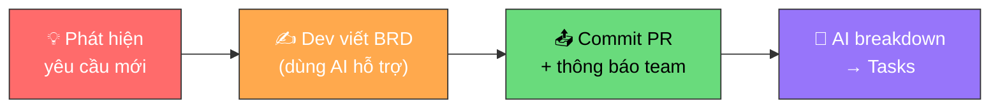

# Viết BRD khi phát sinh yêu cầu mới

**Người chịu trách nhiệm:** [Tech Lead]
**Cập nhật lần cuối:** 2026-09-01
**Trạng thái:** Nháp

## Tại sao có trang này

Trước khi dự án bắt đầu, PRD/BRD cần sẵn sàng. Nhưng trong thực tế, **yêu cầu mới phát sinh liên tục** — đang code mới phát hiện thiếu một workflow, khách hàng chủ động đưa thêm yêu cầu, hoặc team phát hiện edge case chưa ai nghĩ tới.

Cách cũ: dừng code → họp → chờ PM viết tài liệu → mới code tiếp. **Chậm, mất nhịp, tốn thời gian.**

Cách mới: **Dev tự viết BRD** cho phần việc phát sinh → Dev Lead/PM duyệt → AI breakdown thành tasks → lên board. **Nhanh, có trace, ai cũng đóng góp được.**

Đây cũng là một phần quan trọng của **Context Engineering** — bạn đang tạo context chất lượng cao cho AI và cho đồng đội. Viết BRD tốt = AI hiểu đúng = code đúng = ít sửa.

## Khi nào áp dụng (Trigger)

- Đang code, phát hiện **thiếu workflow / tính năng** chưa có trong PRD
- Khách hàng **đưa thêm yêu cầu** mới ngoài scope ban đầu
- Team phát hiện **edge case** hoặc **technical requirement** chưa được document
- Cần tạo task mới nhưng **không có Feature ID** → phải viết BRD trước

---

## Luồng chính

---

## Vai trò & trách nhiệm

| Vai trò | Chịu trách nhiệm gì |
|---------|---------------------|
| **Dev** | Phát hiện yêu cầu mới, viết BRD draft (có AI hỗ trợ), commit PR, thông báo team |
| **Dev Lead** | Review BRD trong PR (code review thông thường). Đảm bảo scope hợp lý, không conflict |
| **PM** | Nắm requirement mới qua thông báo team. Đánh giá impact hợp đồng nếu từ khách |

---

## Các bước

| # | Việc làm | Ai | Đầu ra | Timeline |
|---|----------|----|--------|----------|
| 1 | **Phát hiện & ghi nhận:** Nhận ra yêu cầu mới trong quá trình code hoặc từ khách hàng. Ghi note ngắn: "Thiếu gì, tại sao cần" | Dev | Note mô tả vấn đề | Ngay khi phát hiện |
| 2 | **Viết BRD:** Dùng AI + [BRD template](dev-write-brd-ai-instruction/dev-write-brd-instruction.md), viết **tối thiểu 3 section**: Executive Summary, Business Requirement (BR-XXX) với acceptance criteria, và In Scope / Out of Scope | Dev | File BRD trong repo (`docs/`) | 15-30 phút |
| 3 | **Commit PR + thông báo team:** Commit BRD vào repo, tạo PR. Thông báo lên group team để cả team nắm được yêu cầu mới. Dev Lead sẽ review BRD trong quá trình code review PR thông thường | Dev | PR + team đã nắm | Ngay sau khi viết xong |
| 4 | **Tạo tasks từ BRD:** Dùng quy trình [Dev Tasks Logs](../dev-tasks-logs/dev-tasks-logs-process.md) — prompt AI với Feature ID mới → breakdown → push lên board | Dev + AI | Tasks trên board | Ngay sau khi commit |

---

## Quy tắc cứng (không được vi phạm) + lý do

| Quy tắc | Lý do |
|---------|-------|
| **Dev PHẢI viết BRD trước khi tạo task** cho yêu cầu mới | Task không có BRD = task trôi nổi. Không ai biết scope, không AI nào breakdown chính xác được |
| **BRD tối thiểu 3 section:** Executive Summary + BR-XXX + Scope | Ít hơn 3 section = chưa đủ context. Nhiều hơn = viết sau khi cần |
| **BRD phải nằm trong repo** (commit, PR) — không gửi qua chat | Chat biến mất. Repo có history. AI đọc được file trong repo, không đọc được tin nhắn Telegram |
| **Thông báo team** khi có BRD mới | Cả team cần nắm scope mới. Dev Lead review tự nhiên qua PR |
| **Mỗi BR có acceptance criteria rõ ràng** | Không có criteria = không biết khi nào "xong". AI không breakdown được nếu criteria mơ hồ |

---

## Ngoại lệ & Escalation

| Tình huống | Hành động |
|-----------|----------|
| Hotfix khẩn cấp, không kịp viết BRD đầy đủ | Viết BRD minimal (3 dòng: vấn đề gì, fix gì, impact) → code → bổ sung BRD sau trong 24h |
| Khách hàng thêm yêu cầu lớn (thay đổi scope hợp đồng) | Báo PM ngay. PM đánh giá trước khi viết BRD. Có thể cần đàm phán hợp đồng |
| Dev Lead không đồng ý scope | Discuss. Nếu không thống nhất → escalate lên PM/PL |
| Không biết yêu cầu thuộc BR mới hay BR cũ | Hỏi Dev Lead. Có thể chỉ cần update BR hiện tại thay vì tạo BR mới |

---

## Checklist viết BRD

- [ ] Có **Executive Summary** — vấn đề gì, giải pháp gì, tại sao cần (3-5 câu)
- [ ] Có ít nhất **1 Business Requirement** (BR-XXX) với:
  - [ ] Requirement Statement (hệ thống MUST/SHOULD gì)
  - [ ] Business Rationale (tại sao cần)
  - [ ] Acceptance Criteria (khi nào "xong")
- [ ] Có **In Scope / Out of Scope** — rõ ràng cái gì LÀM, cái gì KHÔNG
- [ ] File nằm trong repo (không phải Google Docs hay Telegram)
- [ ] Đã commit PR + thông báo team

---

## Liên kết

- [Cẩm nang viết BRD cho Dev](dev-write-brd-handbook.md) — Cách viết từng section, mẫu tốt/tồi
- [Mẫu BRD](dev-write-brd-example.md) — BRD thật cho feature phát sinh
- [BRD Template gốc](../../../bootstrap/skills/write-prd/templates/brd-template.md) — Template đầy đủ
- [Dev Tasks Logs](../dev-tasks-logs/dev-tasks-logs-process.md) — Sau khi có BRD → tạo task
- [Board Handbook](../board-handbook/board-handbook.md) — Tổng quan quản lý dự án
