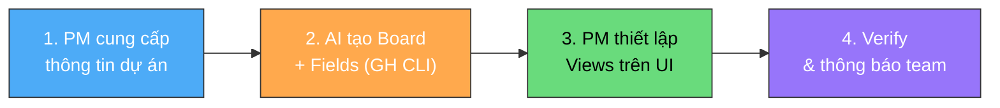

# Khởi tạo Board dự án trên GitHub Projects

**Người chịu trách nhiệm:** [PM / Tech Lead]
**Cập nhật lần cuối:** 2026-09-01
**Trạng thái:** Nháp

## Tại sao có trang này

Board là bản mô phỏng trạng thái thực tế của dự án. Sếp không ngồi cạnh dev cả ngày — nhưng mở board ra, **dưới 10 giây phải biết:** tuần này team đang ở đâu, có ai bị kẹt không, có task nào trễ hạn không. Nếu phải hỏi thêm mới hiểu — board đã thất bại.

Board tệ — thiếu trường, thiếu view — khiến bức tranh bị mờ. Trang này đảm bảo mọi board đều sẵn sàng từ ngày đầu.

## Khi nào áp dụng (Trigger)

- Ngay sau khi [Internal Planning](../pl-planning/planning-process.md) hoàn tất — **trước khi tạo task đầu tiên**.
- Khi có dự án mới được ký hợp đồng.
- Khi bộ phận / phòng ban cần board quản lý riêng.

---

## Luồng chính

---

## Vai trò & trách nhiệm

| Vai trò | Chịu trách nhiệm gì |
|---------|---------------------|
| **PM / Tech Lead** | Cung cấp input (tên dự án, epics, milestones, members). Review board. Thiết lập views. Thông báo team |
| **AI** | Tạo project + custom fields bằng GH CLI. Xem [AI Instruction](./board-create-ai-instruction/board-create-instruction.md) |
| **Team members** | Mở board, kiểm tra Personal Board view, báo lại nếu lỗi |

---

## Các bước

| # | Việc làm | Ai làm | Đầu ra |
|---|----------|--------|--------|
| 1 | **Chuẩn bị input:** Tên dự án, danh sách Epic, Milestones, GitHub ID members | PM/TL | Input sẵn sàng |
| 2 | **Prompt AI tạo board:** Cung cấp input → AI chạy GH CLI tạo project + 4 custom fields (Epic, Milestone, Week, Estimate) | AI + PM | Project + 8 fields sẵn sàng |
| 3 | **Thiết lập 3 Views trên GitHub UI:** Sprint Board, Bugs Board, Personal Board cho mỗi member | PM/TL | 3 views hoạt động |
| 4 | **Verify & thông báo:** Kiểm checklist → gửi link board qua Telegram | PM/TL | Team confirm |

> 📖 **Chi tiết GH CLI commands + quy tắc:** xem [Board Create — AI Instruction](./board-create-ai-instruction/board-create-instruction.md)

---

## Board cần có gì?

### 8 Fields bắt buộc

| Field | Loại | Có sẵn? | Ghi chú |
|-------|------|---------|---------|
| Status | Single select | ✅ | 5 giá trị: Backlog *(default)*, Todo, In Progress, Testing, Done |
| Assignees | Assignees | ✅ | GitHub ID chính xác. Mỗi task chỉ 1 assignee |
| Labels | Labels | ✅ | `operations`, `dev`, `design`, `qa`, `bug` |
| Start date | Date | ✅ | Ngày bắt đầu |
| Target date | Date | ✅ | Hạn chót |
| **Epic** | Single select | ❌ Tạo thêm | Tên tính năng — task không có Epic = task trôi nổi |
| **Milestone** | Single select | ❌ Tạo thêm | Mốc bàn giao: `W33`, `Alpha`, `Beta`... |
| **Week** | Number | ❌ Tạo thêm | Số tuần — Sprint Board filter theo field này |
| **Estimate** | Number | ❌ Tạo thêm | Giờ công — nhận ra Sprint overload sớm |

### 3 Views chuẩn

| View | Filter | Group by | Mục đích |
|------|--------|----------|---------|
| 📌 **Sprint Board** | `Week = [tuần hiện tại]` | Status | Tuần này team làm gì? |
| 🐞 **Bugs Board** | `Labels = bug` | Status | Nợ kỹ thuật đang ở đâu? |
| 👤 **Personal Board** | `Assignees = [github-id]` | Status | Tôi phải làm gì? |

---

## Quy tắc cứng + lý do

| Quy tắc | Lý do |
|---------|-------|
| **Tên board đúng convention** (`[project]-management` / tên bộ phận) | Tên lung tung → 6 tháng sau không ai biết board nào của dự án nào |
| **8 fields — không thiếu, không thêm** | Thiếu = không filter được. Thêm = team không điền |
| **Status chỉ 4 giá trị** | Thêm "Review"/"Blocked" → mỗi người hiểu khác nhau, task kẹt giữa cột |
| **Mỗi member có Personal Board view** | Không thấy task → phải hỏi Lead → mất tự chủ |
| **Board tạo TRƯỚC task đầu tiên** | Task trước board → thiếu fields, sửa sau mất gấp 3 |
| **Tạo trong Org, không repo cá nhân** | Board cá nhân = chỉ mình thấy. Board Org = cả team + COO |

---

## Checklist

### Input
- [ ] Tên dự án / bộ phận
- [ ] Danh sách Epic (tối thiểu 1)
- [ ] Danh sách Milestone
- [ ] GitHub ID của tất cả members

### Board
- [ ] Project đã tạo trong Org `Cyberk-Official`
- [ ] Tên đúng convention
- [ ] `gh project field-list` hiển thị 8 fields
- [ ] Status: 4 giá trị, default = Backlog

### Views
- [ ] Sprint Board: filter Week, group Status
- [ ] Bugs Board: filter Labels=bug
- [ ] Personal Board: mỗi member 1 view

### Thông báo
- [ ] Link board đã gửi qua Telegram
- [ ] Mỗi member confirm Personal Board

---

## Ngoại lệ & Escalation

| Tình huống | Hành động |
|-----------|----------|
| Không có quyền tạo Project trên Org | Liên hệ Anderson (Org owner) |
| Dự án nhỏ, 1–2 người | Vẫn cần Sprint + Bugs Board. Personal gộp Sprint nếu 1 người |
| Board bộ phận (design, qa...) | Giữ 8 fields. Epic thay bằng loại công việc |
| Kế thừa board cũ | Thiếu > 3 fields → tạo mới. Thiếu ≤ 3 → bổ sung |
| GH CLI lỗi | `gh auth refresh -s project`. Vẫn lỗi → tạo manual, log issue DevOps |

---

## Liên kết

- [AI Instruction — GH CLI commands chi tiết](./board-create-ai-instruction/board-create-instruction.md)
- [Cẩm nang Board — Triết lý & cách nghĩ](./board-create-handbook.md)
- [Board Handbook — Tổng quan quản lý dự án](../board-handbook/board-handbook.md)
- [Dev Tasks Logs — Tạo task (bước sau khi có board)](../dev-tasks-logs/dev-tasks-logs-process.md)
- [Internal Planning — Họp nội bộ (bước trước)](../pl-planning/planning-process.md)
