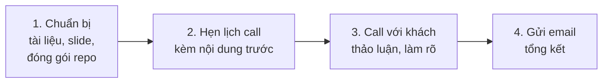

# Bàn giao sản phẩm cho khách hàng

**Người chịu trách nhiệm:** PL/PM dự án
**Cập nhật lần cuối:** 2026-08-25
**Trạng thái:** Nháp

## Tại sao có trang này

Bàn giao sản phẩm là khoảnh khắc quyết định ấn tượng cuối cùng với khách hàng — làm tốt thì mở ra cơ hội tiếp theo, làm tệ thì mất luôn relationship dù sản phẩm tốt đến mấy.

## Khi nào áp dụng (Trigger)

Khi dự án hoàn thành giai đoạn development — tất cả features trong scope đã được build và pass QA trên môi trường production.

---

## Luồng chính

---

## Vai trò & trách nhiệm

| Vai trò | Chịu trách nhiệm gì |
|---------|---------------------|
| Product Lead / PM | Điều phối toàn bộ, liên hệ client, chuẩn bị slide, gửi email tổng kết |
| Tech Lead | Chuẩn bị tài liệu kỹ thuật, đóng gói repository |
| Dev | Chuẩn bị môi trường production, demo tính năng |
| QA | Xác nhận không còn bug critical trước bàn giao |

---

## Các bước

| # | Việc làm | Ai làm | Đầu ra/Ghi chú |
|---|----------|--------|-----------------|
| 1 | **Chuẩn bị tài liệu, slide, đóng gói repository** — tài liệu handover, slide tổng kết dự án, repo sạch sẽ có README | PL + TL + Dev | Slide deck, handover doc, repo đóng gói |
| 2 | **Hẹn lịch call với khách hàng, kèm nội dung trước** — gửi trước ít nhất 1 ngày làm việc, đính kèm agenda để client biết sẽ thảo luận gì | PL | Lịch hẹn + agenda gửi client (xem [mẫu tin nhắn](./handover-example.md)) |
| 3 | **Call với khách hàng — thảo luận, làm rõ** — demo sản phẩm trên production, walk through tài liệu handover, giải thích maintenance policy, open talk | PL + TL + Dev | Buổi bàn giao hoàn tất, action items ghi nhận |
| 4 | **Gửi email tổng kết** — recap buổi họp, đính kèm toàn bộ tài liệu, liệt kê action items, nhắc lại maintenance timeline | PL | Email tổng kết (xem [mẫu email](./handover-example.md)) |

---

## Quy tắc cứng (không được vi phạm) + lý do

| Quy tắc | Lý do |
|---------|-------|
| Demo phải chạy trên production | Staging có thể khác thực tế, mất tin tưởng nếu gặp lỗi |
| Gửi nội dung/agenda cho client ít nhất 1 ngày trước buổi call | Gửi sát giờ tạo cảm giác hời hợt, client không kịp chuẩn bị |
| Không commit tính năng mới tại buổi bàn giao | Ghi nhận → estimate → báo lại sau. Commit tại chỗ = nợ miệng |
| Đã chạy thử toàn bộ flow demo ít nhất 1 lần trước buổi call | Không để bug xảy ra lúc demo trực tiếp |

---

## Checklist tự kiểm (nhúng ngay đây)

- [ ] Dự án đã pass QA, không còn bug critical
- [ ] Slide/tài liệu handover đã hoàn chỉnh
- [ ] Repository đã đóng gói (README, credentials, môi trường)
- [ ] Môi trường production đang hoạt động ổn định
- [ ] Đã chạy thử toàn bộ flow demo ít nhất 1 lần
- [ ] Đã gửi agenda + nội dung cho client trước buổi call
- [ ] Màn hình chia sẻ rõ ràng, âm thanh ổn (nếu online)

---

## Ngoại lệ & escalation

| Tình huống | Hành động |
|-----------|----------|
| Client yêu cầu thêm feature ngoài scope tại buổi bàn giao | Ghi nhận, không commit tại chỗ, báo lại COO |
| Phát hiện bug critical ngay trước buổi call | Hoãn buổi call, fix xong mới bàn giao |
| Client không phản hồi email tổng kết | Follow-up sau 3 ngày, escalate lên COO nếu vẫn im |

---

## Liên kết

- [Cẩm nang bàn giao — cách nghĩ từng giai đoạn](./handover-handbook.md)
- [Mẫu tin nhắn & email](./handover-example.md)
- [Bảng tra SLA bảo trì](./maintenance-policy-reference.md)
