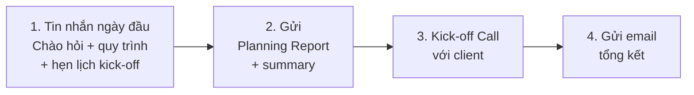

# Kick-off Meeting với Khách hàng

**Người chịu trách nhiệm:** PL/PM dự án
**Cập nhật lần cuối:** 2026-08-27
**Trạng thái:** Nháp

## Tại sao có trang này

Kick-off Meeting là buổi họp chính thức đầu tiên với khách hàng — ấn tượng đầu tiên quyết định cách client nhìn nhận team trong suốt dự án. Đây là lúc client thấy được: team này có chuyên nghiệp không, có hiểu dự án không, có đáng tin để giao tiền không.

Kick-off tốt: client yên tâm, biết mình sẽ làm việc với ai, hiểu team sẽ approach thế nào. Kick-off tệ: client lo lắng, mất tin tưởng trước khi sprint đầu tiên bắt đầu.

## Khi nào áp dụng (Trigger)

Ngay sau khi [Internal Planning](../pl-planning/planning-process.md) hoàn tất và có Planning Report — **cùng ngày hoặc ngày hôm sau**.

---

## Luồng chính

---

## Vai trò & trách nhiệm

| Vai trò | Chịu trách nhiệm gì |
|---------|---------------------|
| Product Lead / PM | Toàn bộ luồng: gửi tin nhắn, gửi plan, hẹn lịch, dẫn dắt buổi call, gửi email tổng kết |
| Tech Lead | Trình bày technical approach trong buổi call, trả lời câu hỏi kỹ thuật |
| Dev chính (nếu cần) | Giới thiệu bản thân, hỗ trợ trả lời câu hỏi chi tiết |

---

## Các bước

| # | Việc làm | Ai làm | Đầu ra | Timeline |
|---|----------|--------|--------|----------|
| 1 | **Tin nhắn ngày đầu tiên** — Tự giới thiệu PL, giải thích quy trình Cyberk (Step 1: Internal Planning hôm nay, Step 2: Kick-off Call), hỏi lịch kick-off call luôn. | PL | Tin nhắn đã gửi (Telegram/Email) + client biết lịch trình + đã hỏi availability cho kick-off | Sáng ngày planning — trước buổi họp nội bộ |
| 2 | **Gửi Planning Report cho client** — Đính kèm Planning Report (PDF) + tin nhắn tóm tắt: rủi ro chính (Risks), cách tiếp cận (Approach), chiến lược triển khai (Strategy). Không gửi file trơn — phải có summary bằng text. Gửi agenda kick-off call khi client đã chọn giờ. | PL | Planning Report + summary đã gửi + agenda kick-off (xem [mẫu](./kick-off-example.md)) | Ngay sau Internal Planning — trong ngày |
| 3 | **Kick-off Call với client** — Theo agenda: giới thiệu team → trình bày Planning chi tiết → thảo luận approach → Q&A mở. | PL + TL | Buổi call hoàn tất, action items ghi nhận | Trong vòng 2–3 ngày sau bước 2 |
| 4 | **Gửi email tổng kết** — Recap buổi họp, đính kèm slide/tài liệu, liệt kê action items, confirm next steps và ngày bắt đầu sprint 1. | PL | Email tổng kết (xem [mẫu email](./kick-off-example.md)) | Trong ngày sau buổi call |

---

## Quy tắc cứng (không được vi phạm) + lý do

| Quy tắc | Lý do |
|---------|-------|
| Phải gửi tin nhắn cho client **trước** khi họp nội bộ | Client biết team đang chủ động làm việc ngay từ ngày đầu — tạo niềm tin |
| Planning Report phải gửi **trong ngày** — không để qua đêm | Gửi nhanh = chuyên nghiệp. Để lâu = client nghĩ team chưa bắt đầu |
| Tin nhắn gửi plan phải kèm **summary text** (risks, approach, strategy) | File trơn không ai đọc ngay. Summary text giúp client nắm ý chính trong 30 giây |
| Gửi agenda cho client ít nhất **1 ngày** trước buổi call | Client cần chuẩn bị câu hỏi. Gửi sát giờ = hời hợt |
| Không commit thêm scope tại buổi kick-off call | Ghi nhận → estimate → báo lại sau. Commit tại chỗ = nợ miệng |
| TL phải tham gia buổi call | Client cần thấy người sẽ lead kỹ thuật — không chỉ PL |

---

## Checklist

### Bước 1 — Tin nhắn ngày đầu tiên
- [ ] Đã tự giới thiệu PL (tên, vai trò, cách liên hệ)
- [ ] Đã giải thích quy trình: Internal Planning → Kick-off Call
- [ ] Đã hỏi availability cho kick-off call
- [ ] Gửi trước buổi họp nội bộ

### Bước 2 — Gửi Planning Report
- [ ] Planning Report đã xuất PDF
- [ ] Summary đã viết: Risks, Approach, Strategy
- [ ] Đã gửi cho client kèm summary text (không gửi file trơn)
- [ ] Agenda kick-off đã gửi khi client chọn giờ
- [ ] Thành phần tham gia đã confirm cả 2 phía

### Bước 3 — Kick-off Call
- [ ] Slide giới thiệu team đã chuẩn bị (ảnh, tên, vai trò)
- [ ] Planning Report đã quen thuộc — PL nắm rõ từng mục để trình bày
- [ ] TL đã chuẩn bị trả lời câu hỏi kỹ thuật

### Bước 4 — Email tổng kết
- [ ] Email đã gửi trong ngày
- [ ] Action items liệt kê rõ ràng
- [ ] Next steps + ngày bắt đầu sprint 1 đã confirm

---

## Ngoại lệ & Escalation

| Tình huống | Hành động |
|-----------|----------|
| Client muốn call ngay, không chờ planning xong | Giải thích: "Team cần hoàn tất kế hoạch nội bộ trước để buổi call có chất lượng. Xin hẹn [ngày]." |
| Client thêm scope mới tại buổi call | Ghi nhận, không commit. Báo lại sau khi estimate: "Chúng tôi sẽ đánh giá impact và phản hồi trong 1–2 ngày." |
| Client không phản hồi agenda / không chọn giờ | Follow-up sau 1 ngày. Nếu vẫn im → escalate lên COO/Anderson. |
| TL không thể tham gia buổi call | Tìm dev chính thay thế. Không tổ chức buổi call mà không có người kỹ thuật. |

---

## Liên kết

- [Cách nghĩ khi kick-off — triết lý & mẫu tốt/tồi](./kick-off-handbook.md)
- [Mẫu agenda, tin nhắn & email](./kick-off-example.md)
- [Internal Planning (họp nội bộ)](../pl-planning/planning-process.md)
