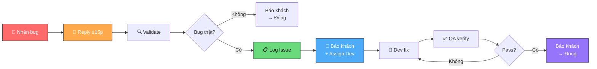

# Quy trình Xử lý Bugs

**Owner (DRI):** QA Lead
**Trạng thái:** Nháp

## Tại sao có trang này

Khách hàng báo lỗi qua nhiều kênh (Telegram, GitHub). Nếu không có quy trình chuẩn, mỗi QA xử lý một kiểu → khách nhận phản hồi không nhất quán → mất niềm tin. Quy trình này đảm bảo **mọi bug đều được tiếp nhận, theo dõi, và đóng** theo cùng một cách.

## Khi nào áp dụng (Trigger)

Mỗi khi nhận bug report từ khách hàng — bất kể kênh nào.

---

## Luồng chính

---

## Vai trò & trách nhiệm

| Vai trò | Chịu trách nhiệm |
|---------|-------------------|
| **QA** | Tiếp nhận, reply khách, validate, log bug, verify fix, báo khách kết quả |
| **Developer** | Fix bug trong deadline theo severity |
| **PM** | Escalation point cho P0/P1. Phê duyệt thay đổi severity |

---

## Các bước

| # | Việc | Ai | Đầu ra | Timeline |
|---|------|----|--------|----------|
| 1 | Nhận bug từ khách (Telegram / GitHub) | QA | Nắm nội dung bug report | — |
| 2 | Reply xác nhận + mã tracking + timeline | QA | Khách biết đã nhận | **≤ 15 phút** |
| 3 | Tạo task validate trên board, tái hiện bug | QA | Kết quả: bug / not bug / cần thêm info | 2h–1 ngày |
| 4 | Nếu bug → đóng task validate, tạo Bug Issue trên GitHub (severity, labels, deadline) | QA | GitHub Issue chính thức | Ngay sau validate |
| 5 | Báo khách: mã bug + link + timeline fix. Assign developer + deadline | QA | Khách được cập nhật. Dev được giao việc | Ngay sau log |
| 6 | Fix bug | Dev | PR/commit | Theo SLA severity |
| 7 | Verify fix. Pass → đóng issue + báo khách. Fail → reopen + tag dev | QA | Bug closed hoặc reopened | Khi dev fix xong |

> Nếu bug đến từ **kênh không chính thức** (nhóm chung, DM): reply ngay tại kênh đó, sau đó chuyển về nhóm bugs-report chính thức.

---

## Quy tắc cứng

| Quy tắc | Lý do |
|---------|-------|
| Reply khách **≤ 15 phút**, kể cả khi chưa biết bug thật hay giả | Im lặng = mất niềm tin. Acknowledge trước, validate sau |
| Mọi bug phải có **GitHub Issue** với severity + deadline | Không có issue = không truy vết được = không ai chịu trách nhiệm |
| QA **tự verify** sau khi dev fix, không tin lời nói | Dev nói "done" không có nghĩa là fix đúng. QA là người gác cổng cuối |
| Không dùng "soon", "ASAP", "shortly" với khách | Mơ hồ = thiếu cam kết. Luôn cho timeline cụ thể |
| **Chưa verify pass → chưa báo khách** | Báo sớm rồi fail = mất niềm tin gấp đôi |

---

## Ngoại lệ & Escalation

| Tình huống | Hành động |
|-----------|----------|
| Bug **P0** (hệ thống chết) | Gọi trực tiếp Dev + PM + Tech Lead. Không chờ Telegram. |
| Bug **P1** (chức năng cốt lõi) | Nhắn Telegram DEV channel + PM ngay. |
| Không tái hiện được bug | Thử ≥ 3 lần, hỏi khách thêm info. Giữ issue mở 2 ngày theo dõi. |
| Khách yêu cầu nâng priority | PM quyết định. QA không tự nâng/hạ severity. |
| Dev quá hạn deadline | QA escalate lên PM. Không tự gia hạn. |

---

## Checklist mỗi bug

- [ ] Reply khách ≤ 15 phút (có tracking + timeline)
- [ ] Tạo task validate trên board
- [ ] Validate + chụp evidence
- [ ] Tạo Bug Issue (severity, steps, evidence, labels)
- [ ] Báo khách: mã bug + link + timeline
- [ ] Assign developer + deadline
- [ ] Verify fix → đóng → báo khách

---

## Liên kết

- [Xử lý Bugs — Cẩm nang chi tiết](bug-handling-handbook.md) — Hướng dẫn cách nghĩ, mẫu tin nhắn tốt/tồi
- [Phân loại Severity & SLA](bug-severity-sla-handbook.md) — Bảng P0→P3, chart phân loại, deadline
- [Mẫu tin nhắn](acknowledgment-messages-example.md) — Tất cả mẫu tin nhắn cho mọi tình huống
