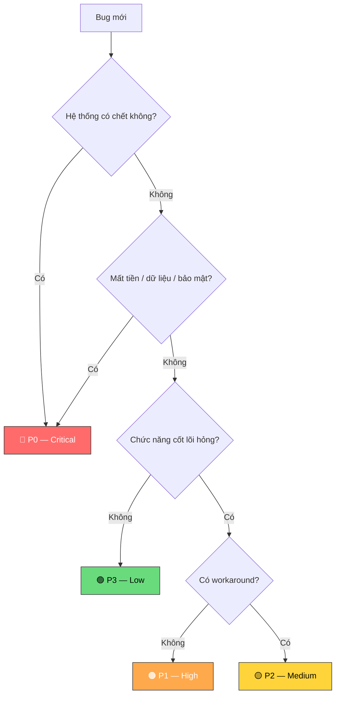

# Phân loại Bug — Sổ tay cho QA

Khi bạn xác nhận một bug, việc đầu tiên là **đánh giá nó nghiêm trọng cỡ nào.** Mức severity quyết định bạn phải reply nhanh bao nhiêu, ai cần biết, và dev có bao lâu để fix.

Cyberk phân làm 4 mức: P0, P1, P2, P3. Đọc xong phần dưới, bạn sẽ biết bug nào thuộc mức nào.

---

## Bảng phân loại

| | Mô tả | Ví dụ | Reply | Fix | Báo ai |
|---|---|---|---|---|---|
| **P0** 🔴 | Hệ thống chết, mất tiền, mất dữ liệu, lỗ hổng bảo mật | Production down, giao dịch treo, contract bị exploit | **≤ 30p** (24/7) | **≤ 4–8h** | Dev + PM + Tech Lead (gọi trực tiếp) |
| **P1** 🟠 | Chức năng cốt lõi hỏng, >20% users ảnh hưởng | Không login được, thanh toán lỗi, data sai | **≤ 1h** | **≤ 1 ngày** | Dev + PM (Telegram) |
| **P2** 🟡 | Có lỗi nhưng có workaround | Filter hỏng nhưng search được, export lỗi nhưng copy-paste được | **≤ 4h** | **≤ 3 ngày** | Dev (GitHub) |
| **P3** 🟢 | UI, typo, thẩm mỹ — không ảnh hưởng chức năng | Sai font, lệch layout 1-2px, tooltip sai chỗ | **≤ 1 ngày** | **Sprint** | Dev (GitHub) |

> Giờ hành chính: 09:00–18:00, GMT+7, Thứ Hai–Thứ Sáu. Ngoại lệ: P0 hỗ trợ 24/7.

---

## Chưa chắc mức nào? Dùng chart này



---

## Khi nào thay đổi severity

**Nâng lên:**
- Khách yêu cầu khẩn cấp → PM có quyền nâng 1 bậc
- Trong 48 giờ trước event/launch → tự động nâng lên P1
- Bug lặp lại sau khi đã fix → nâng 1 bậc
- Liên quan bảo mật → luôn ít nhất P1

**Hạ xuống:**
- Tìm được workaround → P1 có thể hạ xuống P2
- Điều tra thấy ảnh hưởng nhỏ hơn dự kiến
- Mọi thay đổi severity đều cần **PM xác nhận**

---

## Khi nào SLA tạm dừng

Đồng hồ SLA **dừng** khi bạn đang chờ khách hàng — chờ thêm info, chờ phê duyệt, chờ quyền truy cập.

Khi dừng, ghi comment trên GitHub Issue:

```
SLA paused — waiting for [lý do]. Clock paused at [thời gian].
```

---

## Labels trên GitHub

| Label | Dùng khi |
|-------|---------|
| `bug` | Mọi bug |
| `severity:p0` `p1` `p2` `p3` | Theo mức phân loại |
| `client-reported` | Bug do khách hàng báo |
| `needs-fix` | Đã validate, cần dev fix |
| `verified` | QA verify fix xong |

---

*Đọc thêm: [Xử lý Bugs](bug-handling-workflow.md) · [Mẫu tin nhắn](acknowledgment-messages-example.md)*
