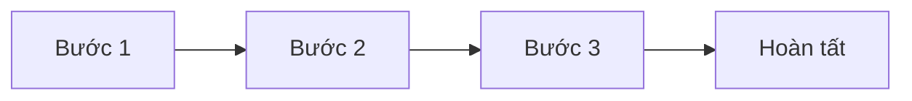

# Tạo Bug trên GitHub

**Người chịu trách nhiệm:** [tên/vai trò — đúng MỘT người]
**Cập nhật lần cuối:** [ngày]
**Trạng thái:** Nháp

## Tại sao có trang này

[1–2 câu: quy trình này giải quyết vấn đề gì]

## Khi nào áp dụng (Trigger)

[Điều gì kích hoạt quy trình này]

---

## Luồng chính

---

## Vai trò & trách nhiệm

| Vai trò | Chịu trách nhiệm gì |
|---------|---------------------|
| ... | ... |

---

## Các bước

| # | Việc làm | Ai làm | Đầu ra | Timeline |
|---|----------|--------|--------|----------|
| 1 | ... | ... | ... | ... |

---

## Quy tắc cứng (không được vi phạm) + lý do

| Quy tắc | Lý do |
|---------|-------|
| ... | ... |

---

## Ngoại lệ & Escalation

| Tình huống | Hành động |
|-----------|----------|
| ... | ... |

---

## Checklist

- [ ] ...

---

## Liên kết

- [Xử lý Bugs](../qa-bugs-handling/bug-handling-process.md)
- [Phân loại Severity & SLA](../qa-bugs-handling/bug-severity-sla-handbook.md)
