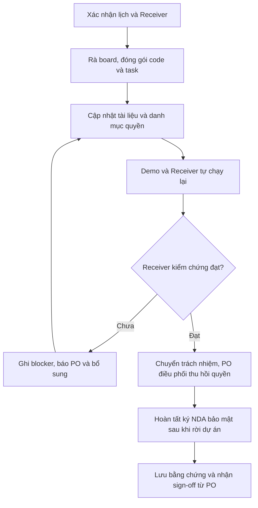

# Bàn giao công việc khi rời dự án — Quy trình cho Developer

**Người chịu trách nhiệm:** Product Owner của dự án

**Cập nhật lần cuối:** 2026-09-17

**Trạng thái:** Nháp

## Tại sao có trang này

Push code xong chưa có nghĩa là bàn giao xong. Quy trình này giúp Developer để lại công việc **tìm được, chạy được, tiếp tục được**: code trên remote, task có người nhận, tài liệu đúng thực tế và quyền truy cập được chuyển giao có xác nhận.

## Khi nào áp dụng (Trigger)

- Bạn chủ động xin rời dự án, được điều chuyển hoặc nghỉ việc tại Cyberk.
- PO đã tiếp nhận thông báo và cần bạn chuẩn bị bàn giao phần việc đang phụ trách.

**Đối tượng đọc:** Developer rời dự án. Các vai trò bên dưới là người phối hợp và xác nhận đầu ra của bạn.

**Lịch bàn giao:** Dùng các mốc báo trước, Cutoff Date, duyệt tài liệu, họp bàn giao và ngày cuối trong [quy trình Project Leave](../../05-product-owner/po-project-leave/po-project-leave-process.md). PO ghi ngày/giờ cụ thể, Receiver và phạm vi bàn giao vào kế hoạch của dự án; bạn xác nhận trước khi thực hiện. Cutoff Date là mốc dừng nhận task mới để tập trung bàn giao.

Phạm vi trang này là bàn giao công việc kỹ thuật tại từng dự án. Nếu nghỉ việc tại Cyberk, phối hợp thêm với HR về thủ tục nhân sự và tài sản công ty.

---

## Vai trò & trách nhiệm

| Vai trò | Chịu trách nhiệm gì |
|---------|---------------------|
| **Developer rời dự án** | Kiểm kê công việc, push code, cập nhật tài liệu, demo, hỗ trợ kiểm chứng và cung cấp danh mục quyền đang giữ. Chủ động báo blocker cho PO. |
| **Product Owner (PO)** | Là người chịu trách nhiệm chính cho lần off-boarding: xác nhận lịch, chỉ định Receiver, duyệt phạm vi bàn giao, điều phối chuyển/thu hồi quyền và sign-off theo Project Leave. |
| **Người nhận bàn giao (Receiver)** | Đọc tài liệu, kiểm tra bằng tài khoản và môi trường của mình, xác nhận nhận từng task/module. Nếu chưa có người thay thế, PO nhận bàn giao tạm thời. |
| **Tech Lead / người quản trị dịch vụ do PO chỉ định** | Review phần kỹ thuật, hỗ trợ chuyển Owner, thay credentials và kiểm tra hệ thống sau thay đổi trong phạm vi được giao. |
| **HR** | Cung cấp mẫu NDA được phê duyệt, phối hợp làm rõ điều khoản, tổ chức ký và lưu bản ký; xác nhận hoàn tất cho PO theo Project Leave. |

Developer chịu trách nhiệm đọc và ký NDA bảo mật sau khi rời dự án; PO kiểm tra xác nhận của HR trước sign-off.

---

## Luồng chính

Luồng trên dành cho bàn giao theo kế hoạch. Khi phải khóa quyền khẩn cấp, PO xử lý theo ngoại lệ của Project Leave ngay, không chờ buổi demo.

---

## Các bước

| # | Việc làm | Ai làm | Đầu ra | Timeline |
|---|----------|--------|--------|----------|
| 1 | **Xác nhận kế hoạch bàn giao.** Gửi PO link danh sách repo/module và công việc đang phụ trách. Xác nhận ngày cuối, Cutoff Date, Receiver, lịch review/demo và thời điểm thu hồi quyền. | Developer + PO | Kế hoạch ghi rõ người nhận và hạn cho từng phần; link hồ sơ bàn giao trong repo dự án | Khi PO tiếp nhận thông báo |
| 2 | **Rà toàn bộ công việc trên board.** Đối chiếu Personal Board với board dự án, issue, PR và cam kết còn mở trong Daily Report. Cùng PO chốt việc hoàn tất trước khi rời đi và việc chuyển tiếp; dừng nhận task mới từ Cutoff Date. | Developer; PO chốt ưu tiên | Mỗi task còn mở có trạng thái thật, link code, next step, blocker và người nhận dự kiến | Trước Cutoff Date; cập nhật mỗi ngày đến khi chuyển giao |
| 3 | **Đóng gói code.** Rà working tree, stash, file chưa track và branch local của dự án. Kiểm tra secrets trước khi commit/push mọi phần code cần bàn giao lên remote được phê duyệt. Mở Draft PR cho phần dở; phần hoàn tất đi qua review thông thường. | Developer | Issue ↔ branch/commit ↔ PR truy vết được; ghi kết quả test, phần chưa test và phần chưa hoàn thành | Trước buổi duyệt tài liệu |
| 4 | **Cập nhật tài liệu tại nguồn.** Sửa README, `.env.example`, PRD/BRD, ADR hoặc hướng dẫn vận hành khi thiếu/sai; mở PR để review. Tạo hồ sơ bàn giao Markdown trong repo, ví dụ `docs/handover/<ten-dev>-<ngay-roi>.md`, dẫn link tới các nguồn này. Xem [cách viết hồ sơ](./dev-project-offboarding-handbook.md). | Developer; PO duyệt | Hồ sơ gồm công việc, logic kỹ thuật, môi trường/quyền và demo; Receiver truy cập được mọi link cần thiết | Theo mốc duyệt tài liệu trong kế hoạch |
| 5 | **Demo và kiểm chứng ngược (Reverse Demo).** Trình diễn phần phụ trách, lỗi đã biết và cách debug. Receiver tự lấy code từ remote, setup theo README bằng quyền của mình, chạy luồng chính và test liên quan. Ghi commit đã kiểm tra, kết quả và câu hỏi còn mở vào hồ sơ. | Developer + Receiver; PO chủ trì | Xác nhận của Receiver và link video buổi bàn giao do PO lưu; điểm chưa đạt có người xử lý và hạn kiểm tra lại | Tại buổi bàn giao; kiểm tra lại trước sign-off nếu chưa đạt |
| 6 | **Chuyển trách nhiệm và quyền.** Sau khi Receiver xác nhận, cập nhật Assignee trên task còn mở. Bàn giao danh mục dịch vụ/quyền cho PO; phối hợp chuyển Owner và rotate credentials từng nắm giữ theo Project Leave, gồm credentials automation đang dùng. Receiver kiểm tra dịch vụ bằng quyền mới, người quản trị xác nhận thu hồi quyền cũ. | Developer phối hợp; PO điều phối; Receiver xác nhận | Task có đúng một Assignee; danh mục quyền có người thực hiện, thời điểm và bằng chứng chuyển/thu hồi | Theo lịch chuyển giao và thu hồi quyền PO đã chốt |
| 7 | **Ký NDA bảo mật sau khi rời dự án.** Nhận mẫu từ HR khi chốt kế hoạch, đọc và làm rõ phạm vi/nghĩa vụ trước khi ký. Thực hiện theo [yêu cầu NDA trong Project Leave](../../05-product-owner/po-project-leave/po-project-leave-process.md#yêu-cầu-ký-nda-khi-off-boarding), kể cả khi điều chuyển nội bộ. | Developer ký; HR chuẩn bị và lưu; PO theo dõi | HR xác nhận NDA đã ký đầy đủ; hồ sơ bàn giao ghi trạng thái, ngày ký và mã tham chiếu | Chuẩn bị từ khi chốt kế hoạch; ký chậm nhất ngày cuối, trước sign-off |
| 8 | **Chốt hồ sơ và nhận sign-off.** Đối chiếu checklist, gửi PO link hồ sơ cùng các xác nhận, gồm xác nhận NDA từ HR. Cập nhật board trước Daily Report cuối; chuyển đầu mối công việc đang theo dõi cho Receiver. Developer hoàn tất phần cập nhật trước khi bị thu hồi quyền; PO bổ sung bằng chứng thu hồi, xác nhận NDA và thông báo sign-off qua kênh liên hệ đã thống nhất. | Developer; PO sign-off | PO xác nhận hoàn tất trong hồ sơ; mọi việc chuyển tiếp có owner và ETA, không còn blocker bàn giao chưa xử lý | Ngày làm việc cuối cùng |

---

## Quy tắc cứng (không được vi phạm) + lý do

| Quy tắc | Lý do |
|---------|-------|
| **Board phản ánh đúng thực tế; không chuyển `Done` chỉ vì đã bàn giao.** Task dở giữ trạng thái phù hợp và chuyển Assignee khi Receiver nhận. | Bàn giao trách nhiệm khác với hoàn thành tính năng; PO cần dữ liệu thật để lập kế hoạch và báo khách hàng. |
| **Code cần bàn giao phải có trên remote; code dở dùng Draft PR, không ép merge hoặc bypass review.** | Giữ được công việc mà vẫn bảo vệ chất lượng nhánh tích hợp và production. |
| **Viết tại nguồn trước, thông báo bằng link sau.** Hồ sơ bàn giao dẫn tới issue, PR, README và BRD hiện có. | Tránh hai bản trạng thái hoặc hướng dẫn khác nhau giữa chat và repo. |
| **Không đưa `.env`, token, private key hoặc mật khẩu vào Git, Telegram, video hay AI prompt.** Chỉ ghi tên biến và vị trí trong 1Password/nguồn secrets PO phê duyệt. | Người nhận cần quyền truy cập hợp lệ, không cần một bản sao secrets phát tán qua nhiều nơi. |
| **Receiver phải tự kiểm chứng bằng tài khoản và môi trường của mình.** | Demo trên máy người cũ không chứng minh team có thể tiếp tục làm việc sau khi người đó rời đi. |
| **Chuyển Owner và xác định automation phụ thuộc trước khi thu hồi theo kế hoạch; không tự xóa tài khoản dịch vụ đang chạy.** | Thu hồi tài khoản cá nhân có thể làm hỏng CI/CD, scheduled job hoặc deploy nếu chưa chuyển phụ thuộc. Trường hợp khẩn cấp theo quyết định của PO. |
| **Developer không tự xác nhận hoàn tất off-boarding; cần xác nhận Receiver và sign-off của PO.** | Có người độc lập kiểm tra đầu ra và trách nhiệm tiếp quản rõ ràng. |
| **NDA bảo mật sau khi rời dự án phải được ký đầy đủ trước sign-off theo Project Leave.** Không chờ ký mới thu hồi quyền. | Nghĩa vụ bảo mật tiếp tục sau khi quyền truy cập chấm dứt; thiếu chữ ký không phải lý do giữ quyền truy cập cũ. |

---

## Ngoại lệ & Escalation

| Tình huống | Hành động |
|-----------|----------|
| **Chưa có Receiver** | Báo PO ngay khi xác nhận kế hoạch. PO tiếp nhận tạm thời theo Project Leave; vẫn chuẩn bị tài liệu và kiểm chứng kỹ thuật, không chờ có người mới mới bàn giao. |
| **Task không kịp hoàn thành / phát sinh yêu cầu sau Cutoff Date** | Cập nhật issue: đã làm gì, còn gì, blocker và ETA; báo PO qua Telegram ngay. PO quyết định chuyển Receiver hoặc điều chỉnh kế hoạch. Requirement mới đi theo [Dev Write BRD](../dev-write-brd/dev-write-brd-process.md). |
| **Receiver không chạy được hoặc tài liệu thiếu bước** | Ghi lỗi và kết quả đã thử, bổ sung tài liệu rồi chạy lại. Nếu xử lý kỹ thuật quá 30 phút chưa xong, báo PO theo [quy tắc onboarding](../dev-project-onboarding/dev-project-onboarding-process.md). Chưa kiểm chứng đạt thì chưa đánh dấu bàn giao đạt. |
| **Dịch vụ gắn email cá nhân / chỉ client có quyền đổi Owner** | Gửi PO tên dịch vụ, owner hiện tại và phụ thuộc ngay khi kiểm kê. PO làm việc với người quản trị/client để chuyển quyền; theo dõi bằng task có owner và ETA. Không gửi tài khoản cá nhân cho Receiver dùng chung. |
| **Nghỉ đột xuất hoặc đã bị khóa quyền** | Báo PO vị trí commit/PR gần nhất, task dở và tài liệu hiện có khi có thể. PO kích hoạt luồng khẩn cấp trong [Project Leave](../../05-product-owner/po-project-leave/po-project-leave-process.md); không dùng tài khoản người khác để truy cập lại. |
| **Đến ngày cuối vẫn còn blocker bàn giao** | Báo PO ngay khi thấy nguy cơ trễ, liệt kê ảnh hưởng và phần thiếu. PO điều chỉnh phương án tiếp nhận và escalate lên Anderson nếu không giải quyết được; giữ trạng thái chưa hoàn tất, không sign-off hình thức. |
| **NDA chưa ký hoặc có điều khoản chưa rõ** | Báo PO và HR ngay; xử lý theo ngoại lệ NDA trong Project Leave. Tiếp tục bàn giao/thu hồi quyền đúng lịch, giữ trạng thái off-boarding chưa hoàn tất cho đến khi có xác nhận ký đầy đủ. |

---

## Checklist tự kiểm

- [ ] Đã xác nhận với PO ngày cuối, Cutoff Date, Receiver, lịch demo và thu hồi quyền.
- [ ] Đã rà Personal Board, board dự án, issue, PR và các cam kết/risk còn mở trong Daily Report.
- [ ] Code cần bàn giao từ working tree, stash và branch local đã được kiểm tra secrets và đưa lên remote; phần dở có Draft PR.
- [ ] Mỗi task còn mở có link code, kết quả test, next step, blocker, đúng một Assignee đã nhận và ETA.
- [ ] README, `.env.example` và tài liệu liên quan đã được cập nhật, review; hồ sơ chỉ dẫn link tới nguồn chính.
- [ ] Receiver đã tự chạy luồng chính và test liên quan; commit, kết quả, video và xác nhận đã được lưu.
- [ ] Đã bàn giao danh mục quyền/dịch vụ; người quản trị xác nhận chuyển Owner, xử lý credentials và thu hồi quyền theo kế hoạch.
- [ ] Đã cập nhật board, chuyển đầu mối theo dõi và gửi dữ liệu cho Daily Report cuối.
- [ ] Đã ký NDA bảo mật thông tin dự án sau khi rời đi; HR xác nhận lưu bản ký, hồ sơ bàn giao có ngày ký và mã tham chiếu.
- [ ] Không còn blocker bàn giao chưa xử lý; đã nhận sign-off của PO trong hồ sơ.

---

## Liên kết

- [Cẩm nang off-boarding cho Developer](./dev-project-offboarding-handbook.md)
- [Project Leave — Timeline và trách nhiệm điều phối của PO](../../05-product-owner/po-project-leave/po-project-leave-process.md)
- [Project Onboarding — Người nhận setup và kiểm chứng](../dev-project-onboarding/dev-project-onboarding-process.md)
- [Dev Daily — Board phản ánh thực tế](../dev-daily/dev-daily-process.md)
- [Dev Tasks Logs — Task và Feature ID](../dev-tasks-logs/dev-tasks-logs-process.md)
- [Daily Report — Next step, ETA và risk](../dev-daily-report/daily-report-process.md)
- [Tạo Repository — Git workflow và cấu hình môi trường](../dev-new-repo/dev-new-repo-process.md)
