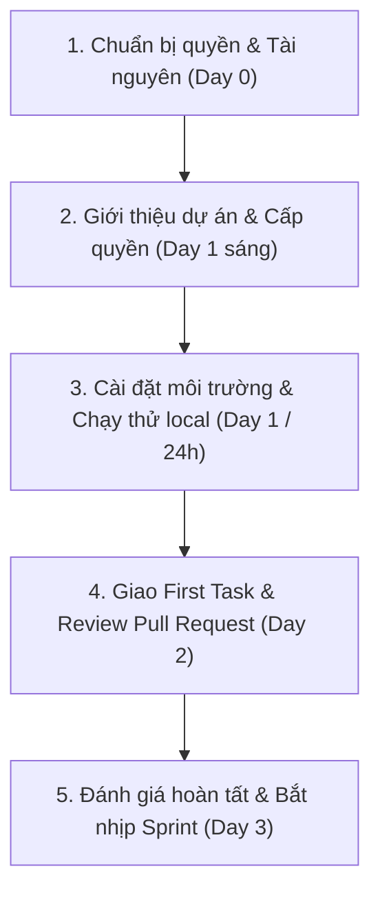

# Onboarding Dự Án

**Người chịu trách nhiệm:** Product Owner  
**Trạng thái:** Đang dùng  

## Tại sao có trang này

Quy trình này nhằm đảm bảo việc tiếp nhận và hướng dẫn thành viên mới gia nhập dự án diễn ra nhanh chóng, chuẩn xác, giúp nhân sự bắt nhịp công việc sớm mà không làm gián đoạn tiến độ chung hay gây rủi ro về an toàn thông tin của Cyberk và khách hàng.

Product Owner trực tiếp giới thiệu tổng quan dự án, kết hợp cùng thành viên mới chủ động sử dụng các công cụ AI để tìm hiểu sâu về kiến trúc, mã nguồn và nghiệp vụ nhằm tăng tốc tối đa quá trình tiếp cận.

Mục tiêu chính:
- **Trong vòng 24 giờ đầu tiên (Day 1):** Thành viên mới cài đặt và chạy thành công ứng dụng trên máy cá nhân dưới sự hướng dẫn của Product Owner.
- **Đến Ngày thứ 2 (Day 2):** Hoàn thành và được merge Pull Request đầu tiên (First PR) dưới sự review của Product Owner.
- **Ngày thứ 3 (Day 3):** Đánh giá hoàn tất quy trình tiếp nhận, chính thức phân bổ công việc vào Sprint của dự án.

## Khi nào áp dụng (Trigger)

Quy trình được kích hoạt khi:
- Thành viên mới gia nhập Cyberk và được phân công vào dự án.
- Thành viên nội bộ được điều chuyển từ dự án khác sang hoặc tham gia thêm dự án mới.
- Thành viên được chỉ định làm người tiếp nhận bàn giao khi có người rời dự án (xem [Quy trình Rời Dự Án](../../05-product-owner/po-project-leave/po-project-leave-process.md)).

---

## Luồng chính

---

## Vai trò & trách nhiệm

| Vai trò | Chịu trách nhiệm gì |
|---------|---------------------|
| **Product Owner** | - Chịu trách nhiệm trực tiếp và toàn diện về việc tiếp nhận thành viên mới vào dự án. - Chuẩn bị và cấp quyền truy cập: GitHub Repository, Project Board trên GitHub Projects, Group Telegram dự án và kho secrets của dự án trên 1Password. - Kiểm tra repo có `.env.example` đầy đủ và `.env` đã nằm trong `.gitignore`. - Trực tiếp tổ chức buổi giới thiệu bối cảnh sản phẩm, yêu cầu của khách hàng, timeline và kiến trúc tổng quan. - Trực tiếp hướng dẫn thành viên mới cài đặt môi trường và nghiệm thu kết quả chạy local trong vòng 24 giờ. - Chọn và giao First Task, review Pull Request đầu tiên và xác nhận hoàn tất quá trình tiếp nhận vào Ngày 3. |
| **Thành viên mới (Onboardee)** | - Tiếp nhận thông tin từ Product Owner, chủ động kết hợp công cụ AI để đọc hiểu cấu trúc mã nguồn, luồng dữ liệu và nghiệp vụ nhằm tăng tốc nắm bắt dự án. - Copy `.env.example` thành `.env`, điền giá trị từ 1Password hoặc nguồn secrets được Product Owner chỉ định và đảm bảo không commit `.env` lên Git. - Chủ động trao đổi và báo cáo: luôn cập nhật tiến độ và báo ngay cho Product Owner khi gặp khó khăn, không để công việc bị tắc nghẽn. - Thực hiện First Task trên GitHub Projects, mở Pull Request và tiếp thu phản hồi review để merge code trong Day 2. - Tham gia đầy đủ Daily meeting và cập nhật Personal Board hàng ngày theo quy định. |

---

## Các bước

| # | Việc làm | Ai làm | Đầu ra | Timeline |
|---|----------|--------|--------|----------|
| 1 | **Chuẩn bị quyền & tài nguyên** - Rà soát danh mục tài nguyên cần cấp. - Chuẩn bị quyền truy cập GitHub Repo, group Telegram, Board dự án và 1Password vault chứa secrets của môi trường development. - Kiểm tra `.env.example` đầy đủ và `.env` đã nằm trong `.gitignore`. | Product Owner | Quyền truy cập và hướng dẫn cấu hình local đã sẵn sàng | **Day 0** (Trước ngày gia nhập 1 ngày) |
| 2 | **Giới thiệu dự án & Cấp quyền** - Add thành viên vào Group/Topic Telegram dự án và giới thiệu với team. - Cấp quyền GitHub, Board và kho secrets development cần thiết. - Tổ chức buổi giới thiệu tổng quan (30–45 phút) về mục tiêu dự án, khách hàng, timeline và kiến trúc hệ thống. | Product Owner + Thành viên mới | Thành viên truy cập đủ tài nguyên và nắm bối cảnh | **Day 1** (Trước 10:00 sáng) |
| 3 | **Cài đặt môi trường dưới sự hướng dẫn của Product Owner** - Product Owner hướng dẫn quy trình cài đặt local theo `README.md`. - Thành viên mới clone repo, copy `.env.example` thành `.env`, điền giá trị từ nguồn secrets được cấp, cài dependencies, chạy migrations/seed database và khởi động ứng dụng. - Nếu gặp lỗi, kết hợp AI phân tích log nhưng không đưa giá trị secret vào prompt. | Thành viên mới (Product Owner hướng dẫn) | Ứng dụng chạy được trên máy cá nhân, test local pass | **Day 1** (Buổi chiều) |
| 4 | **Xác nhận chạy thành công trên máy (Local Run)** - Thành viên mới chạy thử trực tiếp cho Product Owner thấy ứng dụng hoạt động tốt trên `localhost`. - Nếu phát hiện tài liệu `README.md` bị thiếu/sai bước: thành viên mới mở PR cập nhật lại tài liệu ngay. | Thành viên mới + Product Owner | Xác nhận hoàn tất chạy local trong 24 giờ | **Day 1** (Trước 17:30) |
| 5 | **Giao việc & Thực hiện First Task** - Product Owner chọn và giao 1 task nhỏ, cô lập trên GitHub Projects. - Thành viên mới tạo branch đúng chuẩn, kết hợp AI hỗ trợ sinh test/refactor và tự kiểm thử kỹ lưỡng. | Product Owner (Giao) + Thành viên mới (Làm) | Branch code sạch, vượt qua kiểm thử cá nhân | **Day 2** (Buổi sáng) |
| 6 | **Mở Pull Request & Code Review** - Thành viên mới mở PR kèm mô tả chi tiết, bằng chứng kiểm thử (ảnh chụp/video). - Product Owner review, hướng dẫn chuẩn hóa convention và merge PR vào nhánh phát triển. | Thành viên mới + Product Owner | Pull Request đầu tiên được review và merge thành công | **Day 2** (Trước 17:30) |
| 7 | **Đánh giá hoàn tất & Bắt nhịp Sprint** - Họp 15 phút rà soát kết quả tiếp nhận, giải đáp các câu hỏi còn tồn đọng. - Product Owner xác nhận hoàn tất checklist và chính thức phân bổ công việc vào Sprint tiếp theo. | Product Owner + Thành viên mới | Ký duyệt hoàn tất tiếp nhận, thành viên vào Sprint chính thức | **Day 3** (Đầu giờ sáng) |

---

## Quy tắc cứng (không được vi phạm) + lý do

| Quy tắc | Lý do |
|---------|-------|
| Tuyệt đối không commit `.env` hoặc giá trị secret lên Git | Repo chỉ lưu `.env.example` với tên biến và giá trị mẫu. `.env` thật phải nằm trong `.gitignore`; secret lấy từ 1Password hoặc nguồn được Product Owner chỉ định. |
| Product Owner chịu trách nhiệm hướng dẫn trực tiếp, không để thành viên mới tự xoay xở một mình | Đảm bảo nhân sự mới nắm đúng định hướng, tránh tình trạng bơ vơ, mất phương hướng và kéo dài thời gian làm quen dự án vô ích. |
| Tuân thủ cam kết thời gian: 24h chạy thành công local và Day 2 hoàn thành First PR | Tối ưu hóa hiệu suất làm việc. Với sự hướng dẫn trực tiếp của Product Owner và sự trợ lực của AI, việc thiết lập môi trường và làm quen quy trình hoàn toàn có thể hoàn thành trong 48 giờ. |
| Áp dụng quy tắc 30 phút (không im lặng khi gặp sự cố quá 30 phút) | Khi gặp lỗi kỹ thuật: tự tìm hiểu và debug cùng AI tối đa 30 phút. Nếu không xử lý được, bắt buộc phải báo ngay cho Product Owner (kèm log lỗi và cách đã thử) để được hỗ trợ, không để trễ tiến độ chung. |
| Mọi code đầu tiên phải qua Pull Request và có phê duyệt của Product Owner trước khi merge | Kiểm soát chất lượng mã nguồn, hướng dẫn thành viên mới làm quen với coding convention và luồng CI/CD của dự án; tránh rủi ro phá vỡ nhánh chính. |
| Bắt buộc sử dụng đúng bộ công cụ chuẩn của Cyberk | Mọi giao tiếp diễn ra trên **Telegram**, quản lý công việc trên **GitHub Projects**, mã nguồn và tài liệu trên **Git**. Secrets chỉ lấy từ nguồn được Product Owner phê duyệt, không gửi trong nhóm chat hoặc đưa vào AI prompt. |

---

## Ngoại lệ & Escalation

| Tình huống | Hành động |
|-----------|----------|
| **Không cài đặt được môi trường do xung đột phần cứng hoặc hệ điều hành đặc thù** | - Sau 1 giờ không giải quyết được: Product Owner trực tiếp chia sẻ màn hình cùng kiểm tra và xử lý lỗi. - Nếu môi trường máy quá khác biệt: chuyển sang dùng Docker Compose hoặc DevContainer chuẩn của dự án. - Ghi chú giải pháp vào tài liệu của repo để dùng lại sau này. |
| **Thiếu hoặc sai biến môi trường** | So sánh `.env` với `.env.example`, kiểm tra quyền truy cập kho secrets và xác nhận đang dùng đúng cấu hình development. Nếu vẫn lỗi, báo Product Owner kèm tên biến bị thiếu và log đã che giá trị nhạy cảm. |
| **Tài liệu hướng dẫn (README.md) của dự án bị thiếu hoặc sai lệch do thay đổi lâu ngày** | Product Owner trực tiếp giải thích các bước thực tế; thành viên mới ghi chép lại chính xác và mở ngay 1 Pull Request cập nhật lại file `README.md`. |
| **Dự án đang trong giai đoạn phát hành gấp, Product Owner bận họp liên tục** | - Product Owner phân công tạm thời một Developer có kinh nghiệm trong team kèm cặp thay thế. - Khoanh vùng cho thành viên mới một task hoàn toàn độc lập (như viết unit test hoặc tài liệu) để không ảnh hưởng đến luồng phát hành. |
| **Thành viên mới là người tiếp nhận bàn giao từ nhân sự rời dự án** | - Product Owner chủ trì buổi họp bàn giao giữa người rời đi và người tiếp nhận. - Thành viên mới phải trực tiếp chạy lại toàn bộ mã nguồn và xác nhận quyền truy cập trước sự chứng kiến của Product Owner (xem [Quy trình Rời Dự Án](../../05-product-owner/po-project-leave/po-project-leave-process.md)). |

---

## Checklist

### Dành cho Product Owner

- [ ] **Day 0:** Đã chuẩn bị và kiểm tra phân quyền trên GitHub Repo (quyền Write/Triage, không cấp bypass).
- [ ] **Day 0:** Đã kiểm tra `.env.example` đầy đủ, `.env` nằm trong `.gitignore` và kho secrets development sẵn sàng.
- [ ] **Day 1 (Sáng):** Đã mời thành viên vào đúng Group & Topic Telegram của dự án.
- [ ] **Day 1 (Sáng):** Đã cấp quyền truy cập kho secrets development cho thành viên mới.
- [ ] **Day 1 (Sáng):** Đã tổ chức buổi họp giới thiệu bối cảnh, khách hàng, kiến trúc tổng quan.
- [ ] **Day 1 (Chiều):** Đã trực tiếp hướng dẫn và xác nhận thành viên chạy thành công dự án trên `localhost` (trong vòng 24h).
- [ ] **Day 2 (Sáng):** Đã giao một First Task rõ ràng trên GitHub Projects (có mô tả và tiêu chuẩn hoàn thành).
- [ ] **Day 2 (Chiều):** Đã review Pull Request đầu tiên của thành viên mới, góp ý convention và merge code.
- [ ] **Day 3 (Sáng):** Đã trao đổi trực tiếp rà soát kết quả tiếp nhận, đưa thành viên vào Sprint chính thức.

### Dành cho Thành viên mới (Onboardee)

- [ ] **Day 1 (Sáng):** Đã truy cập được toàn bộ hệ thống cần thiết (Telegram, GitHub, Figma, Board và kho secrets development).
- [ ] **Day 1 (Sáng):** Đã lắng nghe giới thiệu dự án và chủ động kết hợp AI tìm hiểu cấu trúc mã nguồn.
- [ ] **Day 1 (Chiều):** Đã tạo `.env` từ `.env.example`, điền đủ cấu hình development và chạy thành công ứng dụng trên máy cá nhân.
- [ ] **Day 1 (Chiều):** Đã chạy thử bộ test tự động trên máy cá nhân và toàn bộ bài test đều pass.
- [ ] **Day 1 (Chiều):** Đã mở PR cập nhật lại các bước chưa rõ trong `README.md` (nếu phát hiện sai sót).
- [ ] **Day 2 (Sáng):** Đã tham gia Daily meeting, cập nhật Personal Board trên GitHub Projects theo [Quy trình Dev Daily](../dev-daily/dev-daily-process.md).
- [ ] **Day 2 (Sáng):** Đã tạo branch đúng quy chuẩn, thực hiện task kết hợp AI và tự kiểm thử cẩn thận.
- [ ] **Day 2 (Chiều):** Đã mở Pull Request đầu tiên kèm mô tả rõ ràng, tag Product Owner review và xử lý feedback.
- [ ] **Day 2 (Chiều):** Pull Request đầu tiên đã được merge vào nhánh chính của dự án.
- [ ] **Day 3 (Sáng):** Hoàn tất đánh giá tiếp nhận và sẵn sàng nhận công việc chính thức trong Sprint.

---

## Liên kết

- [Cẩm nang Onboarding Dự Án (Handbook)](dev-project-onboarding-handbook.md)
- [Quy trình Tạo Repository Mới](../dev-new-repo/dev-new-repo-process.md)
- [Quy trình Rời Dự Án (Project Leave)](../../05-product-owner/po-project-leave/po-project-leave-process.md)
- [Cẩm nang Giao tiếp trong Team (Horenso)](../../03-team/team-communicate/communicate-handbook.md)
- [Quy trình Quản lý Công việc Hàng ngày (Dev Daily)](../dev-daily/dev-daily-process.md)
- [Cẩm nang Quản lý Board Dự Án (Board Handbook)](../../05-product-owner/board-handbook/board-handbook.md)
- [Quy trình Báo cáo Hàng ngày (Dev Daily Report)](../dev-daily-report/daily-report-process.md)
