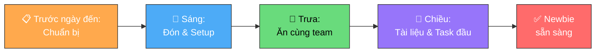

# Đón Người Mới

**Người chịu trách nhiệm:** [HR / Line Manager]
**Trạng thái:** Nháp

## Tại sao có trang này

Ngày đầu tiên quyết định ấn tượng của người mới về cả công ty. Nếu Manager/Buddy không chuẩn bị trước, newbie sẽ bỡ ngỡ, ngồi chờ, và mất niềm tin ngay từ đầu. Quy trình này giúp việc đón người mới diễn ra **chuyên nghiệp, ấm áp, và không thiếu sót**.

## Khi nào áp dụng (Trigger)

Mỗi khi có nhân sự mới sắp vào Cyberk — bắt đầu chuẩn bị **trước ngày họ đến**.

## Mục tiêu Day One

- **Hoà nhập nhanh:** Newbie làm quen không gian văn phòng và đồng nghiệp
- **Trang bị công cụ:** Email, Telegram, WiFi — sẵn sàng làm việc
- **Truyền đạt định hướng:** Hệ thống tài liệu nội bộ và quy định cốt lõi

---

## Luồng chính

---

## Vai trò & trách nhiệm

| Vai trò | Chịu trách nhiệm gì |
|---------|---------------------|
| **Line Manager** | Chuẩn bị trước ngày đến, tạo tài khoản, giải thích quy định, giao task đầu |
| **Buddy** | Đón tiếp, dẫn tham quan, hướng dẫn setup, rủ ăn trưa, trả lời câu hỏi |
| **HR** | Hỗ trợ tạo email, hợp đồng, giấy tờ hành chính |

---

## Các bước

| # | Việc | Ai | Đầu ra | Timeline |
|---|------|----|--------|----------|
| 1 | Chuẩn bị bàn làm việc, thiết bị sạch sẽ sẵn sàng | Manager | Chỗ ngồi ready | Trước ngày đến |
| 2 | Thông báo trên group chat nội bộ: "Ngày mai có newbie vào" | Manager | Team biết, chuẩn bị chào đón | Trước ngày đến |
| 3 | Tạo sẵn email công ty + các tài khoản cần thiết | Manager + HR | Email + password sẵn sàng | Trước ngày đến |
| 4 | Đích thân đón newbie, dẫn tham quan văn phòng (vệ sinh, nước, nghỉ ngơi) | Buddy | Newbie biết không gian | Sáng |
| 5 | Giới thiệu sơ lược với các thành viên khác — ice-breaking | Buddy | Phá băng | Sáng |
| 6 | Bàn giao: email, WiFi, hướng dẫn tạo Chrome Profile + Telegram | Manager/Buddy | Newbie online và nhận được tin nhắn | Sáng |
| 7 | Rủ newbie ăn trưa cùng team (hoặc nhắc team mời) | Buddy | Không khí thân thiện | Trưa |
| 8 | Hướng dẫn đăng ký cơm trưa | Buddy | Newbie biết cách đặt cơm | Trưa |
| 9 | Gửi link tài liệu onboarding, yêu cầu đọc nghiêm túc | Manager | Newbie có tài liệu | Chiều |
| 10 | Dành 15–30 phút giải thích "luật chơi": Horenso, trang phục, bảo mật | Manager | Newbie nắm quy định cốt lõi | Chiều |
| 11 | Giao task đầu tiên — nhỏ, đơn giản (clone repo, chạy local, hoặc bài giới thiệu) | Manager | Newbie bắt đầu làm quen workflow | Chiều |

---

## Quy tắc cứng

| Quy tắc | Lý do |
|---------|-------|
| **Chuẩn bị TẤT CẢ trước ngày newbie đến** — email, bàn, thông báo team | Newbie đến mà chưa có email = mất nửa ngày chờ. Ấn tượng đầu tiên rất quan trọng |
| **Đích thân đón** — không để newbie tự tìm chỗ ngồi | Cảm giác bị bỏ rơi ngày đầu rất khó quên. 5 phút đón tiếp = ấn tượng cả năm |
| **Rủ ăn trưa cùng team** — không để newbie ăn một mình | Bữa trưa là cơ hội phá băng tốt nhất. Ăn một mình ngày đầu = cô đơn |
| **Task đầu tiên phải NHỎ** — không giao task khó ngày 1 | Ngày đầu là để làm quen, không phải để chứng minh. Thành công nhỏ tạo tự tin |
| **Nhấn mạnh bảo mật** — không chỉ gửi link, phải nói rõ | Bảo mật là nguyên tắc sống còn. Gửi link không đủ — phải đảm bảo newbie hiểu |

---

## Ngoại lệ & Escalation

| Tình huống | Hành động |
|-----------|----------|
| Email chưa tạo kịp ngày đầu | Manager liên hệ IT/HR trước 1 ngày. Nếu muộn → dùng email cá nhân tạm 1 buổi |
| Buddy nghỉ đúng ngày newbie vào | Manager tự đón hoặc assign buddy tạm |
| Newbie remote (không đến văn phòng) | Video call thay tour. Gửi tài liệu qua Telegram. Vẫn rủ "ăn trưa online" |

---

## Checklist

### Trước ngày đến (Manager + HR)
- [ ] Bàn làm việc sạch sẽ, thiết bị sẵn sàng
- [ ] Thông báo trên group chat nội bộ
- [ ] Tạo email công ty + mật khẩu khởi tạo
- [ ] Chỉ định Buddy

### Sáng ngày 1 (Buddy)
- [ ] Đích thân đón newbie
- [ ] Dẫn tham quan văn phòng
- [ ] Giới thiệu với team (ice-breaking)
- [ ] Bàn giao: email, WiFi, Chrome Profile, Telegram
- [ ] Add vào các nhóm Telegram công ty/dự án

### Trưa (Buddy + Team)
- [ ] Rủ ăn trưa cùng team
- [ ] Hướng dẫn đăng ký cơm trưa

### Chiều (Manager)
- [ ] Gửi link tài liệu [Getting Started](../newbie-getting-started/getting-started-handbook.md)
- [ ] Giải thích 15–30 phút: Horenso, trang phục, bảo mật
- [ ] Giao task đầu tiên (nhỏ, đơn giản)

---

## Liên kết

- [Getting Started — Cẩm nang cho Newbie](../newbie-getting-started/getting-started-handbook.md) — Gửi link này cho newbie đọc
- [Trang phục](../newbie-getting-started/outfit-handbook.md)
- [Cơm trưa](../newbie-getting-started/lunch-handbook.md)
