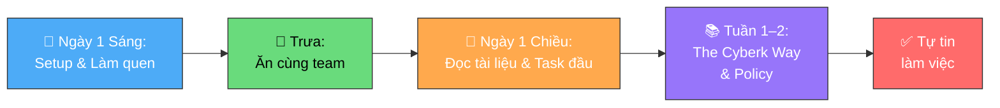

# Bắt đầu tại Cyberk

**Người chịu trách nhiệm:** [HR / Line Manager]
**Trạng thái:** Nháp

## Tại sao có trang này

Ngày đầu tiên ở công ty mới ai cũng bỡ ngỡ. Trang này giúp bạn biết **phải làm gì, theo thứ tự nào** — từ lúc bước vào văn phòng đến khi bạn tự tin làm việc độc lập.

## Khi nào áp dụng (Trigger)

Ngày đầu tiên bạn đi làm tại Cyberk.

---

## Luồng chính

---

## Vai trò & trách nhiệm

| Vai trò | Chịu trách nhiệm gì |
|---------|---------------------|
| **Bạn (Newbie)** | Chủ động đọc tài liệu, setup công cụ, hỏi khi chưa hiểu |
| **Buddy** | Người đồng hành — hướng dẫn, trả lời câu hỏi, dẫn đi ăn trưa |
| **Line Manager** | Cung cấp tài khoản, giải thích quy định, giao task đầu tiên |

---

## Các bước

| # | Việc | Ai | Đầu ra | Timeline |
|---|------|----|--------|----------|
| 1 | Nhận email công ty + mật khẩu WiFi từ Manager/Buddy | Manager → Bạn | Có email + WiFi | Sáng ngày 1 |
| 2 | Tạo Chrome Profile riêng cho công việc, đăng nhập email công ty | Bạn | Chrome profile sẵn sàng | Sáng ngày 1 |
| 3 | Cài Telegram, join các nhóm công ty/dự án | Bạn | Nhận được tin nhắn từ team | Sáng ngày 1 |
| 4 | Đi ăn trưa cùng team | Buddy rủ | Làm quen đồng nghiệp | Trưa ngày 1 |
| 5 | Đọc tài liệu onboarding: trang phục, cơm trưa, horenso | Bạn | Nắm được "luật chơi" cơ bản | Chiều ngày 1 |
| 6 | Nhận task đầu tiên (nhỏ, đơn giản) | Manager assign | Làm quen workflow | Chiều ngày 1 |
| 7 | Đọc The Cyberk Way: sứ mệnh, giá trị cốt lõi, cơ cấu tổ chức | Bạn | Hiểu công ty mình đang ở | Tuần 1–2 |
| 8 | Đọc Policy: WFH, nghỉ phép, lương, overtime, bảo mật | Bạn | Biết quyền lợi và nghĩa vụ | Tuần 1–2 |

---

## Quy tắc cứng

| Quy tắc | Lý do |
|---------|-------|
| **Đọc quy định bảo mật thông tin** — bắt buộc, không phải khuyến nghị | Đây là nguyên tắc sống còn. Vi phạm có thể ảnh hưởng đến cả công ty và khách hàng |
| **Hỏi ngay khi không hiểu** — không ai trách bạn vì hỏi nhiều | Người mới im lặng không phải vì hiểu, mà vì ngại. Hỏi sớm = ít sai sớm |
| Setup email + Telegram **trong buổi sáng ngày 1** | Không setup = không nhận được thông tin = lạc khỏi team ngay ngày đầu |

---

## Checklist Ngày 1

- [ ] Nhận email công ty
- [ ] WiFi password: liên hệ Manager/Buddy
- [ ] Tạo Chrome Profile riêng + đăng nhập email
- [ ] Cài Telegram + join nhóm công ty
- [ ] Ăn trưa cùng team
- [ ] Đọc: [Trang phục](outfit-handbook.md)
- [ ] Đọc: [Cơm trưa](lunch-handbook.md)
- [ ] Nhận task đầu tiên

## Checklist Tuần 1–2

- [ ] Đọc The Cyberk Way (sứ mệnh, giá trị, cơ cấu)
- [ ] Đọc Horenso (cách giao tiếp)
- [ ] Đọc chính sách WFH
- [ ] Đọc quy định nghỉ phép, lương, overtime
- [ ] ⚠️ Đọc quy định bảo mật thông tin (bắt buộc)

---

## Liên kết

- [Trang phục](outfit-handbook.md) — Mặc gì đi làm
- [Cơm trưa](lunch-handbook.md) — Cách hoạt động và đăng ký
- [Welcoming Newbie (dành cho HR/Manager)](../welcoming-newbie/welcoming-newbie-process.md)
