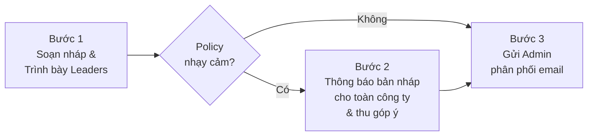

# Ban hành Quyết định / Policy

**Người chịu trách nhiệm:** CEO
**Cập nhật lần cuối:** 2026-08-29
**Trạng thái:** Đang dùng

## Tại sao có trang này

Để các quyết định, chính sách của công ty được ban hành bài bản — thay vì C-level thích ra thì ra. Quy trình này giúp Leaders biết trước, nhân viên có cơ hội góp ý (khi cần), và mọi người nhận thông tin qua kênh chính thức.

## Khi nào áp dụng (Trigger)

- CEO hoặc C-level muốn ban hành chính sách mới
- Cần sửa đổi lớn hoặc thay thế policy đang có hiệu lực

---

## Luồng chính

---

## Vai trò & trách nhiệm

| Vai trò | Chịu trách nhiệm gì |
|---------|---------------------|
| **CEO / C-level** | Soạn policy, trình bày Leaders, phê duyệt bản cuối |
| **Leaders** | Được thông báo trước khi policy ban hành |
| **Nhân viên** | Góp ý bản nháp khi policy nhạy cảm (Bước 2) |
| **Admin** | Gửi email bản chính thức cho toàn công ty |

---

## Các bước

| # | Việc làm | Mô tả |
|---|----------|-------|
| **1** | Soạn bản nháp | Soạn nội dung policy theo [skill create-decision](../../policy/skills/create-decision/SKILL.md), xuất file HTML để dễ đọc |
| **2** | Trình bày Leaders | Đăng bản nháp trong nhóm `C-LEVEL` hoặc `LEADERS` trên Telegram, giải thích ngắn vì sao cần policy này |
| **3** | Thông báo toàn công ty *(nếu nhạy cảm)* | Gửi bản nháp trong nhóm chung, ghi rõ "đây là bản nháp, mời góp ý trước ngày [DD/MM]". Thu góp ý 3-5 ngày, cập nhật nếu cần |
| **4** | Duyệt & xuất PDF | CEO phê duyệt bản cuối, xuất file PDF chính thức |
| **5** | Gửi Admin phân phối | Chuyển PDF cho Admin kèm hướng dẫn nội dung email. Admin gửi email cho toàn bộ công ty |

> **Khi nào cần Bước 3?** Khi policy ảnh hưởng tới quyền lợi hoặc thói quen hàng ngày của nhân viên: nghỉ phép, WFH, lương, giờ làm, kỷ luật. Policy thuần kỹ thuật (quy chuẩn Git, naming convention) nhảy thẳng từ Bước 2 sang Bước 4.

---

## Quy tắc cứng + lý do

| Quy tắc | Lý do |
|---------|-------|
| Mọi policy phải qua Bước 1 (trình bày Leaders) — không có ngoại lệ | Leaders cần biết trước để không bị động khi nhân viên hỏi |
| Phân phối chính thức qua Admin bằng email, không tự gửi trên Telegram | Email là kênh chính thức, Telegram sẽ bị cuốn trôi |
| Bản nháp phải ghi rõ là "bản nháp" | Tránh nhầm lẫn với bản chính thức |

---

## Ngoại lệ & Escalation

| Tình huống | Hành động |
|-----------|----------|
| Policy khẩn cấp (bảo mật, pháp lý) | Bỏ qua Bước 2, nhưng Bước 1 vẫn bắt buộc |

---

## Checklist

- [ ] Bản nháp đã soạn xong
- [ ] Đã trình bày trong nhóm Leaders
- [ ] *(Nếu nhạy cảm)* Đã thông báo toàn công ty và thu góp ý
- [ ] CEO đã duyệt bản cuối, xuất PDF
- [ ] Đã chuyển PDF cho Admin
- [ ] Admin xác nhận đã gửi email

---

## Liên kết

- [Cẩm nang ban hành Policy](./policy-issuance-handbook.md) — Mẫu tin nhắn tốt/tồi cho từng bước
- [Skill soạn Policy](../../policy/skills/create-decision/SKILL.md) — Pipeline MD → HTML → PDF
