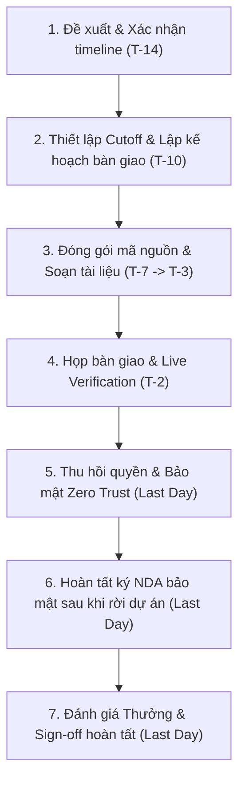

# Rời Dự Án — Quy trình Chuẩn

**Người chịu trách nhiệm:** Product Owner  
**Cập nhật lần cuối:** 2026-09-17
**Trạng thái:** Đang dùng  

## Tại sao có trang này

Quy trình này nhằm đảm bảo việc chuyển giao công việc, tài nguyên, mã nguồn và quyền hạn của một thành viên khi rời khỏi dự án diễn ra suôn sẻ, không làm gián đoạn tiến độ chung (Business Continuity), không thất thoát tri thức (Zero Knowledge Loss) và bảo vệ an toàn tuyệt đối tài sản/thông tin của Cyberk và khách hàng.

## Khi nào áp dụng (Trigger)

Quy trình được kích hoạt khi:
- Thành viên dự án chủ động đề xuất xin rời dự án.
- Có quyết định điều chuyển nhân sự sang dự án khác từ Ban Quản lý.
- Thành viên nghỉ việc tại công ty.

---

## Luồng chính

---

## Vai trò & trách nhiệm

| Vai trò | Chịu trách nhiệm gì |
|---------|---------------------|
| **Product Owner** | - Chịu trách nhiệm trực tiếp và toàn diện về quá trình offboarding thành viên khỏi dự án. - Họp 1-1 xác nhận timeline, đánh giá rủi ro (Impact Assessment) và điểm nghẽn SPOF. - Chỉ định Receiver và thiết lập Cutoff Date (T-7 dừng nhận task mới). - Thẩm định và phê duyệt tài liệu bàn giao (Handover Doc). - Chủ trì buổi họp bàn giao (Handover Session), giám sát Live & Reverse Demo và lưu trữ video record. - Thực hiện thu hồi 100% quyền truy cập (GitHub, Cloud, Secrets, SaaS) và chuyển Owner dịch vụ. - Đánh giá chất lượng bàn giao, đề xuất thưởng dự án theo [[project-bonus-policy\|Chính Sách Thưởng Dự Án]] và ký duyệt Sign-off. |
| **Thành viên rời đi (Outgoing Member)** | - Thông báo chính thức trước tối thiểu 2 tuần. - Tập trung dứt điểm các task dở dang trước mốc Cutoff Date. - Push 100% commit và branch cá nhân lên remote GitHub (không để code trên máy cá nhân). - Soạn thảo tài liệu bàn giao chuẩn 4 trụ cột và quay video demo luồng chạy. - Trình diễn Live Demo tại buổi họp bàn giao và giải đáp mọi khúc mắc kỹ thuật. - Bàn giao quyền sở hữu (Owner) toàn bộ tài khoản/API key cho Product Owner. |
| **Thành viên nhận bàn giao (Receiver)** | - Đọc trước tài liệu bàn giao và mã nguồn liên quan trước buổi họp. - Tham gia buổi họp bàn giao, chủ động đặt câu hỏi làm rõ logic ngầm và edge cases. - **Tự tay clone mã nguồn, tạo `.env` từ `.env.example`, lấy cấu hình development từ kho secrets và chạy ứng dụng thành công trên máy mình** dưới sự chứng kiến của PO và người rời đi. - Tiếp quản chính thức các issue và module được phân công. |
| **HR** | Chuẩn bị mẫu NDA được công ty phê duyệt, phối hợp giải đáp điều khoản và tổ chức ký; kiểm tra đủ chữ ký theo mẫu, lưu bản ký có giới hạn quyền truy cập và xác nhận cho PO. |

**Trách nhiệm về NDA:** PO đưa việc ký vào kế hoạch và kiểm tra xác nhận từ HR trước sign-off. Thành viên rời đi đọc, làm rõ điều khoản, ký NDA và thực hiện nghĩa vụ bảo mật sau khi rời dự án.

---

## Các bước

| # | Việc làm | Ai làm | Đầu ra | Timeline |
|---|----------|--------|--------|----------|
| 1 | **Gửi yêu cầu rời dự án** - Gửi thông báo chính thức và lý do. | Outgoing Member | Email/Tin nhắn chính thức gửi Product Owner | **T-14 ngày** (Trước ngày rời dự án ít nhất 2 tuần) |
| 2 | **Họp 1-1, Đánh giá rủi ro & Chỉ định Receiver** - Product Owner họp 1-1, rà soát SPOF và lên kế hoạch chuyển giao. | Product Owner + Outgoing Member | Kế hoạch chuyển giao & Người nhận (Receiver) được chỉ định | Trong vòng **24–48 giờ** sau khi nhận yêu cầu |
| 3 | **Thiết lập Cutoff Date & Đóng gói công việc** - Dừng nhận task mới, dứt điểm task cũ. - Push 100% remote branch, đóng gói Draft PRs. | Outgoing Member + Product Owner | Git sạch, PR được merge hoặc đóng gói, Board cập nhật | **T-7 ngày** đến **T-3 ngày** |
| 4 | **Soạn thảo & Phê duyệt tài liệu bàn giao** - Outgoing Member soạn Handover Doc chuẩn 4 phần kèm video demo. - Product Owner thẩm định tính tự giải thích (Self-explanatory). | Outgoing Member (Soạn) + Product Owner (Duyệt) | Handover Doc hoàn thiện được Product Owner phê duyệt | Hoàn thành trước **T-3 ngày** |
| 5 | **Chủ trì Họp bàn giao & Live Verification** - Live Demo luồng tính năng. - Receiver tự tay chạy local (Reverse Demo). - Record video buổi họp và lưu vào Wiki. | Product Owner (Chủ trì) + Outgoing Member + Receiver | Buổi họp hoàn tất, video được lưu trữ, Receiver chạy được app | **T-2 ngày** |
| 6 | **Thu hồi quyền truy cập & Bảo mật Zero Trust** - Thu hồi quyền GitHub, Cloud SSH/IAM, kho secrets, transfer Owner SaaS và rotate credentials mà thành viên từng nắm giữ. | Product Owner | Bảng kiểm định quyền hạn thu hồi 100% | **Ngày làm việc cuối cùng** (Trước 18:00) |
| 7 | **Ký NDA bảo mật thông tin dự án sau khi rời đi** - PO yêu cầu HR chuẩn bị mẫu ngay khi chốt kế hoạch. - Thành viên đọc, làm rõ điều khoản và ký; HR kiểm tra đủ chữ ký theo mẫu, lưu bản ký và xác nhận cho PO. | Outgoing Member (Ký) + HR (Chuẩn bị, lưu) + Product Owner (Theo dõi) | NDA đã ký đầy đủ; hồ sơ bàn giao ghi mã tham chiếu, ngày ký và xác nhận của HR | Chuẩn bị từ khi chốt kế hoạch; hoàn tất **chậm nhất ngày làm việc cuối cùng, trước sign-off** |
| 8 | **Đánh giá Thưởng, Tri ân & Ký duyệt Sign-off** - Kiểm tra xác nhận NDA đã ký từ HR. - Đánh giá thưởng pro-rata theo chính sách. - Gửi lời cảm ơn trên nhóm team và ký duyệt hoàn tất. | Product Owner | Checklist hoàn tất 100%, Sign-off đóng quy trình | **Ngày làm việc cuối cùng** |

### Yêu cầu ký NDA khi off-boarding

- Áp dụng cho mọi thành viên rời dự án, **kể cả điều chuyển nội bộ**. Việc đã ký NDA khi gia nhập không tự thay thế bước ký xác nhận nghĩa vụ bảo mật khi off-boarding; HR chuẩn bị NDA hoặc phụ lục xác nhận theo mẫu công ty phê duyệt.
- Văn bản phải xác định dự án, thông tin được bảo vệ và nghĩa vụ sau khi rời đi: mã nguồn, tài liệu kỹ thuật/nghiệp vụ, dữ liệu khách hàng/người dùng, thông tin truy cập và thông tin kinh doanh chưa công khai. Ghi rõ phạm vi, thời hạn bảo mật, các ngoại lệ và yêu cầu hoàn trả/xóa bản sao theo văn bản được phê duyệt; không tự đặt thời hạn trong hồ sơ bàn giao.
- Thành viên không tự ý tiết lộ, chia sẻ hoặc tái sử dụng thông tin thuộc phạm vi bảo mật sau khi rời dự án; việc xử lý bản sao dữ liệu thực hiện theo NDA và hướng dẫn của PO/HR sau khi bảo đảm đã bàn giao đầy đủ.
- HR lưu bản ký tại nơi quản lý hồ sơ có giới hạn quyền truy cập. Repo bàn giao chỉ ghi **trạng thái, ngày ký, mã tham chiếu và xác nhận của HR**; không commit bản ký chứa chữ ký hoặc dữ liệu cá nhân vào repo, không gửi trong nhóm Telegram dự án.
- Nếu chưa có mẫu phù hợp, PO yêu cầu HR làm việc với Anderson để chốt mẫu trước khi ký. **Chưa có xác nhận NDA đã ký đầy đủ thì chưa sign-off hoàn tất off-boarding.**

---

## Quy tắc cứng (không được vi phạm) + lý do

| Quy tắc | Lý do |
|---------|-------|
| Bắt buộc thông báo trước tối thiểu 2 tuần (trừ bất khả kháng) | Đảm bảo Product Owner có đủ thời gian sắp xếp người thay thế và lên kế hoạch chuyển giao không làm vỡ tiến độ chung. |
| Dừng nhận task mới từ mốc Cutoff Date (T-7 ngày) | Dành trọn vẹn thời gian cho việc dứt điểm task dở, dọn dẹp Git, viết tài liệu và kiểm thử chuyển giao. |
| Tuyệt đối không để mã nguồn dở dang trên máy local cá nhân | Toàn bộ commit và branch phải được push lên remote GitHub trước ngày cuối cùng để tránh mất mát dữ liệu khi thu hồi máy/tài khoản. |
| Tài liệu bàn giao phải đạt chuẩn "Self-explanatory" và được Product Owner phê duyệt | Đảm bảo người mới vào sau đọc là có thể tự chạy và vận hành được ngay mà không cần liên hệ lại người cũ. |
| Receiver bắt buộc phải tự tay chạy thành công mã nguồn trên máy mình trong buổi họp | Kiểm chứng thực tế tri thức đã được tiếp thu, loại bỏ tình trạng bàn giao hình thức một chiều. |
| Áp dụng bảo mật Zero Trust: Thu hồi 100% quyền truy cập và secrets trong ngày cuối cùng | Ngăn chặn triệt để rủi ro rò rỉ dữ liệu của Cyberk và khách hàng. Tuyệt đối không để sót SSH keys hay quyền Admin sau khi rời đi. |
| Bắt buộc hoàn tất ký NDA bảo mật sau khi rời dự án trước sign-off; không trì hoãn thu hồi quyền để chờ ký | Thu hồi quyền xử lý khả năng truy cập, còn NDA xác nhận nghĩa vụ với thông tin thành viên đã tiếp cận; cả hai đều cần được hoàn tất. |
| Tự ý bỏ việc (Ghosting) hoặc không hoàn thành bàn giao sẽ bị hủy thưởng dự án | Đồng bộ với [[project-bonus-policy\|Chính Sách Thưởng Dự Án]] nhằm đảm bảo tính kỷ luật và cam kết trách nhiệm. |

---

## Ngoại lệ & Escalation

| Tình huống | Hành động |
|-----------|----------|
| **Nghỉ đột xuất (lý do bất khả kháng: sức khỏe nặng, biến cố gia đình)** | - Product Owner lập tức khóa mọi quyền truy cập trong vòng 1 giờ để bảo vệ hệ thống. - Kéo toàn bộ code mới nhất từ remote Git về kiểm tra commit cuối cùng; rà soát task trên GitHub Projects. - Chỉ định Interim Receiver tiếp quản khẩn cấp để giữ nhịp Sprint. - Đề xuất phân chia thưởng pro-rata theo đóng góp thực tế (cần Anderson duyệt). |
| **Thành viên cố tình ngắt liên lạc (Ghosting) hoặc bất hợp tác** | - Khóa ngay lập tức mọi quyền truy cập Git, Cloud, Server, Database, SaaS. - Thu hồi toàn bộ quyền lợi thưởng dự án theo quy chế kỷ luật. - Báo cáo ngay lên Anderson để có phương án pháp lý/hành chính nếu cần. |
| **Dự án chưa tuyển được Receiver thay thế (Team neo người)** | - Product Owner tạm thời đóng vai trò Receiver trung gian, lưu trữ toàn bộ Handover Doc và Video record vào Wiki dự án. - Khi có nhân sự mới, áp dụng trực tiếp [[project-onboarding-process\|Quy trình Onboarding Dự Án]] để chuyển giao lại trong 24h. |
| **NDA chưa ký, có điều khoản chưa rõ hoặc thành viên chưa thể ký/từ chối ký** | PO ghi trạng thái còn thiếu, báo HR và escalate lên Anderson; ghi người xử lý và hạn tiếp theo. HR phối hợp làm rõ hoặc tổ chức ký từ xa theo hình thức công ty chấp nhận nếu cần. Tiếp tục bàn giao và thu hồi quyền đúng lịch; chưa sign-off hoàn tất khi NDA chưa được ký đầy đủ. |

---

## Checklist

### Dành cho Product Owner

- [ ] **T-14:** Đã tiếp nhận thông báo, họp 1-1 xác nhận timeline và đánh giá rủi ro (Impact Assessment).
- [ ] **T-10:** Đã chỉ định Receiver và ban hành kế hoạch chuyển giao (Handover Plan).
- [ ] **Khi chốt kế hoạch:** Đã yêu cầu HR chuẩn bị NDA bảo mật sau khi rời dự án và xác nhận lịch ký.
- [ ] **T-7:** Đã thiết lập Cutoff Date, chốt danh sách task dở dang trên GitHub Projects.
- [ ] **T-3:** Đã thẩm định và phê duyệt tài liệu bàn giao (Handover Doc) đạt chuẩn 4 trụ cột.
- [ ] **T-2:** Đã chủ trì buổi họp Handover Session, xác nhận Receiver chạy thành công local, và lưu trữ video record.
- [ ] **Last Day:** Đã thu hồi quyền GitHub Repo/Org của thành viên.
- [ ] **Last Day:** Đã xóa SSH keys trên server, xóa IAM User/Service Account, thu hồi quyền Database.
- [ ] **Last Day:** Đã tiếp nhận chuyển giao quyền sở hữu (Owner) các tài khoản SaaS (Figma, Sentry, Vercel, Domain...).
- [ ] **Last Day:** Đã thu hồi quyền kho secrets và xoay vòng API keys/credentials mà thành viên từng nắm giữ.
- [ ] **Last Day:** Đã xóa khỏi các nhóm/topic Telegram bảo mật của dự án.
- [ ] **Trước sign-off:** HR đã xác nhận NDA ký đầy đủ, lưu bản ký có giới hạn quyền truy cập; hồ sơ bàn giao có mã tham chiếu và ngày ký.
- [ ] **Last Day:** Đã đánh giá thưởng dự án pro-rata theo chính sách, gửi lời cảm ơn trên nhóm team và ký duyệt Sign-off.

### Dành cho Thành viên rời đi (Outgoing Member)

- [ ] **T-14:** Đã gửi thông báo chính thức trước ít nhất 2 tuần và tham gia họp 1-1 với Product Owner.
- [ ] **T-7:** Đã ngừng nhận task mới, tập trung dứt điểm các task đang làm dở.
- [ ] **T-5:** Đã push 100% commit và branch cá nhân lên remote GitHub (không giữ code local).
- [ ] **T-3:** Đã hoàn thành Handover Doc chuẩn 4 phần kèm video quay màn hình demo luồng code.
- [ ] **T-2:** Đã trình diễn Live Demo trong buổi họp và hướng dẫn Receiver chạy thành công mã nguồn.
- [ ] **Last Day:** Đã chuyển giao quyền Owner tài khoản dịch vụ và secrets cho Product Owner.
- [ ] **Last Day:** Đã cập nhật trạng thái toàn bộ issues cá nhân trên GitHub Projects sang Closed hoặc reassign.
- [ ] **Trước sign-off:** Đã đọc, làm rõ điều khoản và ký NDA về nghĩa vụ bảo mật thông tin dự án sau khi rời đi; HR đã xác nhận tiếp nhận bản ký.

### Dành cho Người nhận bàn giao (Receiver)

- [ ] **T-3:** Đã đọc trước tài liệu bàn giao và chuẩn bị danh sách câu hỏi làm rõ.
- [ ] **T-2:** Đã tham gia buổi họp, tự tay clone code, tạo `.env` từ `.env.example` và chạy ứng dụng thành công trên máy mình.
- [ ] **T-2:** Đã nắm rõ luồng xử lý của module, các edge cases và cách debug khi có sự cố.
- [ ] **Last Day:** Đã tiếp nhận chính thức các issue và task được phân công trên GitHub Projects.

---

## Liên kết

- [Off-boarding cho Developer — Các bước bàn giao kỹ thuật và checklist](../../04-developer/dev-project-offboarding/dev-project-offboarding-process.md)
- [Cẩm nang Rời Dự Án cho Product Owner (Lead Handbook)](project-leave-lead-handbook.md)
- [Cẩm nang Rời Dự Án cho Thành viên (Member Handbook)](project-leave-member-handbook.md)
- [Quy trình Onboarding Dự Án (Process)](../project-onboarding/project-onboarding-process.md)
- [Cẩm nang Onboarding Dự Án (Handbook)](../project-onboarding/project-onboarding-handbook.md)
- [Cẩm nang Giao tiếp trong Team (Horenso)](../team-communicate/team-communicate-handbook.md)
- [Quy trình Quản lý Công việc Hàng ngày (Dev Daily)](../dev-daily/dev-daily-process.md)
- [Cẩm nang Quản lý Board Dự Án](../../05-product-owner/board-handbook/board-handbook.md)
- Chính Sách Thưởng Dự Án *(tài liệu đang cập nhật)*
