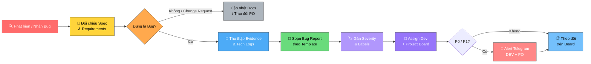

# Quy trình Log Bug trên GitHub

**Owner (DRI):** QA Lead
**Trạng thái:** Nháp

## Tại sao có trang này

Một bug report sơ sài, thiếu dữ liệu kỹ thuật, phân loại sai mức độ nghiêm trọng hoặc log nhầm tính năng do không nắm rõ tài liệu sẽ khiến Developer mất nhiều thời gian tranh luận, bug dễ bị bỏ sót và làm chậm tiến độ release. Quy trình này chuẩn hóa **toàn bộ các bước tạo bug issue trên GitHub** — từ bước đối chiếu requirement, thu thập bằng chứng kỹ thuật đến phân loại, phân công xử lý và theo dõi cả những trường hợp đặc biệt (thiếu evidence / khó tái hiện).

## Khi nào áp dụng (Trigger)

- Ngay khi QA phát hiện lỗi mới trong quá trình kiểm thử nội bộ (Internal QA / Manual / Automation / Regression).
- Sau khi QA đã xác nhận (validate) thành công lỗi do khách hàng hoặc các bên liên quan báo về.

---

## Luồng chính

---

## Vai trò & trách nhiệm

| Vai trò | Chịu trách nhiệm |
|---------|-------------------|
| **QA** | Đối chiếu requirement/spec hiện tại, tái hiện lỗi, trích xuất evidence/logs, viết issue theo đúng template, đánh giá severity ban đầu, gán nhãn, assign dev và alert khi có P0/P1 |
| **Developer** | Đọc hiểu bug report, xác nhận tiếp nhận issue, phản hồi nếu cần thêm dữ liệu và thực hiện fix đúng hạn |
| **PO / Tech Lead** | Điểm escalation làm rõ requirement khi có tranh chấp, phê duyệt thay đổi severity và ưu tiên thứ tự xử lý bug trong sprint |

---

## Các bước

| # | Việc | Ai | Đầu ra | Timeline |
|---|------|----|--------|----------|
| 1 | **Tái hiện & Thu thập dữ liệu ban đầu:** Xác định các bước kích hoạt lỗi, chuẩn bị tài khoản test và dữ liệu đầu vào | QA | Chuỗi thao tác tái hiện lỗi ổn định | 15–30 phút sau khi phát hiện |
| 2 | **Đối chiếu Requirement / Specs / Design:** Kiểm tra lại PRD, User Story, tài liệu API spec và bản thiết kế Figma mới nhất để đảm bảo lỗi phát sinh thực sự sai lệch so với tài liệu hiện tại (loại trừ trường hợp tính năng mới đổi spec) | QA | Xác nhận chính xác: Bug vs Change Request / Intended Behavior | 5–15 phút |
| 3 | **Trích xuất bằng chứng kỹ thuật:** Chụp ảnh khoanh vùng lỗi, quay video/GIF thao tác, lấy Console error và Network payload (Request/Response) | QA | File ảnh, video, JSON logs | Cùng lúc với bước 1 & 2 |
| 4 | **Đánh giá mức độ nghiêm trọng (Severity):** Đối chiếu với [Bảng phân loại P0–P3](../qa-bugs-handling/bug-severity-sla-handbook.md) để gán severity chuẩn | QA | Mức Severity xác định (P0/P1/P2/P3) | Ngay trước khi viết report |
| 5 | **Soạn thảo Bug Issue:** Sử dụng template chuẩn trên GitHub repo tương ứng. Viết tiêu đề đúng format, điền đầy đủ Description, Steps to Reproduce, Expected vs Actual (dẫn chứng spec), Evidence | QA | Draft Issue hoàn chỉnh nội dung | 5–10 phút |
| 6 | **Thiết lập Metadata & Phân công:** Gán nhãn (`bug`, `severity:pX`, `module:*`, `source:*`), Assign Developer phụ trách, chọn Milestone/Sprint và đưa vào Project Board | QA | GitHub Issue chính thức được publish | Ngay sau bước 5 |
| 7 | **Thông báo & Điều phối:** Nếu là **P0/P1**, ping ngay link issue vào nhóm Telegram dự án tag Dev + PO. Nếu là **P2/P3**, theo dõi trên Board | QA | Dev & PO nhận được thông báo | Ngay sau khi issue tạo thành công |

---

## Quy tắc cứng

| Quy tắc | Lý do |
|---------|-------|
| **Bắt buộc đối chiếu Requirement / Figma trước khi log** | Tránh log nhầm các tính năng đã thay đổi spec hoặc hành vi mong muốn (intended behavior) thành bug, gây lãng phí thời gian tranh luận của team |
| **Tiêu đề bắt buộc đúng cú pháp:** `[Module][Môi trường] Tóm tắt lỗi` | Giúp team nhìn vào là biết ngay vị trí lỗi và ngữ cảnh, hỗ trợ lọc và phân loại issue nhanh chóng trên Board |
| **Bắt buộc có ít nhất 1 bằng chứng kỹ thuật** (Screenshot khoanh vùng / Video / Network Logs) | Loại bỏ tranh cãi "Không tái hiện được", giúp Dev định vị ngay vị trí lỗi trong code mà không cần tốn thời gian hỏi lại. *(Trường hợp không có evidence/chỉ có 1 ảnh: xem ngoại lệ `needs-repro`)* |
| **Steps to Reproduce phải đánh số và có test data cụ thể** | Tránh mô tả chung chung dạng văn xuôi. Bất kỳ ai đọc các bước cũng có thể tự tái hiện được lỗi |
| **Một Issue = Một Bug (Không log gộp nhiều lỗi)** | Giúp quản lý tiến độ fix, commit PR và QA verify độc lập, tránh tình trạng 1 phần sửa xong nhưng issue vẫn bị treo |
| **Bắt buộc gán đủ 4 trường metadata:** Severity, Module label, Assignee, Project Board | Tránh để bug rơi vào trạng thái "mồ côi", không ai phụ trách và bị trôi khỏi tầm kiểm soát |
| **Bug P0/P1 phải ping Telegram ngay lập tức** | Đảm bảo tính sẵn sàng xử lý khẩn cấp theo đúng cam kết SLA với khách hàng và stakeholders |

---

## Ngoại lệ & Escalation

| Tình huống | Hành động |
|-----------|----------|
| **Bug không có evidence / Chỉ có 1 ảnh chụp / Chưa tái hiện lại được (Zero Evidence / Cannot Reproduce)** | **Vẫn bắt buộc tạo Bug Issue trên GitHub để theo dõi, không bỏ qua:** 1. Gắn label `needs-repro` (hoặc `cannot-reproduce`). 2. Mô tả chi tiết tối đa bối cảnh xảy ra: thời gian phát hiện chính xác, tài khoản test, chuỗi hành động trước đó, môi trường/thiết bị/mạng, đính kèm ảnh chụp duy nhất (nếu có). 3. Để issue mở theo dõi trong 2–3 ngày (hoặc trong suốt Sprint). Nếu tái hiện lại ➔ bổ sung video/logs kỹ thuật; nếu hết thời gian theo dõi không gặp lại và không ảnh hưởng ➔ trao đổi với PO/Tech Lead để đóng issue với lý do `wontfix` / `cannot reproduce`. |
| **Tài liệu / Requirement không rõ ràng hoặc chưa thống nhất** | Trao đổi nhanh với PO/BA để xác nhận logic mong muốn trước khi log bug; không tự giả định spec. |
| **Bug P0 (Hệ thống down / Cháy dữ liệu)** | Tạo issue nhanh với thông tin cơ bản + gọi điện hoặc tag khẩn cấp Dev + PO + Tech Lead trên Telegram ngay lập tức. |
| **Bug chập chờn (Intermittent / Không xảy ra 100%)** | Thử lại ít nhất 5 lần, ghi rõ tần suất (ví dụ: `3/10 lần`), đính kèm video toàn màn hình và request ID để Dev điều tra log server. |
| **Bug do bên thứ ba (3rd-Party / RPC / Payment Gateway)** | Ghi rõ lỗi từ service ngoài, đính kèm response payload từ 3rd party, gắn label `external-dependency` và báo PO. |
| **Bất đồng ý kiến về Severity giữa QA và Dev** | QA giữ nguyên đánh giá ban đầu, tag PO / Tech Lead vào issue để đưa ra quyết định cuối cùng. |
| **Phát hiện bug trùng lặp (Duplicate)** | Đóng issue mới tạo kèm comment dẫn link đến issue gốc (`Duplicate of #<issue-id>`). |

---

## Checklist mỗi bug

- [ ] **Đã đối chiếu lại Requirement / PRD / Figma** xác nhận hành vi sai so với tài liệu hiện tại
- [ ] Tiêu đề đúng chuẩn `[Module][Môi trường] Tóm tắt lỗi`
- [ ] Xác định đúng mức độ nghiêm trọng (`P0`, `P1`, `P2`, `P3`)
- [ ] Đã ghi rõ môi trường, thiết bị, trình duyệt và tài khoản kiểm thử
- [ ] Đánh số các bước tái hiện (1, 2, 3...) kèm dữ liệu kiểm thử cụ thể
- [ ] Làm rõ sự khác biệt giữa **Expected Result** và **Actual Result**
- [ ] Đính kèm Evidence (Screenshot khoanh vùng / Video / Console / Network JSON) *(hoặc gắn label `needs-repro` + mô tả ngữ cảnh chi tiết nếu thiếu evidence)*
- [ ] Gán đầy đủ Labels (`bug`, `severity:pX`, `module:*`, `source:*`)
- [ ] Đã Assign Developer, chọn Milestone và add vào Project Board
- [ ] Nếu là P0/P1: Đã ping link issue vào nhóm Telegram dự án tag Dev + PO

---

## Liên kết

- [Cẩm nang tạo Bug trên GitHub](qa-bugs-logs-handbook.md) — Hướng dẫn chi tiết cách viết từng mục, mẫu report và ví dụ tốt/tồi
- [Quy trình Xử lý Bugs](../qa-bugs-handling/bug-handling-process.md) — Quy trình end-to-end xử lý bug từ tiếp nhận đến đóng
- [Phân loại Severity & SLA](../qa-bugs-handling/bug-severity-sla-handbook.md) — Bảng phân loại P0→P3, chart và deadline phản hồi
- [Mẫu tin nhắn tiếp nhận](../qa-bugs-handling/acknowledgment-messages-example.md) — Bộ mẫu tin nhắn chuẩn khi trao đổi với khách
