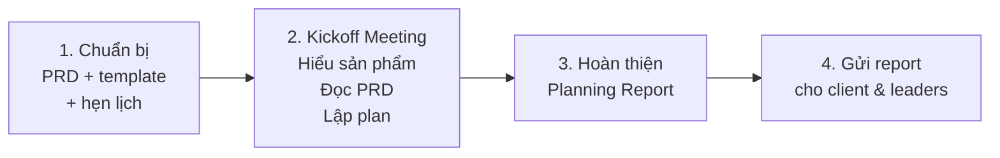

# Lập kế hoạch dự án (Internal Planning)

**Người chịu trách nhiệm:** [PL/PM]
**Cập nhật lần cuối:** 2026-08-26
**Trạng thái:** Nháp

## Tại sao có trang này

Internal Kickoff Meeting là buổi họp quan trọng nhất trước khi bắt tay vào phát triển — quyết định cả team có cùng hiểu đúng yêu cầu, cùng thống nhất kế hoạch, hay mạnh ai nấy hiểu. Kickoff tốt thì dự án chạy mượt từ sprint đầu; kickoff hời hợt thì 2 tuần sau mới phát hiện mỗi người hiểu một kiểu.

## Khi nào áp dụng (Trigger)

Khi dự án mới được ký hợp đồng, PRD đã sẵn sàng, và team đã được assign — **trước khi bắt đầu sprint đầu tiên**.

---

## Luồng chính

---

## Vai trò & trách nhiệm

| Vai trò | Chịu trách nhiệm gì |
|---------|---------------------|
| Product Lead / PM | Chuẩn bị buổi họp (gửi PRD, book phòng), dẫn dắt buổi kickoff, tổng hợp Planning Report, gửi cho client & leaders |
| Tech Lead | Đánh giá kiến trúc kỹ thuật, estimate effort tổng thể, xác định rủi ro công nghệ, đề xuất tech stack |
| Dev | Đọc PRD trước và ghi chú câu hỏi, estimate task của mình, nhận phân công, góp ý task list |
| QA | Xác định test strategy, góp ý về rủi ro chất lượng, estimate effort QA |
| Designer | Xác nhận design scope, cam kết timeline wireframe/high-fidelity, đánh giá UX risk |

---

## Các bước

| # | Việc làm | Ai làm | Đầu ra | Timeline |
|---|----------|--------|--------|----------|
| 1 | **Chuẩn bị** — Gửi PRD cho team đọc trước (yêu cầu comment vào doc). Gửi Planning Template để xem qua. Custom template cho phù hợp dự án. Book phòng họp nghiêm túc — càng xa khu vực làm việc thường ngày càng tốt. | PL | PRD đã gửi (Google Doc, cho phép comment), Planning Template đã custom, lịch đã book | Trước buổi họp ít nhất 1 ngày |
| 2 | **Kickoff Meeting** — Gồm 4 phần trong 1 buổi họp: | PL + cả team | | |
| 2a | → *Hiểu sản phẩm:* Leader trình bày bối cảnh dự án — khách hàng là ai, vấn đề họ đang giải quyết, mục đích (gọi vốn? doanh thu? user?). Dùng slide, user flow, hoặc demo nếu có. | PL | Team hiểu MỤC ĐÍCH, không chỉ tính năng | 15 phút |
| 2b | → *Đọc PRD & thảo luận:* Leader giải thích từng phần PRD theo user flow. Dev/QA hỏi ngay chỗ chưa rõ. Ghi lại câu hỏi chưa trả lời được vào "Follow-up Questions for Client". | PL + cả team | Danh sách câu hỏi cho client, điểm mâu thuẫn đã phát hiện | 30–45 phút |
| 2c | → *Lập kế hoạch:* Cả team cùng phân loại feature (4 mức: Key Success → Thiết yếu → Không ưu tiên → Nice-to-have). Dev estimate task. Phân công owner cho từng task/epic. | PL + cả team | Task list có owner + deadline + estimate | 30–45 phút |
| 2d | → *Xác định rủi ro:* Liệt kê rủi ro (4 loại: tiến độ, công nghệ, giao tiếp client, con người). Mỗi rủi ro có giải pháp/kịch bản xử lý. | PL + TL | Bảng rủi ro + giải pháp | 15 phút |
| 3 | **Hoàn thiện Planning Report** — Tổng hợp kết quả họp vào Planning Template. Kiểm tra: task list cover hết Key Success Features chưa? Mọi task có owner + deadline chưa? Thêm phần "Follow-up Questions". Xuất PDF. | PL | Planning Report hoàn chỉnh (PDF) | Trong ngày — ngay sau buổi họp |
| 4 | **Gửi report** — Gửi cho client qua email/Telegram kèm câu hỏi follow-up. Gửi cho Anderson/COO qua Telegram kèm tóm tắt rủi ro chính. | PL | Client nhận report, leaders nắm tình hình | Trong ngày |

---

## Quy tắc cứng (không được vi phạm) + lý do

| Quy tắc | Lý do |
|---------|-------|
| Team phải đọc PRD **trước** buổi họp | Không đọc trước = mất 45 phút đầu giải thích lại, buổi họp không có chiều sâu thảo luận |
| Key-members (TL, dev chính, QA) bắt buộc tham gia | Thiếu người quan trọng = quyết định thiếu cơ sở kỹ thuật, phải họp lại lần 2 |
| Planning Report phải gửi **trong ngày** sau kickoff | Để lâu = quên 30% chi tiết, report mất chính xác, client lo lắng |
| Mỗi task phải có **1 owner + deadline cụ thể** | Task không có owner = không ai làm. Không có deadline = không bao giờ xong |
| Dev tự estimate task của mình, PL không estimate thay | PL estimate thay = con số sai (không hiểu chi tiết kỹ thuật). Dev không commit vì "không phải con số của mình" |
| Buổi kickoff phải có **facilitator** (người dẫn dắt) rõ ràng | Không có facilitator = buổi họp loãng, không có kết luận, không có quyết định |

---

## Ngoại lệ & Escalation

| Tình huống | Hành động |
|-----------|----------|
| PRD chưa rõ, có nhiều điểm mâu thuẫn | Ghi lại tất cả câu hỏi, follow-up với client **trước** khi lập kế hoạch chi tiết. Không estimate trên requirement mơ hồ. |
| Team không đủ capacity cho scope dự án | Escalate lên COO/Anderson để điều chỉnh resource, timeline, hoặc scope. Không im lặng chấp nhận rồi trễ. |
| Client thay đổi yêu cầu sau kickoff | Đánh giá impact (timeline, effort, cost), cập nhật Planning Report, thông báo cho client + leaders. |
| Key-member vắng buổi kickoff | Ghi lại meeting notes, brief riêng cho người vắng trong vòng 24h. Không để ai "tự đọc meeting notes". |
| Không kịp gửi report trong ngày | Gửi bản draft (dù chưa perfect) kèm ghi chú "final version gửi trước 10am mai". Không để quá 24h. |

---

## Checklist

### Trước buổi họp
- [ ] PRD đã gửi cho team ít nhất 1 ngày trước
- [ ] Planning Template đã chuẩn bị, custom cho dự án
- [ ] Key-members đã xác nhận tham gia
- [ ] Phòng họp đã book (nghiêm túc, xa khu vực làm việc)
- [ ] Slide giới thiệu dự án đã chuẩn bị (bối cảnh, mục đích, user)

### Trong buổi họp
- [ ] Team đã đọc PRD và có câu hỏi
- [ ] Bối cảnh + mục đích dự án đã được giải thích
- [ ] PRD đã thảo luận, điểm chưa rõ đã ghi lại
- [ ] Features đã phân loại 4 mức ưu tiên
- [ ] Mọi task có owner + deadline + estimate
- [ ] Rủi ro đã xác định + có giải pháp

### Sau buổi họp
- [ ] Planning Report đã hoàn thiện (PDF)
- [ ] Report đã gửi cho client + leaders trong ngày
- [ ] Follow-up Questions đã gửi cho client
- [ ] Key-member vắng đã được brief riêng

---

## Liên kết

- [Cách nghĩ khi planning — triết lý & mẫu tốt/tồi](./planning-handbook.md)
- [Mẫu Planning Report & Agenda](./planning-example.md)
